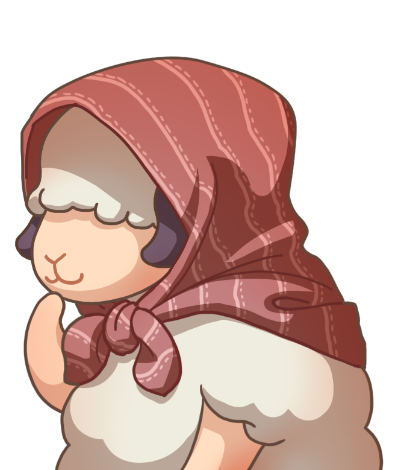
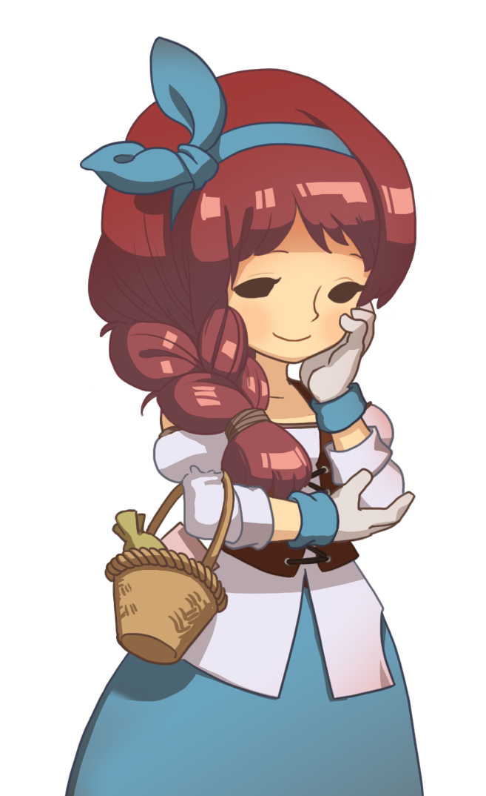
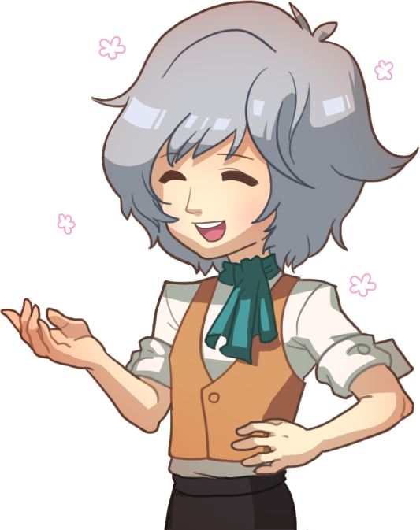
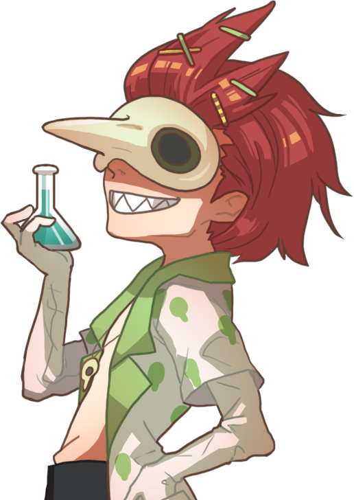

# Sheepfarm in Meta-land

<figure><figcaption></figcaption></figure>

## Introduction

Welcome to Sheepfarm! In this sweet virtual world, you can acquire pastures, nurture ambitious sheep, and reap the rewards. The sheep of Meta-land are born competitors, making them perfect candidates to raise as racing champions. With wool as your primary resource, you have the power to build wealth, foster champions, or elevate your farm. The choice is yours. Start your journey!

***

## Story

<figure><figcaption></figcaption></figure>

In the peaceful meadows of Sugarland, shepherds and their sheep thrived in a sweet paradise, where the very air was tinged with the scent of candies and snacks. These sweet treats formed the heart of Sugarland's charm, not only for its residents but also for the sheep that roamed the candy-filled meadows. It was a place where sugar and smiles were in abundance.

As the word of Sugarland's sweet existence spread, more and more people came in search of this extraordinary sweetness. However, the influx of settlers brought unforeseen challenges, particularly the shortage of pastures for their beloved sheep. Once-peaceful settlements faced new obstacles.

Wise wizards and caring rulers embarked on a quest for a solution. After extensive research and magical experimentation, they unveiled an innovative answer: a virtual dimension crafted just for sheep, known as _Meta-land_. Here, the sheep could continue to graze on sweet treats, and the bond between shepherds and their fluffy friends would remain unbroken.

Farmers and their sheep journeyed to Meta-land, where the weather was always pleasant, the pastures lush, and the snacks abundant. As the wizards continued their work to perfect this haven, Meta-land's story was just beginning to unfold, promising more enchanting locations for all to explore.

#### Sheep Racing is Born

<figure><figcaption></figcaption></figure>

In the sweet realm of Sugarland, nestled on Mallowbu Island, a place renowned for its warm and welcoming residents, a cherished tradition unfolded each year – the crowning of the Legendary Runner Sheep. This event brought immense pride and joy to Mallowbu's people, who celebrated with races lined with candy decorations and valuable prizes.

With the portal to Meta-land now open, the kind-hearted folks of Mallowbu made a heartfelt decision to share their cherished tradition with the rest of the world. Inspired by the enchanting themes of the diverse villages in Sugarland, Sheep Racing was expanded to include participants from near and far.

Join us in this journey of sheep farming, adventure, and friendly competition as you nurture your sheep in the perfect pastures of Meta-land, and perhaps, one day, your own sheep will earn the coveted title of _Legendary Runner_!

***

## Characters

Here, amidst the charm and wonder, reside a diverse cast of characters, each with their own unique backgrounds and dreams. From the caring shepherds who tend to their flocks with devotion, to the wise wizards who seek solutions to challenges, and the spirited sheep with dreams of adventure, these characters embody the essence of Meta-land's magic.

#### Michelle

_"I'm on my way to becoming a legendary shepherd, just wait and see!"_

<figure><figcaption></figcaption></figure>

Meet Michelle, the perpetual ray of sunshine. She's easily recognizable with her two fluffy pigtails and a lollipop hair accessory, perfectly in sync with the sweet ambiance of Meta-land. Her heart is forever entwined with the sheep of Meta-land, and she's their steadfast friend. She looks up to Shepherd, who, quite ironically, is a wise sheep known for his helpful advice.

While Michelle aspires to become a true shepherd herself, she's not there just yet. Still, she eagerly shares her own style of quirky wisdom on raising sheep, often with a touch of innocent hilarity. Her advice may not always be spot-on, but her infectious spirit and genuine affection for the sheep make her an endearing presence. Shepherd, on the other hoof, is the one who truly understands the sheep's needs and gives wise advice to both Michelle and players alike.

Together, they form an unconventional but heartwarming duo in Meta-land, guiding players on their journey to becoming legendary shepherds.

#### **Meryl**

_"Meeeh!"_

<figure><figcaption></figcaption></figure>

Meryl is not just a sheep; she's family. Since their early days, she and Michelle have been inseparable, sharing a bond as thick as wool.

Born into adversity after losing her parents at a tender age, Michelle stepped into the role of protector, tending to Meryl's every need around the clock. In Meryl's eyes, Michelle isn't just her friend; she's the mother she never had. Their connection is unbreakable, and they're rarely seen apart.

When Michelle's laughter echoes through the pastures or tears glisten in her eyes, you can bet Meryl is there, standing as a steadfast and devoted friend, forever by her side.

#### **Shepherd**&#x20;

_“Erm... Baah?“_

<figure><figcaption></figcaption></figure>

As if he's descended from the heavens, Shepherd graces the world with his presence, a silent guardian watching over shepherds and guiding their hearts. He acts like Michelle's guardian angel, imparting wisdom about good and bad deeds.&#x20;

Cloaked in a timeworn hood that conceals his true identity, Shepherd wanders the land, appearing when the need arises. In Michelle's journey to become a skilled shepherd, Shepherd appears mysteriously, delivering pearls of wisdom with each encounter before vanishing into the unknown.

Legend has it that Sugarland once spoke of a _Legendary Shepherd_, and this mysterious sheep bears an uncanny resemblance to that tale... Yet, the full truth remains shrouded in mystery, waiting for the day it unfolds.

#### Kelly

_"Welcome! Let's turn your wishes into treasures."_

<figure><figcaption></figcaption></figure>

Meet Kelly, the friendly owner of the town's local shop. After losing her parents at a young age, she took on the responsibility of caring for her younger sister, Katie, and worked diligently to support them both.

In her cozy shop, Kelly offers a variety of goods, from unique items and rare treasures to essential supplies for sheep farming and more. She's a welcoming presence in the community, always ready to assist her customers. Her shop is a place where everyone feels at home.

#### Katie

_"You bet, we've got some new sheep in today!"_

<figure><figcaption></figcaption></figure>

Katie is Michelle's closest friend in town and also happens to be Kelly's younger sister. She helps her big sister manage all the sheep-related affairs in the town, handling every sheep transaction with enthusiasm. She also takes care of all your sheep-related needs, from adopting new sheep to ensuring they have enough food and supplies.&#x20;

She's your go-to helper for standard game pass transactions, helping you provide the best care for your woolly companions. Her vivacious and sociable nature lights up the town, but a dash of scatterbrained charm occasionally leads to playful mishaps. But don't be deceived by her petite frame—beneath it lies surprising strength and a heart filled with unwavering courage.

#### Eddie

_"In the heart of Meta-land, I discovered the secret to a sheep's happiness."_

<figure><figcaption></figcaption></figure>

Eddie always felt like an outsider in his family. While his father, Winston, focused on accumulating wealth and status, Eddie found solace in the company of sheep. After arriving in Meta-land, he became deeply intrigued by the intricate dynamics of animal therapy, enabling him to explore the profound connections among sheep, their well-being, and their happiness.

Passionate about giving the sheep the best care possible, Eddie dedicates himself to providing them with special attention and the finest items. He believes that when sheep are content and harmonious, their wool quality improves significantly. Leveraging his expertise, he turns this passion into a profitable venture, benefiting both the sheep and the village.

Eddie offers premium game pass items and valuable services to enhance your gameplay journey. He's dedicated to the well-being of the village's sheep and ensures you have everything you need to excel in the game.&#x20;

#### Mailman

_"Good morning, everyone! I've got some good news for you today!"_

<figure><figcaption></figcaption></figure>

The Seasonal Mailman, a harbinger of good news in Meta-land. His attire seamlessly adapts to the shifting seasons, blending in with the ever-changing landscape. With his presence, he brings a sense of cheer to the tranquil surroundings.

He's also the friendly courier who ensures that players' gifts reach their post boxes safely. No matter the season, his demeanor radiates warmth and sunshine, just like a perfect day in Meta-land.

**Race Manager**

_"Prepare your sheep for glory, and they shall conquer the arena!”_

<figure><figcaption></figcaption></figure>

Meet the Race Manager, the dynamo behind Arena races. He's all about that high-energy sheep racing action!

Once, in the days before the arena dazzled with lights and cheers, our Race Manager was a skilled shepherd. He had a talent for raising racing champions, sheep with lightning-fast hooves. His fame spread among shepherds far and wide.

Now, he's your guide to the arena's excitement, a shepherd with stories of past racing glory. He'll inspire you with tales of his champions, helping you unlock your sheep's full potential.

#### **Bookmaker**

_”It's been said that fortune favours the brave, my friend. Care to take a chance and see if it rings true on the racetrack?”_

<figure><figcaption></figcaption></figure>

Meet the Bookmaker, a Mallowbu Island resident with the fastest feet and the quickest wit.

She’s always on the move, never staying still for a moment. As the island's trusted bookmaker for sheep races, her expertise in odds and betting is unmatched. Rapid calculations and lightning-quick bets have made her an essential figure in the thrilling world of sheep racing.

Just don't blink, or you might miss her in the hustle and bustle of the racing excitement!

**Lucky Lenny**

_”Embrace the unexpected. Life's more flavourful when seasoned with luck!”_

<figure><figcaption></figcaption></figure>

Meet Lenny—better known as Lucky Lenny—the eccentric Chief of Mallowbu Island who's always up for a gamble. In his presence, the mundane becomes extraordinary, and the ordinary turns into an adventure. Sheep races, lotto pronouncements, even island-wide events—Lenny lets fate guide the way.

In council meetings, Chief Lenny decisions are often influenced by the throw of his lucky dice, adding a spontaneous charm to his leadership style.

With a mischievous twinkle in his eye, Lenny keeps the islanders entertained with his unpredictable events. Mallowbu Island, under Lucky Lenny's reign, has become a living testament to the sweetness of unpredictable joys of life.

#### Micayla

_“Get ready, folks! The sheep are are lined up and ready to make a run for it! Who will be crowned the champion?”_

<figure><figcaption></figcaption></figure>

From a very young age, Micayla displayed exceptional singing talent, earning the adoration of people and eventually becoming a celebrated singer. However, her focus on her music often leaves her naive and oblivious to the complexities of the world.

Currently, she takes on the role of an announcer for Sheep Racing, providing lively commentary and entertainment for the audience. Her magnetic presence draws larger crowds to the races and her affection for the adorable sheep has even inspired her to adopt a style reminiscent of these fluffy creatures.

**Deolize**

_"Oh…you're quite the talker, aren't you?"_

<figure><figcaption></figcaption></figure>

Deolize is an incredibly reclusive witch who has spent a staggering 324,235 years living alone in her tower. She has a profound aversion to human company, preferring the solitude of her own thoughts. Because of her age, she has acquired knowledge that spans centuries and has even crossed paths with the Legendary Shepherd, though their encounter may not have been the most harmonious.

In the realm of Meta-land, Deolize is a renowned potions expert, skilled in the art of crafting various elixirs and concoctions. Her magical brews have the power to boost the abilities of the village's sheep, aiding them on their journey to become masters of sheep racing.

**Marge, the Stylish Matriarch**

_"Fashion is a canvas of self-expression!"_

<figure><figcaption></figcaption></figure>

Marge is a revered figure in Meta-land. She's known for her impeccable fashion sense and her unique ability to create stylish clothing from wool sourced from surrounding sheep farms. She crafts attire for villagers and sometimes even stylish outfits for the village's beloved sheep.

Marge's journey into the world of fashion began in her youth when she discovered her love for dressmaking. In a village where sheep farming was a way of life, her passion for fashion shone brightly. Over the years, Marge's reputation as the stylish matriarch of Meta-land flourished.

Today, Marge is passionate about supporting local shepherds and turning their wool into wearable works of art.

**Lady Amberworth**&#x20;

_“Running the MARD Shop daily goes beyond sales—it's about sculpting a narrative of refined taste and quality in the marketplace.”_

<figure><figcaption></figcaption></figure>

Hailing from the Marmalade Kingdom, Lady Amberworth is the powerhouse behind the family MARD Shop. Managing the day-to-day affairs, she ensures the ongoing success of the family empire with unwavering standards.

Draped in citrusy splendor, Lady Amberworth turns the shop into an opulent haven, where each item is carefully chosen to meet her high standards. With a commitment to the finer things in life, she orchestrates the Mard Shop's success with grace and charm.

Her husband, the trading whiz from Marmalade Kingdom, handles the hustle and bustle of transactions with finesse. Together, they lead a life adorned with opulence, crafting a realm of sophistication where Marmalade Tokens symbolize prosperity.

Their daughter, Monica, adds a mysterious touch to the family dynamic. A silent observer of the lavish life they've woven, Monica's grumpy demeanor hints at a complexity that adds a unique flavour to the family's opulent existence.

#### **Mr. Amberworth**

_“Each token we exchange weaves a story of prosperity into the very soul of our marketplace.”_

<figure><figcaption></figcaption></figure>

At the heart of Marmalade Kingdom's trade hub is Mr. Amberworth, the man behind the MARD Shop. He's the savvy trader in charge, navigating transactions with ease. His focus on the art of the deal complements Lady Amberworth's dedication to quality, creating a dynamic partnership in both business and life.

Mr. Amberworth's expertise turns each transaction into a success, making him a vital figure in the MARD trading scene. With a strategic mind and confident demeanor, he plays a key role in defining the opulence of Marmalade Kingdom.

#### **Jolly (Amberworth)**

_“Hmph, it's not like I came here because I liked you or anything.”_

<figure><figcaption></figcaption></figure>

Meet Jolly, a highborn girl from the distant Marmalade Kingdom, who unexpectedly finds herself in Meta-land one fateful day.

Having spent her entire life confined within the walls of her ancestral mansion, she finally mustered the courage to embark on her very first adventure beyond those imposing doors. Astonishingly, her parents remain oblivious to her disappearance, unaware of her daring adventure into the unknown...

Everything in Meta-land, especially the sheep, fascinates her. However, unlike her name suggests, Jolly is not the epitome of cheerfulness. Expressing her emotions is a baffling challenge for her, often leading to fits of frustration. Because of this, making friends on her adventure is a struggle, as she finds it hard to connect with others in this new world.

#### **Kaligali**&#x20;

_"Kekeke, what ingenious creation shall unveil itself today?"_

<figure><figcaption></figcaption></figure>

Meet Kaligali, the enigmatic scientist who mysteriously arrived in town.

Driven by an insatiable passion for invention, he's convinced of his unparalleled genius and uses his imaginative mind to craft a myriad of creations. While most of his contraptions tend to baffle others, there's an occasional stroke of brilliance that results in inventions benefiting the town's sheep, much to everyone's surprise.

For reasons unknown, he fiercely guards his true identity, concealing his face behind a mysterious mask. Unfond of most townsfolk, his closest companion is an eccentric sheep named Fantôme, sharing his affinity for masks and standing out as an oddity among the flock.

But Kaligali's eccentricities don't end there. He possesses a peculiar fascination with morphing sheep, delving into realms of experimentation that blur the lines between science and magic. His presence in town adds a touch of mystery, making him a true puzzle yet to be fully unraveled.

#### **Old Man Wallace**&#x20;

_"Gather round, children! Let me tell you a tale of sheep and adventures from the good ol' days."_

<figure><figcaption></figcaption></figure>

Old Man Wallace is known for his leisurely demeanor and wise presence. Having retired from shepherding long ago, he now tends to his crops and enjoys the simple pleasures of life. But his true joy lies in sharing stories of days gone by with the village children, offering them valuable life lessons wrapped in tales of adventure and wonder.

In the peaceful meadows of Meta-land, Old Man Wallace can often be found in the company of his steadfast companion, a wise and elderly sheep who has been his friend for as long as anyone can remember. Together, they create a cherished legacy of storytelling and friendship in the village.

**Uncle Mutton**&#x20;

_"Baah..."_

<figure><figcaption></figcaption></figure>

Uncle Mutton, the wise and endearing companion of Old Man Wallace.

He's not one for jokes or games, but Uncle Mutton has a heart as warm as his fleece. He's known for his gentle and nurturing nature, always there with a comforting presence when villagers need a friend. Uncle Mutton's baahs are more like comforting murmurs, offering reassurance in times of need.

Despite his wisdom, Uncle Mutton's eyesight isn't what it used to be, and he's been known to wander too close to pits and cliffs, often requiring a little rescue mission by the villagers... He enjoys peace and quiet, especially when he can listen to Old Man Wallace's captivating stories that whisk him away to dreamy pastures and adventures of his own.

