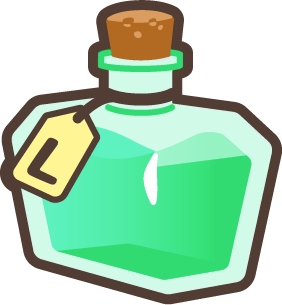

# Consumable Items

Sheepfarm in Meta-land offers a wide array of consumables that will help you cultivate your dream racing team and reap the rewards of your hard work. These items are your ticket to prosperity and success on the farm and on the racetrack.

### Below is a summary of all the consumable items in the game and their respective uses:



<table><thead><tr><th width="140" align="center">Image</th><th width="240" align="center">Item Name</th><th width="320" align="center">Use In Game</th><th data-hidden></th></tr></thead><tbody><tr><td align="center"></td><td align="center">Bonbon</td><td align="center">Replenishes sheep's hunger by 100%</td><td></td></tr><tr><td align="center"></td><td align="center">Lucky Coin</td><td align="center">Spin the lucky wheel for an extra chance at luck</td><td></td></tr><tr><td align="center"></td><td align="center">Lambooster</td><td align="center">Accelerate a Lambkin's growth instantly</td><td></td></tr><tr><td align="center"></td><td align="center">Amnesia Dust</td><td align="center">Reset a sheep and gain valuable EXP potions</td><td></td></tr><tr><td align="center"></td><td align="center">Mystery Cube</td><td align="center">Reshuffle racing attributes</td><td></td></tr><tr><td align="center"></td><td align="center">Wool Bundle</td><td align="center">Boosts sheep's level with 200,000 EXP</td><td></td></tr><tr><td align="center"></td><td align="center">EXP Potion (Small)</td><td align="center">Boosts sheep's level with 10 EXP</td><td></td></tr><tr><td align="center"></td><td align="center">EXP Potion (Medium)</td><td align="center">Boosts sheep's level with 500 EXP</td><td></td></tr><tr><td align="center"></td><td align="center">EXP Potion (Large)</td><td align="center">Boosts sheep's level with 10,000 EXP</td><td></td></tr><tr><td align="center"></td><td align="center">Racing Ticket</td><td align="center">Bet on races in Ticket Racing</td><td></td></tr><tr><td align="center"></td><td align="center">Beanz Racing Scope</td><td align="center">Used for previewing practice runs in Beanz Racing</td><td></td></tr><tr><td align="center"></td><td align="center">Ticket Racing Scope</td><td align="center">Used for previewing practice runs in Ticket Racing</td><td></td></tr><tr><td align="center"></td><td align="center">Recharge Potion (Small)</td><td align="center">Restore 10% of sheep's energy</td><td></td></tr><tr><td align="center"></td><td align="center">Recharge Potion (Medium)</td><td align="center">Restore 50% of sheep's energy</td><td></td></tr><tr><td align="center"></td><td align="center">Recharge Potion (Large)</td><td align="center">Restore 100% of sheep's energy</td><td></td></tr><tr><td align="center"></td><td align="center">Matchmaker Ticket</td><td align="center">Initiates new matchmaking in the Arena</td><td></td></tr><tr><td align="center"></td><td align="center">KROMA Minting Voucher (Normal)</td><td align="center">Transform Normal non-NFT sheep into NFTs</td><td></td></tr><tr><td align="center"></td><td align="center">KROMA Minting Voucher (Rare)</td><td align="center">Transform Rare non-NFT sheep into NFTs</td><td></td></tr><tr><td align="center"></td><td align="center">KROMA Minting Voucher (Epic)</td><td align="center">Transform Epic non-NFT sheep into NFTs</td><td></td></tr><tr><td align="center"></td><td align="center">KROMA Minting Voucher (Random)</td><td align="center">Converts to a random rarity Minting Voucher upon claiming</td><td></td></tr></tbody></table>



