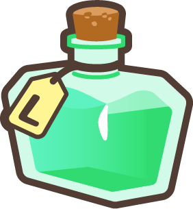
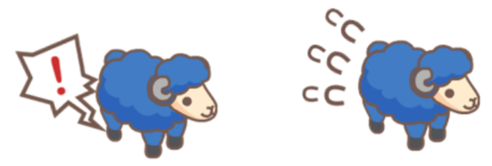

# Consumable Items

<figure><figcaption></figcaption></figure>

SheepFarm in Meta-land offers a wide selection of consumables designed to help you build the ultimate racing team and achieve success on the farm and racetrack. These items are key to unlocking prosperity, enhancing your sheep’s performance, and rewarding your hard work.

### Below is a summary of all the consumable items in the game and their respective uses:



<table><thead><tr><th width="124" align="center">Image</th><th width="240" align="center">Item Name</th><th width="320" align="center">Use In Game</th><th data-hidden></th></tr></thead><tbody><tr><td align="center"></td><td align="center">Bonbon</td><td align="center">Replenishes sheep's hunger by 100%</td><td></td></tr><tr><td align="center"></td><td align="center">Lucky Coin</td><td align="center">Spin the lucky wheel for an extra chance at luck</td><td></td></tr><tr><td align="center"></td><td align="center">Lambooster</td><td align="center">Accelerate a Lambkin's growth instantly</td><td></td></tr><tr><td align="center"></td><td align="center">Glow-up Tonic</td><td align="center">Ignites a Lambkin's glow instantly</td><td></td></tr><tr><td align="center"></td><td align="center">Amnesia Dust</td><td align="center">Reset a sheep and gain valuable EXP potions</td><td></td></tr><tr><td align="center"></td><td align="center">Mystery Cube</td><td align="center">Reshuffle racing attributes</td><td></td></tr><tr><td align="center"></td><td align="center">Wool Bundle (L)</td><td align="center">Boosts sheep's level with 200,000 EXP</td><td></td></tr><tr><td align="center"></td><td align="center">Wool Bundle (M)</td><td align="center">Boosts sheep's level with 100,000 EXP</td><td></td></tr><tr><td align="center"></td><td align="center">Wool Bundle (S)</td><td align="center">Boosts sheep's level with 50,000 EXP</td><td></td></tr><tr><td align="center"></td><td align="center">EXP Potion (Small)</td><td align="center">Boosts sheep's level with 10 EXP</td><td></td></tr><tr><td align="center"></td><td align="center">EXP Potion (Medium)</td><td align="center">Boosts sheep's level with 500 EXP</td><td></td></tr><tr><td align="center"></td><td align="center">EXP Potion (Large)</td><td align="center">Boosts sheep's level with 10,000 EXP</td><td></td></tr><tr><td align="center"></td><td align="center">Betting Ticket</td><td align="center">Bet on races in Ticket Racing</td><td></td></tr><tr><td align="center"></td><td align="center">Beanz Racing Scope</td><td align="center">Used for previewing practice runs in Beanz Racing</td><td></td></tr><tr><td align="center"></td><td align="center">Ticket Racing Scope</td><td align="center">Used for previewing practice runs in Ticket Racing</td><td></td></tr><tr><td align="center"></td><td align="center">Recharge Potion (Small)</td><td align="center">Restore 10% of sheep's energy</td><td></td></tr><tr><td align="center"></td><td align="center">Recharge Potion (Medium)</td><td align="center">Restore 50% of sheep's energy</td><td></td></tr><tr><td align="center"></td><td align="center">Recharge Potion (Large)</td><td align="center">Restore 100% of sheep's energy</td><td></td></tr><tr><td align="center"></td><td align="center">Matchmaker Ticket</td><td align="center">Initiates new matchmaking in the Arena</td><td></td></tr><tr><td align="center"></td><td align="center">Race Skipper</td><td align="center">Skip directly to the results of an Arena Race</td><td></td></tr><tr><td align="center"></td><td align="center">KROMA Minting Voucher (Normal)</td><td align="center">Transform Normal non-NFT sheep into NFTs</td><td></td></tr><tr><td align="center"></td><td align="center">KROMA Minting Voucher (Rare)</td><td align="center">Transform Rare non-NFT sheep into NFTs</td><td></td></tr><tr><td align="center"></td><td align="center">KROMA Minting Voucher (Epic)</td><td align="center">Transform Epic non-NFT sheep into NFTs</td><td></td></tr><tr><td align="center"></td><td align="center">KROMA Minting Voucher (Random)</td><td align="center">
Converts to a random rarity Minting Voucher upon claiming  

<strong>Voucher Probability:</strong>
<ul><li>Epic: 2%</li><li>Rare: 9%</li><li>Normal: 89%</li></ul></td><td></td></tr></tbody></table>




<table><thead><tr><th width="151">Image</th><th>Item Name</th><th>Use In Game</th></tr></thead><tbody><tr><td></td><td>Bonbon</td><td>Replenishes sheep's hunger by 100%</td></tr></tbody></table>




<table><thead><tr><th width="108">Image</th><th>Item Name</th><th>Use In Game</th></tr></thead><tbody><tr><td>

</td><td>Lambooster</td><td>Accelerate a Lambkin's growth instantly</td></tr><tr><td></td><td>Glow-up Tonic</td><td>Ignites a Lambkin's glow instantly</td></tr></tbody></table>




<table><thead><tr><th width="115">Image</th><th>Item Name</th><th>Use In Game</th></tr></thead><tbody><tr><td></td><td>Amnesia Dust</td><td>Reset a sheep and gain valuable EXP potions</td></tr><tr><td></td><td>Mystery Cube</td><td>Reshuffle racing attributes</td></tr><tr><td></td><td>Wool Bundle (Small)</td><td>Boosts sheep's level with 50,000 EXP</td></tr><tr><td></td><td>Wool Bundle (Medium)</td><td>Boosts sheep's level with 100,000 EXP</td></tr><tr><td></td><td>Wool Bundle (Largee)</td><td>Boosts sheep's level with 200,000 EXP</td></tr><tr><td></td><td>EXP Potion (Small)</td><td>Boosts sheep's level with 10 EXP</td></tr><tr><td></td><td>EXP Potion (Medium)</td><td>Boosts sheep's level with 500 EXP</td></tr><tr><td></td><td>EXP Potion (Large)</td><td>Boosts sheep's level with 10,000 EXP</td></tr></tbody></table>




<table><thead><tr><th width="121">Image</th><th>Item Name</th><th>Use In Game</th></tr></thead><tbody><tr><td></td><td>Betting Ticket</td><td>Bet on races in Ticket Racing</td></tr><tr><td></td><td>Beanz Racing Scope</td><td>Used for previewing practice runs in Beanz Racing</td></tr><tr><td></td><td>Ticket Racing Scope</td><td>Used for previewing practice runs in Ticket Racing</td></tr><tr><td></td><td>Recharge Potion (Small)</td><td>Restore 10% of sheep's energy</td></tr><tr><td></td><td>Recharge Potion (Medium)</td><td>Restore 50% of sheep's energy</td></tr><tr><td></td><td>Recharge Potion (Large)</td><td>Restore 100% of sheep's energy</td></tr><tr><td></td><td>Matchmaker Ticket</td><td>Initiates new matchmaking in the Arena</td></tr><tr><td></td><td>Race Skipper</td><td>Skip directly to the results of an Arena Race</td></tr></tbody></table>




<table><thead><tr><th width="147">Image</th><th>Item Name</th><th>Use In Game</th></tr></thead><tbody><tr><td></td><td>Lucky Coin</td><td>Spin the lucky wheel for an extra chance at luck</td></tr><tr><td></td><td>KROMA Minting Voucher (Normal)</td><td>Transform Normal non-NFT sheep into NFTs</td></tr><tr><td></td><td>KROMA Minting Voucher (Rare)</td><td>Transform Rare non-NFT sheep into NFTs</td></tr><tr><td></td><td>KROMA Minting Voucher (Epic)</td><td>Transform Epic non-NFT sheep into NFTs</td></tr><tr><td></td><td>KROMA Minting Voucher (Random)</td><td>
Converts to a random rarity Minting Voucher upon claiming  

<strong>Voucher Probability:</strong>
<ul><li>Epic: 2%</li><li>Rare: 9%</li><li>Normal: 89%</li></ul></td></tr></tbody></table>



