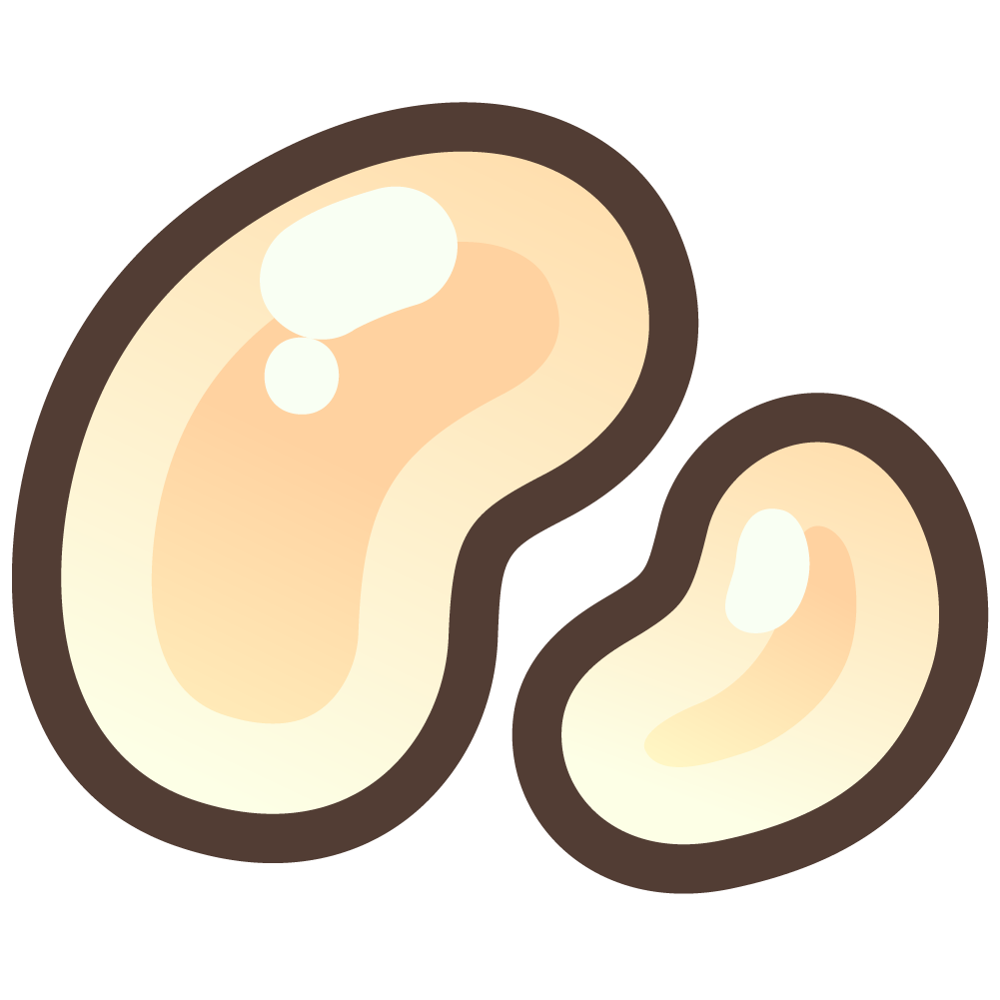

# Currency

In the world of Sheep farming, various currencies play a vital role in shaping your farming experience. These in-game currencies open doors to a world of possibilities, allowing you to purchase items, enhance your sheep's well-being, or explore a realm of luxury. Understanding and utilizing these currencies wisely can greatly impact your success as a shepherd.

##

## **Rainbow Beanz - A Shimmering Treasure**

<figure><figcaption></figcaption></figure>

Rainbow Beanz are a precious and sought-after currency in the game. While they are not as easy to obtain for free, they can still be acquired by various means, including in-app purchases, or by exchanging MARD Tokens on our official website. With Rainbow Beanz in your possession, you'll have access to exclusive and luxurious items, allowing you to easily enhance your sheep farming experience.

### **Guide: Purchasing RB (Mobile App)**

Note that the option to directly purchase Rainbow Beanz within the game is exclusively available on mobile as an in-app purchase.

1. **Access Beanz Shop:** In the top right corner, click the plus button next to your Rainbow Beanz balance. This will take you to the Beanz shop.
2. **Select Beanz:** On the first tab with an image of Rainbow Beanz, choose the amount you want to buy.
3. **App Store Confirmation:** You will be redirected to your device's app store for purchase confirmation.
4. **Confirm Purchase:** Confirm the purchase through your app store, and your Rainbow Beanz balance should reflect the new amount.

### Guide: Purchasing RB (MARD Shop)

_Coming Soon..._

## **Seasonal Beanz - Embrace the Seasonal Spirit**

<figure><figcaption></figcaption></figure>

Seasonal Beanz are a unique and time-sensitive currency within the game. They provide access to exclusive seasonal items and decor in the shop, allowing players to embrace the spirit of each season. However, there's a catch – Seasonal Beanz expire at the end of every season, encouraging players to enjoy the special offerings while they last.

These Beanz can be earned through various means, such as rewards, achievements, and even by participating in Beanz betting. So, make the most of each season by collecting and spending your Seasonal Beanz wisely before they disappear with the changing winds.

### **Guide: Purchasing SB**

If you need more Seasonal Beanz, visit the Beanz shop to exchange Rainbow Beanz for them. Don't forget, your first purchase each season gives you double the value!

1. **Access Beanz Shop:** In the top right corner, click the plus button next to your Seasonal Beanz balance. This will take you to the Beanz shop.
2. **Select Beanz:** On the second tab with an image of Seasonal Beanz, choose the amount you want to buy.
3. **App Store Confirmation:** You will be redirected to your device's app store for purchase confirmation.
4. **Confirm Purchase:** Follow the provided steps to confirm your purchase and your Seasonal Beanz balance should reflect the new amount.

## MARD Tokens - The Currency of Opulence

<figure><figcaption></figcaption></figure>

MARD Tokens are the currency of opulence within the game. Hailing from the luxurious Marmalade Kingdom, these tokens symbolize prosperity and refinement. They are a valuable resource used for various transactions within the[ <mark style="color:blue;">MARD Shop</mark>](mard-shop.md), where Lady Amberworth ensures that only the finest and most sophisticated items are available.

You can earn MARD Tokens through purchases, through in-game achievements, rewards, and by trying your luck in ticket betting, adding an exciting element of chance to your journey towards opulence. These tokens grant you access to a world of elegance, that will make your sheep farming experience a truly lavish experience.

**MARD Tokens come in two distinct forms:**

* **MARD in Game:** This currency is confined to the virtual realm of the game, enriching your in-game experience.
* **MARD in Wallet:** This is the real-world counterpart, residing outside the game in your [<mark style="color:blue;">crypto wallet</mark>](../web-3.0/tokenomics.md). It represents a tangible asset with potential real-world value.

Both forms of MARD Tokens offer unique opportunities and adventures, bridging the gap between the virtual and real worlds.
