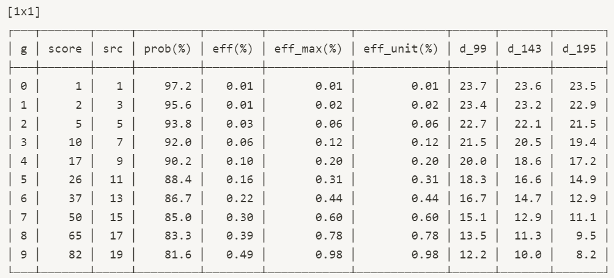
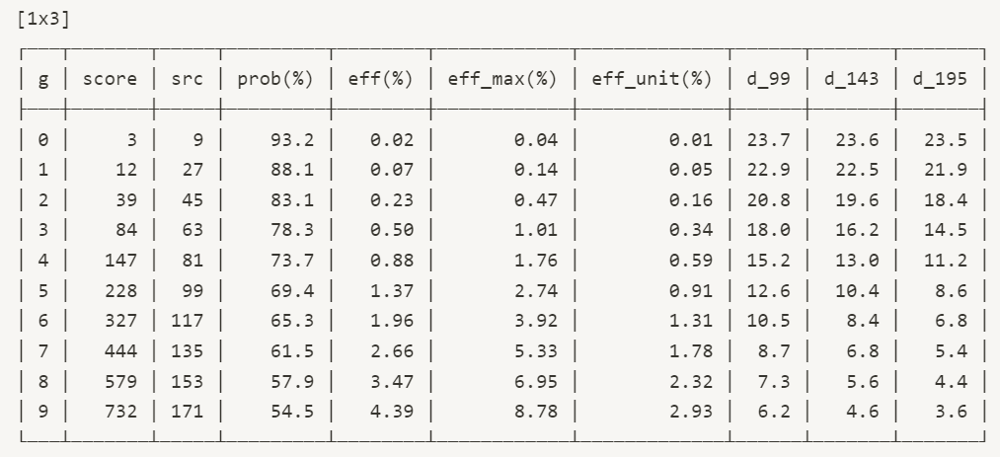
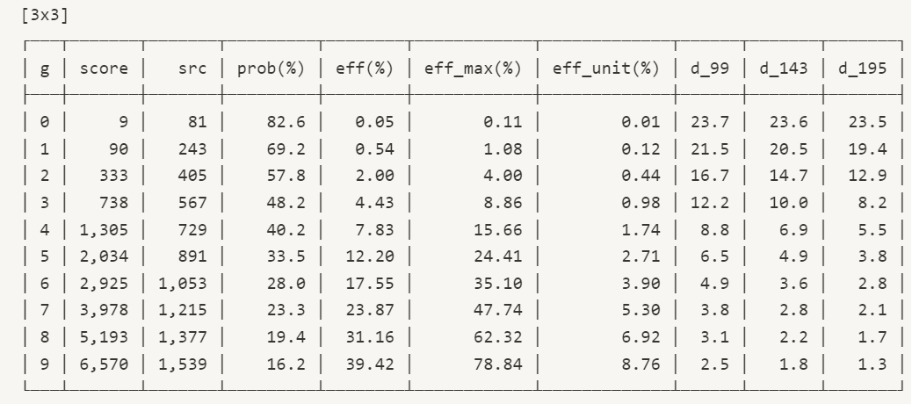
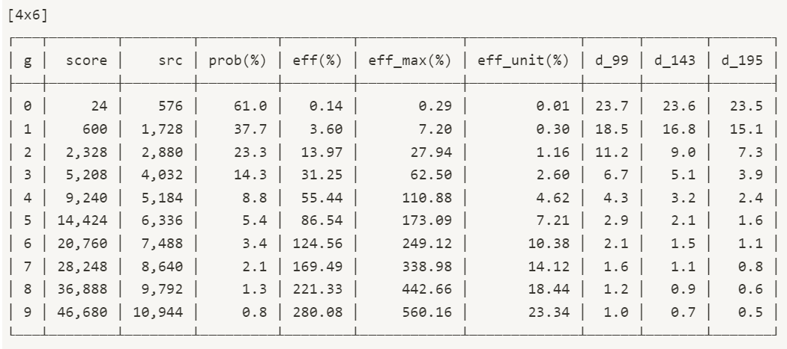

# Decor Upgrade

.png>)

Decorative items(Decor) can be used as-is, but they can also be enhanced to make them more effective in their intended usage. Upgraded decor can make shortened time to produce wool. Decorative items can be upgraded from the shop, and other decoration items can be used as a resource to upgrade them.

### Range

* Decor that is not upgraded yet, their status is level 0(zero). At the level 0, decor contribute to enhance productivity of wool very slightly.
* Upgrade range of level is from +1 to +9 and as the level grows, the item’s contribution to improve productivity exponentially.
* Although decor is level 0, combo that include decor items will take effect.

### Effects

* “Total decreasing of wool producing time from the upgrade effect”(is called below “Effect”) is determined by the level and area of the item. And items which has the same amount of area have the same amount of “Effect”. As the level and the size of the item increases, “Effect” and materials required to attempt the upgrade also increases.
* Each decor has weather properties, and it will affect the amount of “Effect”. Decor that matches the weather by DAO gains twice “Effect” as much “Effect” as decor that does not.
* Each decor has fit with sheep, and this synergy is determined by whether or not they are included in the Lucky box of the same season. For example, Miss Sommelier is not included in the Season 1 Lucky box, but only in the Season 3 Lucky box, so it only fits with Season 3 decors. If sheep fits with decor, then upgrade level of decor will be applied fully. But if sheep doesn’t fit with decor, then upgrade level of decor will be applied only up to +3 level of “Effect” even if level of decor is higher than 3. This fit system is applied selectively to each sheep.
* “Effect” from Decor and Combo system is applied by summing up not multiplying.
* Below is the table showing the relevance level up mechanism of upgrade system when the weather does not match. You can find “Point” of each decor corresponding to the area and level which affects “Effect” of each décor, and required point to upgrade. You can upgrade your decor without full point of material, but it will shorten probability to upgrade.







































* Index
  * g : level of each decor
  * score : point of decor
  * src : full point to have max level of probability to upgrade
  * prob : Maximized chance to success upgrading
  * eff : “Effect” of each decor without matching weather properties
  * eff\_max : “Effect” of each decor when weather is matched
  * eff\_unit : “Effect” of each decor per area
  * d\_99 : Wool producing time when small pasture is filled with this decor fully
  * d\_143 : Wool producing time when Medium pasture is filled with this decor fully
  * d\_195 : Wool producing time when Large pasture is filled with this decor fully

You can find  full number with this google spreadsheet link : [https://bit.ly/3M6KUEM](https://bit.ly/3M6KUEM)

Upgrading does not always guarantee success. If you want to make high-level decor over +5, keep in mind that the upgrade level could possibly be reduced!
