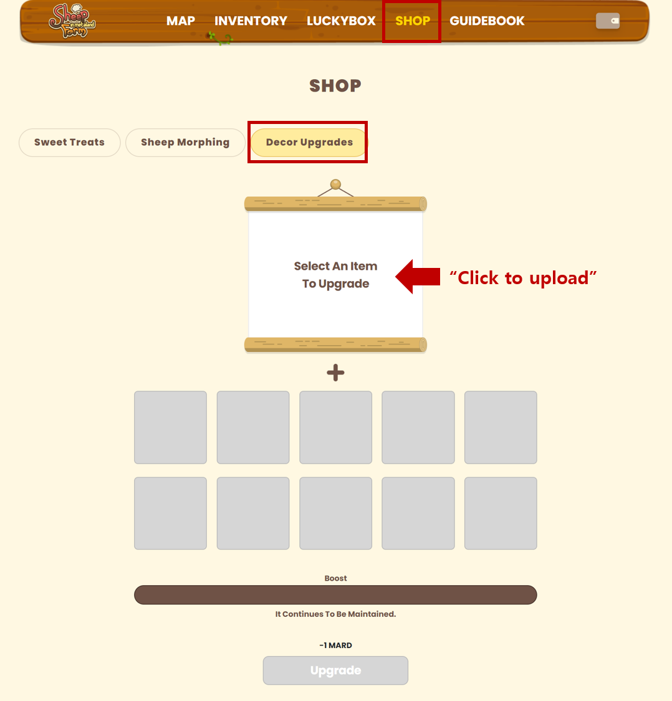
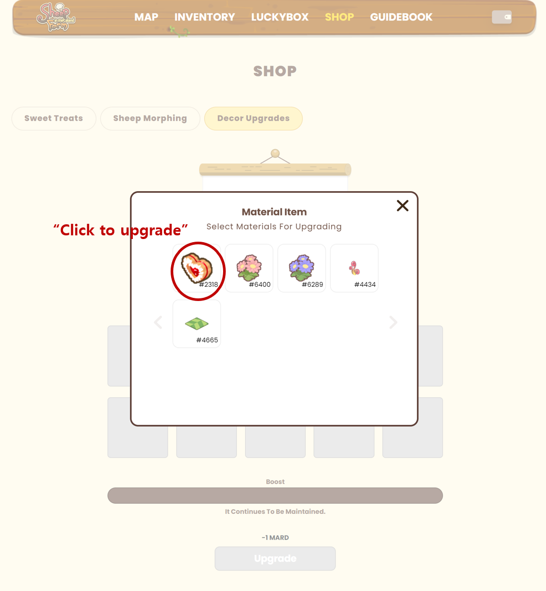
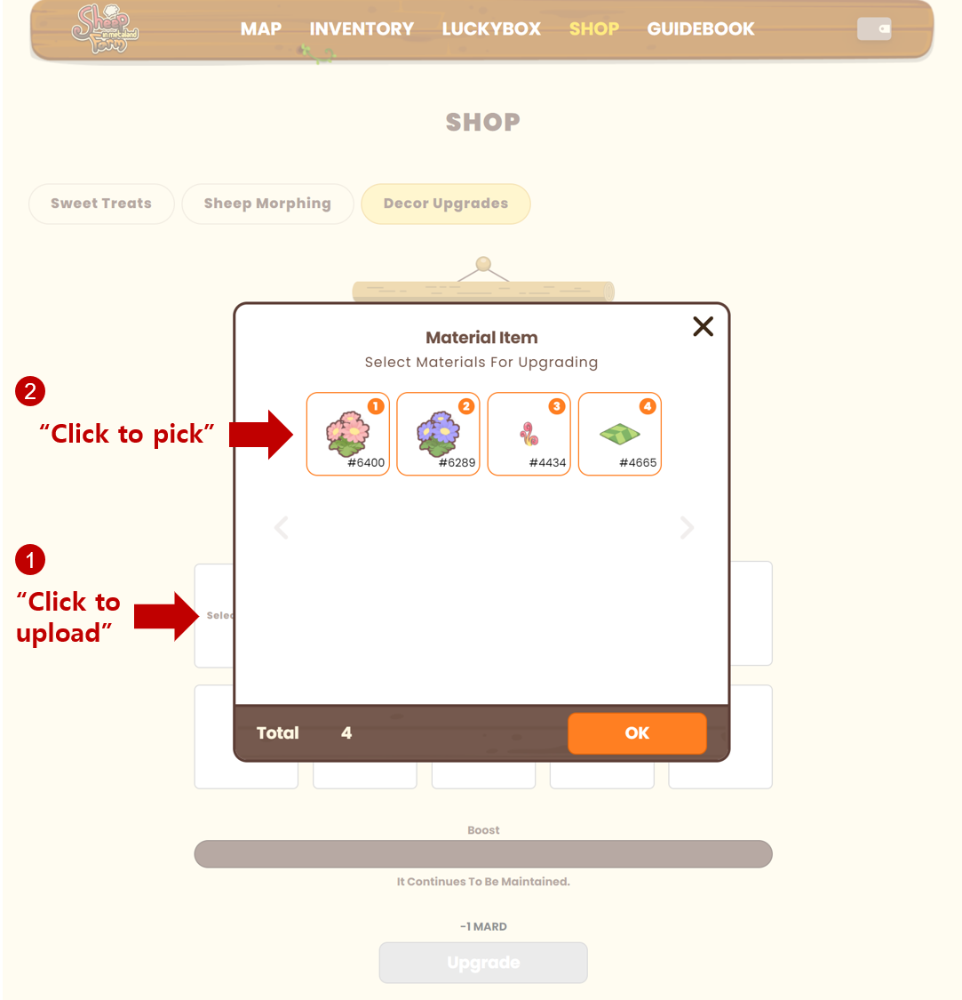
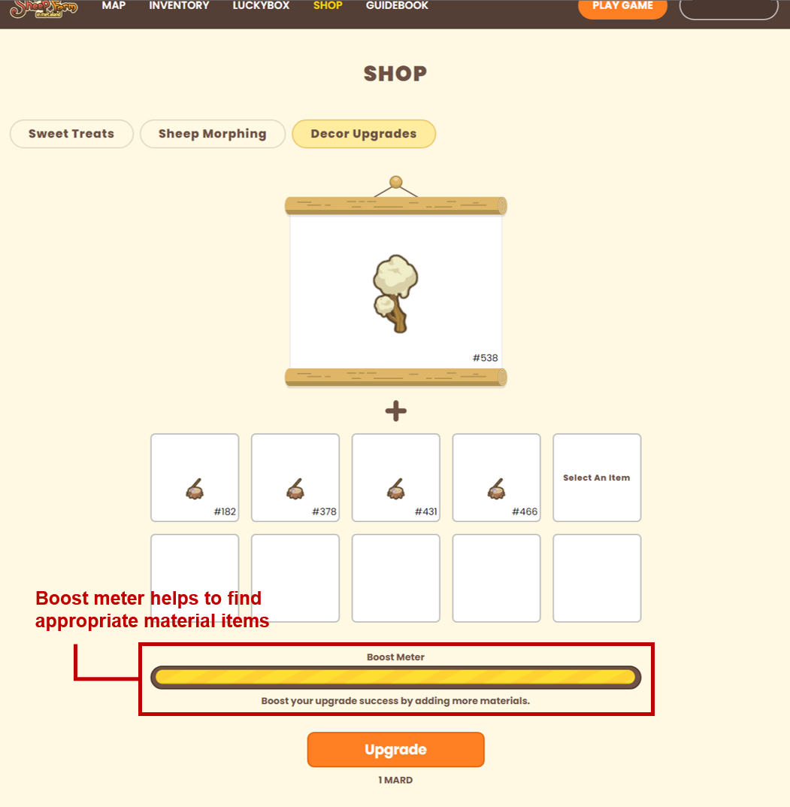
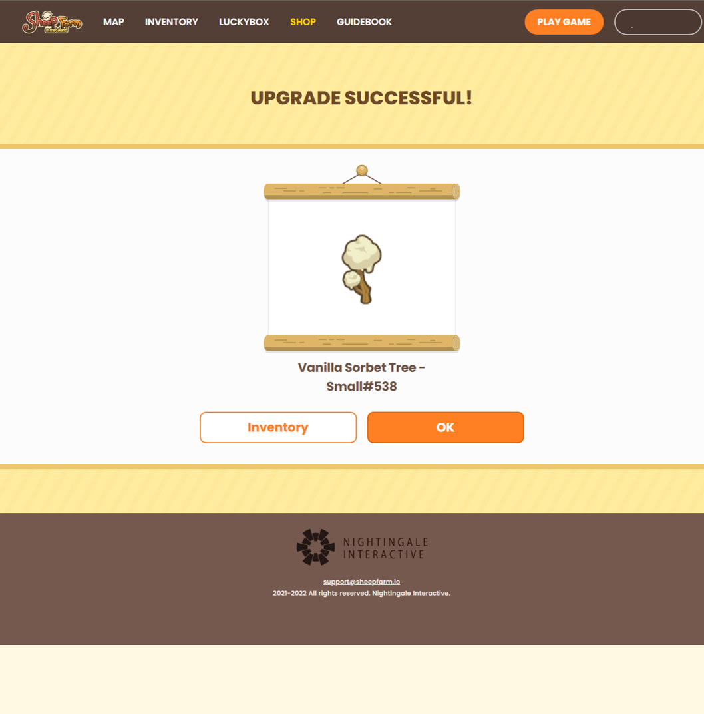

# How to upgrade decor

* You can find decor upgrade tab at the Shop menu.

* Choose one decor item from the list to upgrade.

* After then, you need to choose several decor items to be used as a material for upgrading.

* You are ready to upgrade your decor item finally.

* You can find your decor item is upgraded!!

