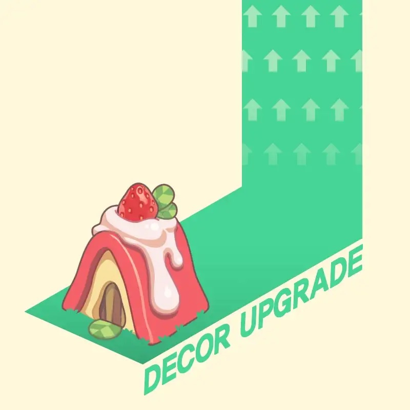

# Decor Upgrades

<figure><figcaption></figcaption></figure>

Decorative items can be used as-is, but they can also be enhanced to make them more effective in their intended usage. Upgraded decor can greatly speed up the production of wool. Decorative items can be upgraded from the shop, and other decoration items can be used as a resource to upgrade them.

### Range

* Decor that has not been upgraded yet has a status of level 0 (zero). Decor have a relatively small impact on wool output at the level of 0.
* There are 9 levels of upgrade available(from +1 to +9), with each level increasing the item's impact on increased productivity exponentially.
* Even if a decor item's level is zero, active combo effects that include decor items will take full effect regardless of the item's level.

### Effects

* The total decrease in wool production time caused by the upgrade effect is determined by the item's level and surface area. Objects with the same amount of surface area have the same degree of effect. As the item's level and size increase, so do the effect and materials required to attempt an upgrade.
* Each item of decor has weather-related properties that significantly influence how effective it is. Decor that aligns with the weather as determined by DAO has twice the impact on effects as decor that does not.
* Each decor has a compatibility with sheep, which is determined by whether or not they are included in the same season's Lucky box. Miss Sommelier, for example, is only available in Season 3 Lucky boxes, and so only matches Season 3 decor items. The decor upgrade level will be fully implemented if a sheep matches the decor. Although, even if the decor level is greater than 3, if the sheep do not match the decor, only up to upgrade level +3 effects will be applied. This matching mechanism is applied to each sheep individually.
* The effects of the Decor and Combo system are applied by adding up rather than multiplying.
* The levelling up mechanism of the upgrade system when the weather does not match is detailed in the table below. It also displays the point values of decor that correspond to the area and level that impacts the effect of each decor item, as well as the points required to upgrade it. You can upgrade your decor without sufficient material points, but the probability of success will be significantly lower.







































* Index
  * g: Decor item level
  * score: Decor item points
  * src: Points required to have max level of probability to upgrade.
  * prob: Maximized probability to successfully upgrade
  * eff: Effect of each decor when weather properties are not matched.
  * eff\_max : Effect of each decor when weather is matched
  * eff\_unit: Effect of each decor per surface area
  * d\_99: Wool production time when small pasture is fully decorated
  * d\_143: Wool production time when medium pasture is fully decorated
  * d\_195: Wool production time when large pasture is fully decorated

You can access the complete list on the following spreadsheet: [https://bit.ly/3M6KUEM](https://bit.ly/3M6KUEM)

Success is not always guaranteed by an upgrade. If you wish to create high-level decorations above +5, keep in mind that the upgrade level could be possibly be decreased!
