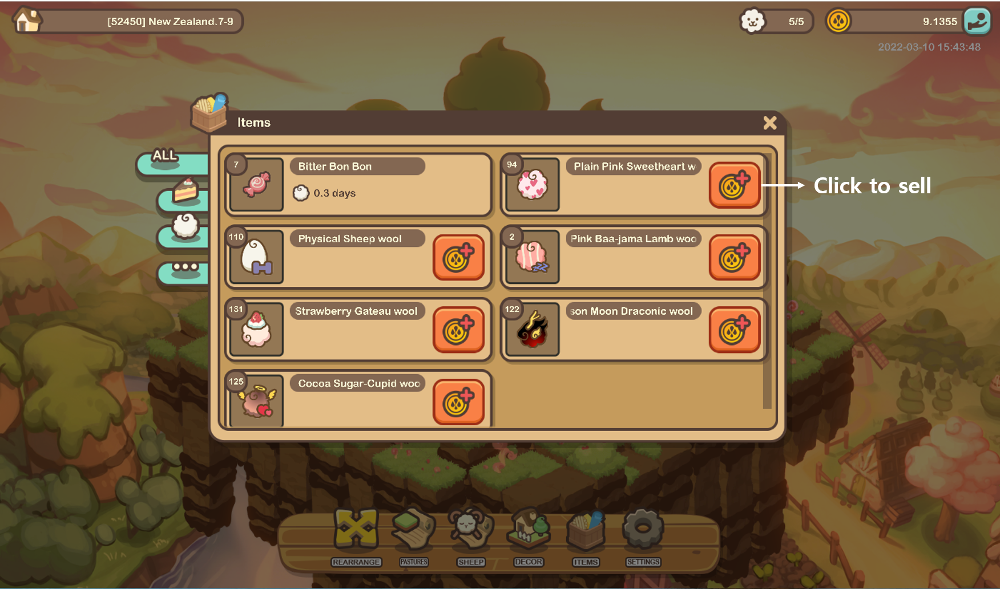
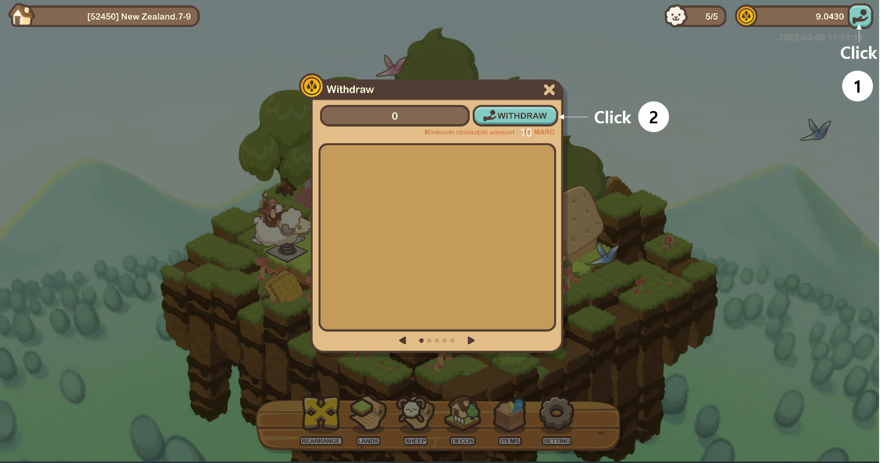
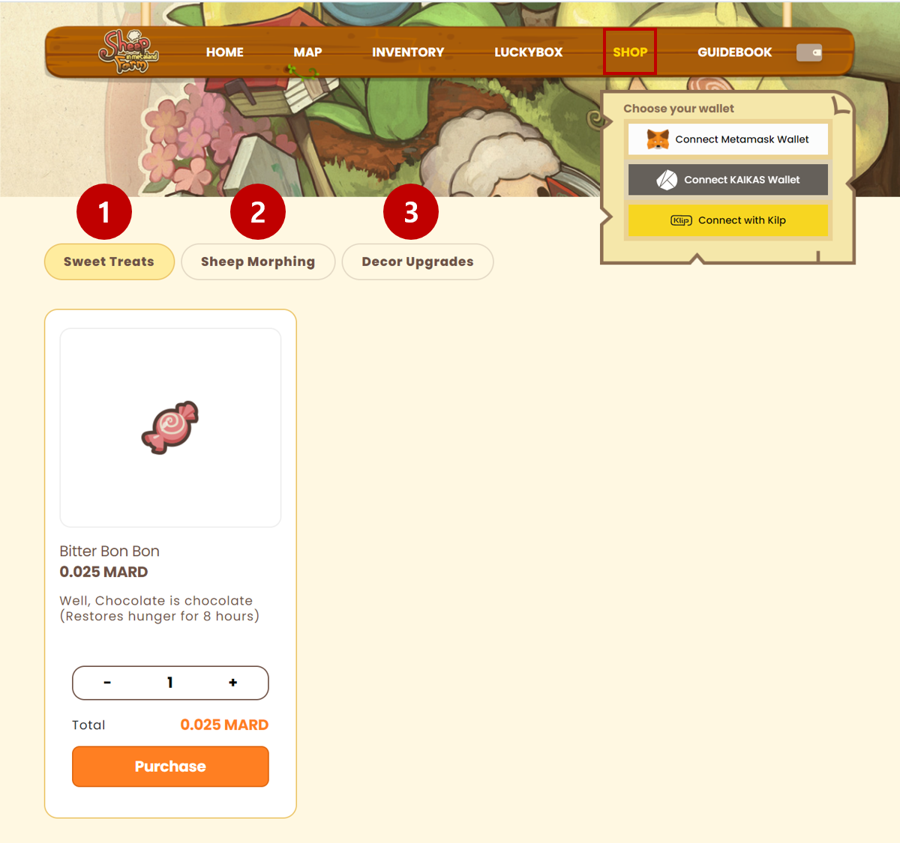

# Earning And Spending MARD

### Selling Wool

* Users can earn MARD by selling harvested wool in the game.
* Wool and other items are stored indefinitely in your item box.

### Withdrawing MARD

* The minimum withdrawal amount is 10 MARD, and you can withdraw MARD directly from the game to your wallet.

### Spending MARD

* MARD can be used to purchase sweet treats and MARD boxes, which are both available for purchase on the website.&#x20;

