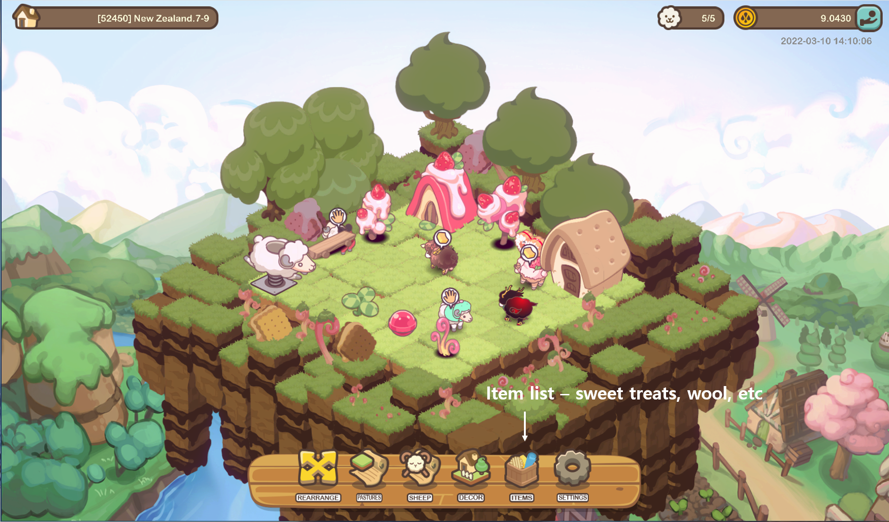
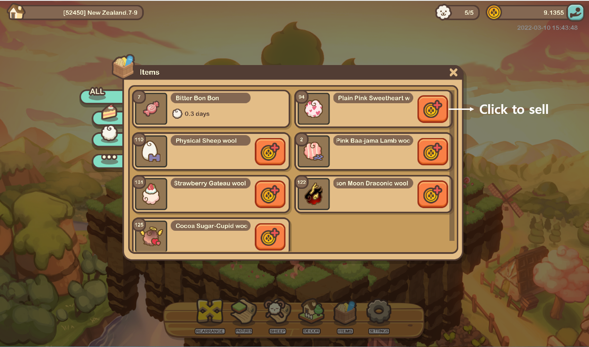
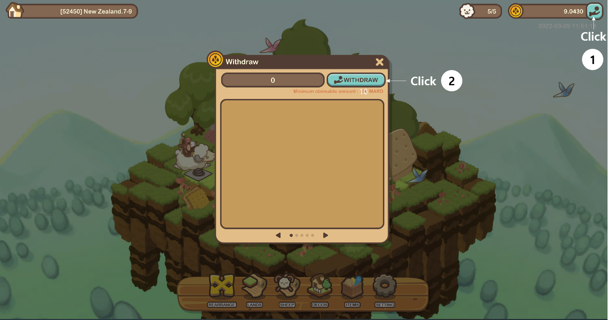
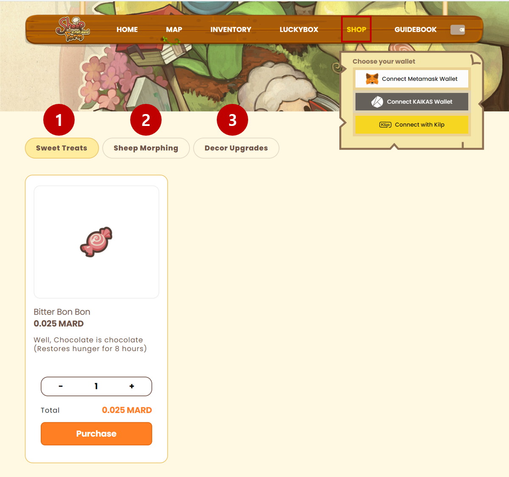
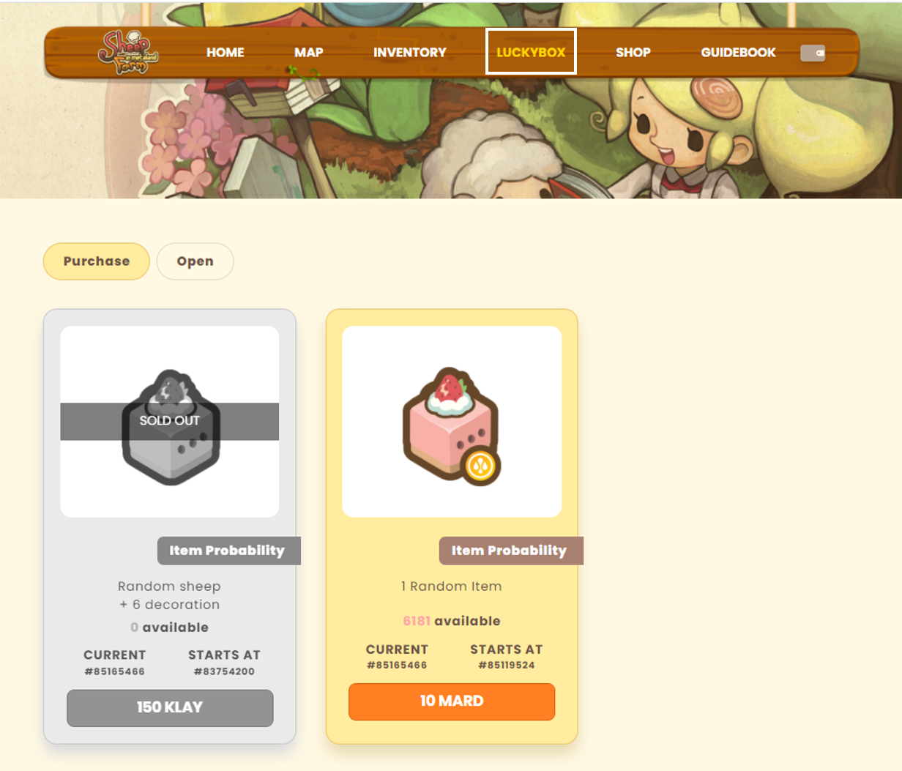

# Earning and Using MARD

### Selling wool

* Users can earn MARD by selling harvested wool in the game.
* Wool and other items are stored in a warehouse and can be saved indefinitely.

### Withdrawal MARD

* The minimum withdrawal amount is 10 MARD, and users can withdraw MARD directly from the game to their wallet.

### Using MARD

* MARD can be used to purchase sweet treats and MARD boxes, which are both available for purchase on the website.

