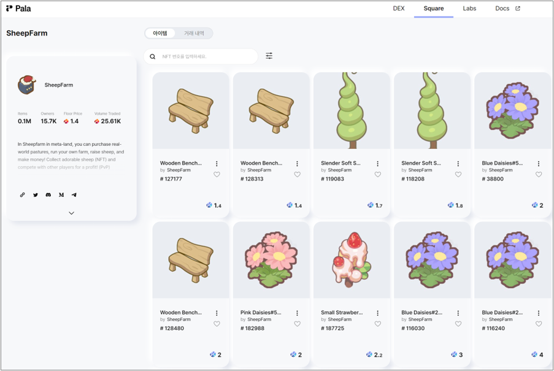

# Getting Started

### Join

* Users that have a pasture, sheep, and sweet treats in their wallet can play without requesting permission.
* NFTs for playing the game (pastures, sheep, decorations) can be purchased through Opensea (https://opensea.io/collection/sheepfarm), Palasquare (https://pala.world/square), or our Mard-ket (https://sheepfarm.ftnft.us/).

* Sweet treats for feeding sheep are not NFTs and must therefore be purchased on our website ([https://sheepfarm.io](https://sheepfarm.io/)).

### Using NFTs in Meta-land

* To access NFTs in-game, you can transfer Sheepfarm NFTs to Meta-land via our website ([https://sheepfarm.io](https://sheepfarm.io/)).
* The website allows you to remove items from the game as well.



### Logging-in

* The following wallets can be used to log in to the Sheepfarm website and to play the game.

1. Metamask Wallet
2. KAIKAS Wallet
3. Klip Wallet

* Connect your wallet

### Pasture selection

* Select a pasture to view your adorable sheep.

* You can switch between pastures at any time during gameplay.

