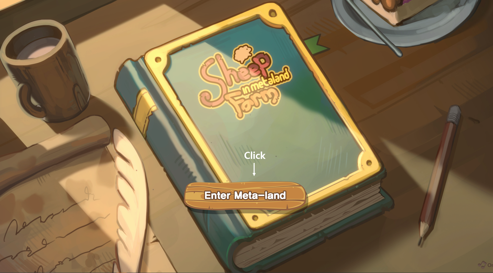
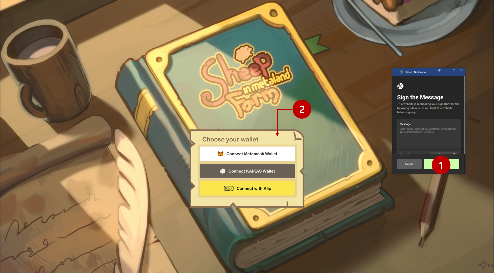
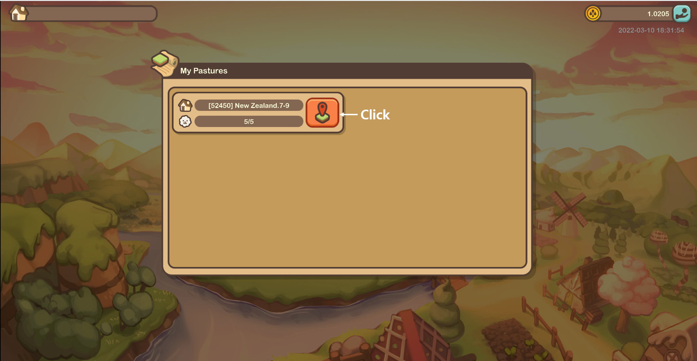
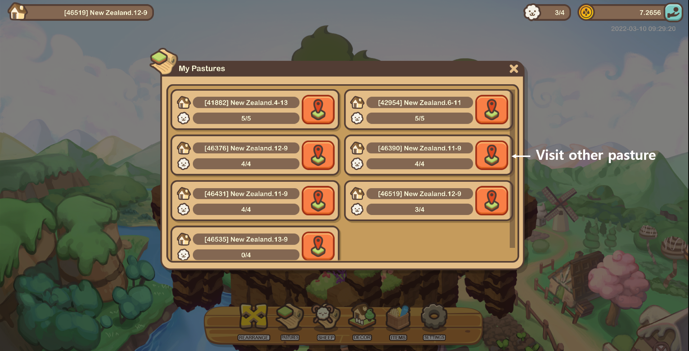

# Getting Started

### Join

* Users that have a pasture, sheep, and sweet treats in their wallet can play without requesting permission.
* User can find NFTs(pasture, sheep, decoration) at Opensea([https://opensea.io/collection /sheepfarm](https://opensea.io/collection/sheepfarm)) or Palasquare([https://pala.world/square](https://pala.world/square)) for playing the game.&#x20;
* Sweet treats for eating sheep is not NFT, so user need to buy it at the website ([https://sheepfarm.io](https://sheepfarm.io)).

### Using NFT in the Meta-land

* To access NFTs in-game, users can transfer Sheepfarm NFTs to Meta-land via the website ([https://sheepfarm.io](https://sheepfarm.io)).
* User can withdraw items at the website also to pull out from the game.



### Log-in

* The following wallets can be used to play the game and to log in to the Sheepfarm website.

1. Metamask Wallet
2. KAIKAS Wallet
3. Klip Wallet

* Connect of wallet

### Pasture selection

* To see their adorable sheep, users must select a pasture.

* Users can view their other pastures at any time during gameplay.

