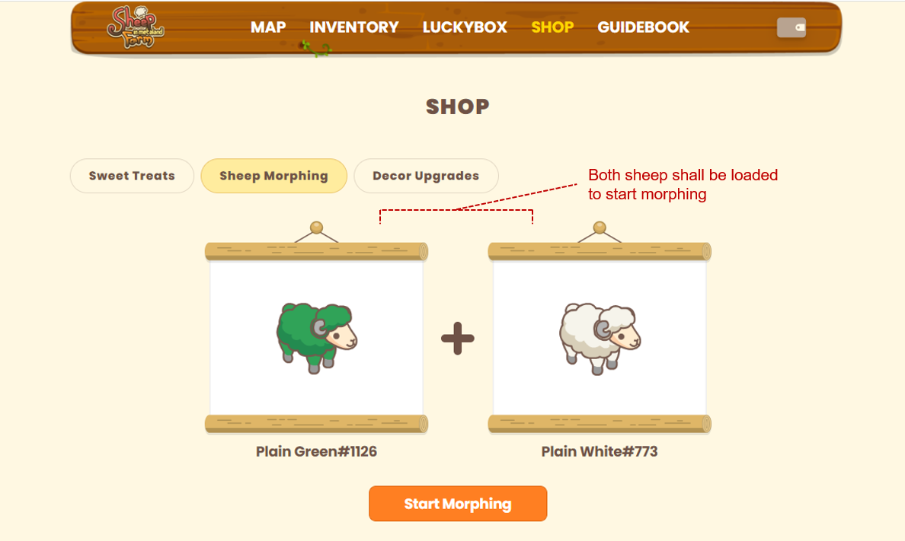

# Morphing

### Before to try morphing

1. Preparing two equal grade of sheep  and a fee of MARD shall be required in your wallet.
2. Two sheep for using to morph shall have different gender.

### The way of morphing

* Click the Sheep morphing button in the Shop section.

* Pick two sheep of the same grade and place them on each board.

* After two sheep are ready, you can start morphing with paying some fees.&#x20;
  * For normal sheep morphing, you need to pay 10 MARD(Normal morphing) or 20 MARD(Advanced Morphing)
  * For rare sheep morphing, you need to pay 25 MARD(Normal morphing) or 50 MARD (Advanced Morphing).
  * For epic sheep morphing is not available yet. It can be updated when higher grade of sheep appear.
  * Difference between Normal and advanced morphing will be 5% of chance to get higher grade of sheep.

* You can get new sheep! You can find new sheep at real-world item list of inventory section.
  * Sheep used in morphing will not be appeared as a new sheep.
  * Please stay tune when you morphing process is going on. It may take some time to process due to Main-net network problems.

### Find new sheep

* Some sheep will be appeared only for morphing

| Features |                  Ominous Nocturne                 |                  Captain Keelson                 |
| :------: | :-----------------------------------------------: | :----------------------------------------------: |
|   Grade  |                        Rare                       |                       Epic                       |
|   Image  |  |  |
