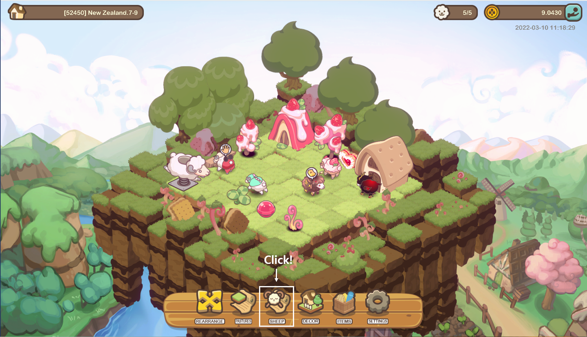
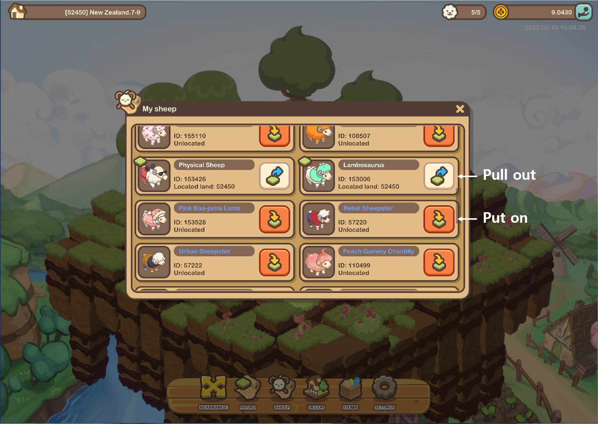
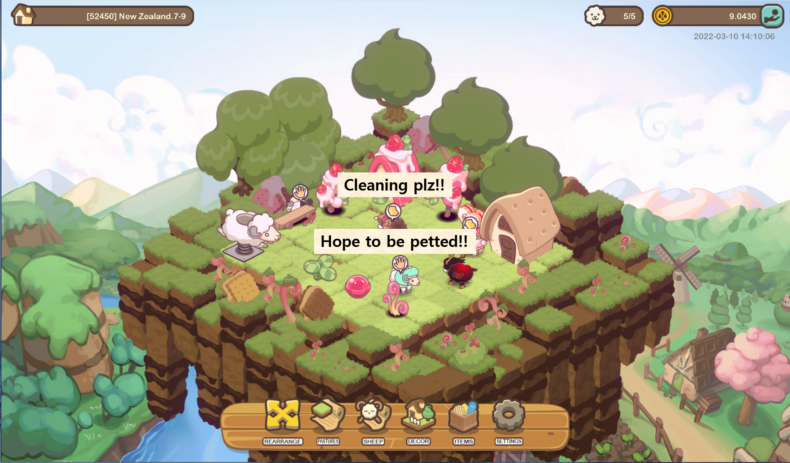
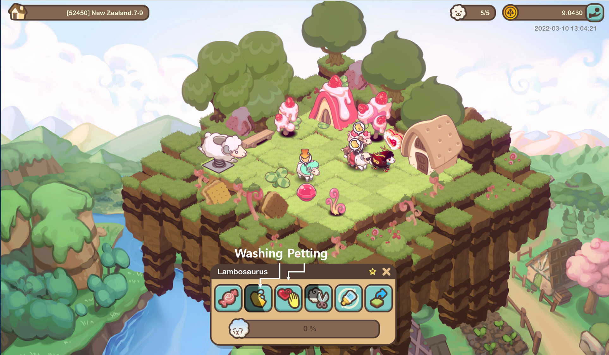
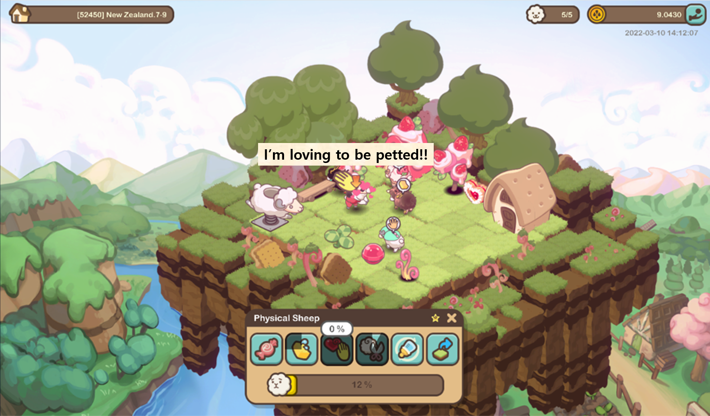
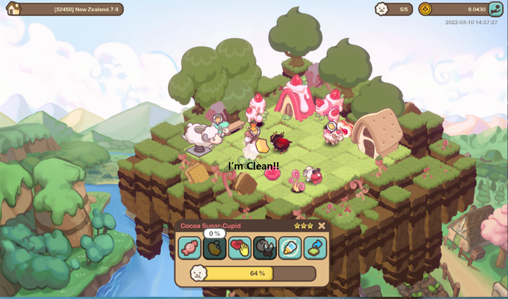

# Sheep care

### Placing sheep

* Users can add and remove sheep from their pasture at any time during gameplay.

### Sheep pampering : Petting and Cleasing

* Sheep enjoys being petted and cleaned on a regular basis. Make your adorable sheep feel beloved!

* When you find a signal of petting and cleaning from sheep

* Sheep will produce wool quickly and get "Intimacy" if they feel beloved. And "Intimacy" of sheep is required for morphing("Intimacy will be updated at open beta season).

### Shearing sheep

* Shearing sheep on a regular basis provides users with wool. Unless the wool is sheared in a timely manner, the sheep will stop producing more wool.
* Sheep produce 1 bunch of wool per day, and it can be shortened by the decor and combo effects on the pasture.
* Shearing can be done automatically on the pastures of Stewart Island.
