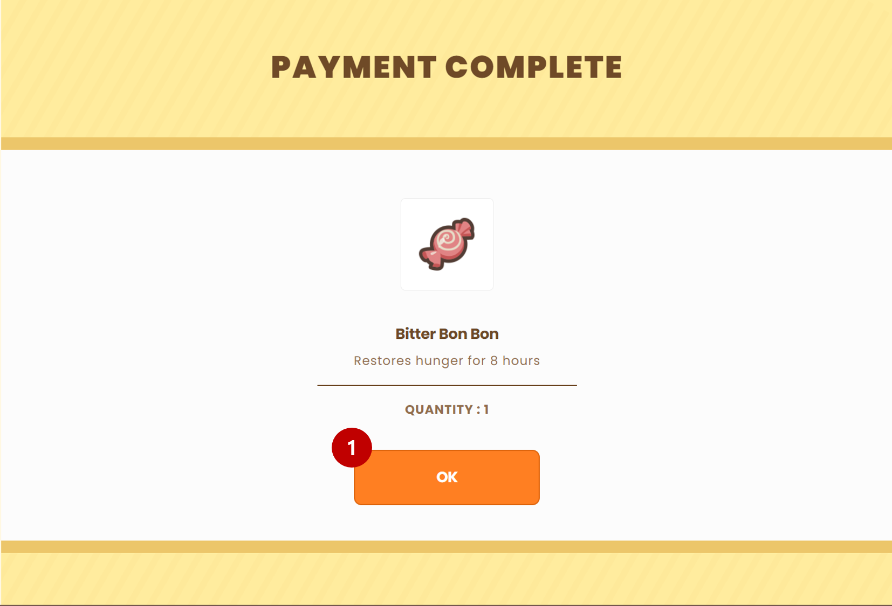
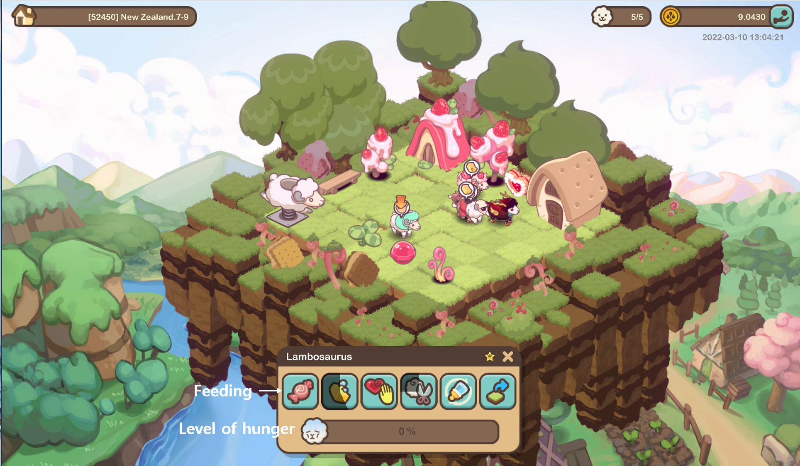
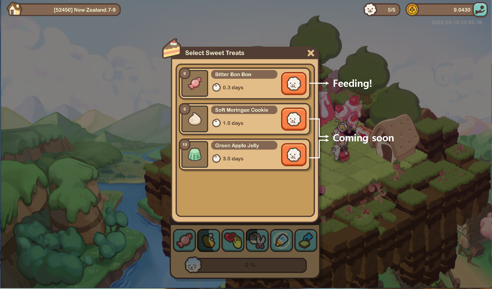

# Feeding

Sheep require sweet treats on a regular basis in order to be happy and produce wool.

### Purchasing

* Sweet treats are available for purchase on the website(https://sheepfarm.io).

* Purchasing process

* Users can find directly sweet treats in metaland.

### Feeding to each sheep

* Users can feed sweets to each of their sheep individually.

* Sheep becomes happy with sweets!!

### Auto-feeding

* On some pastures, auto-feeding is available. If the auto-feeding function is enabled, the sheep will consume a new sweet treat anytime their hunger level falls below 50%.
* This functionality can also be regulated individually for each sheep.&#x20;

