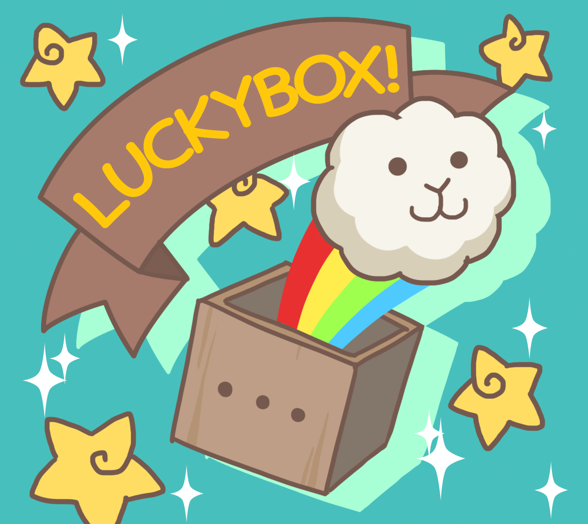

# Lucky Box

Lucky boxes each contain a total of **seven different goodies**, with sheep or other decorating items being randomly included. There will be several distinct types of Lucky boxes, each with a different price and contents. While decorative goods may appear to be fairly easy to get, this will not always be the case. Certain decor items will be exceedingly rare and difficult to obtain. However, with enough luck, you might even get a high-rarity sheep from your box!

**At least one sheep** will be among the seven items in a lucky box, with the breed and rarity of each one being randomly generated. Everything is dependent on the probability established in a box, which you can inspect along with the contents before purchasing it. And because everything is regulated by smart contracts, you will not have to worry about being ripped off. Blockchain technology has truly changed the world!
