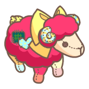

# Season 3

The 3rd season of lucky boxes will be available at April 22nd at 12 p.m. (UTC). Like before, there are only 6,315 available for purchase in the 3rd season. Lucky boxes contain a total of 7 different items, with sheep or other decor items being randomly included. The contents of each box guarantee 1 sheep of any rarity rating, as well as an additional 6 decoration items.

While it will be open to everyone, there will be a limited number of people who will be eligible to purchase boxes at a lower price compared to the rest of the general public. In order to facilitate the sale, participants will be divided into three groups, each of which will have access to a specific set of lucky boxes during the course of the sale. The 3 separate sets of lucky boxes will be available at different prices.

#### **Minting Groups:**

* VIP Pasture Owners: Users that own not less than 10 pastures
* Standard Pasture Owners: Users that own at least 1 pasture
* Public: Anyone interested in purchasing

#### **Sales Details:**

* VIP Boxes: 2,000 at 2.5 NGIT
* Standard Boxes: 2,000 at 3 NGIT
* Public Boxes: 2,315 at 3.5 NGIT
* Total: 6,315

VIP Pasture owners will have access to all sets of boxes at their respective prices, and public boxes can be purchased by both the VIP and standard owner groups!

A snapshot for pasture owners will be taken on 22-04-2022, 11:00 (UTC)

### Contents List




<table><thead><tr><th>Sheep</th><th data-type="select">Rarity</th><th align="center">Image</th></tr></thead><tbody><tr><td>Miss Chambermaid</td><td></td><td align="center"></td></tr><tr><td>Madame Mille-feuille</td><td></td><td align="center"></td></tr><tr><td>Carmine Ragdoll</td><td></td><td align="center"></td></tr><tr><td>Cerulean Ragdoll</td><td></td><td align="center"></td></tr><tr><td>Flamboyant Bonnebell</td><td></td><td align="center"></td></tr><tr><td>Rosette Bonnebell</td><td></td><td align="center"></td></tr><tr><td>Plain Mint</td><td></td><td align="center"></td></tr><tr><td>Plain White Tailored</td><td></td><td align="center"></td></tr><tr><td>Plain Black Tailored</td><td></td><td align="center"></td></tr><tr><td>Plain Orange Polka</td><td></td><td align="center"></td></tr><tr><td>Marshmallow Chantilly</td><td></td><td align="center"></td></tr><tr><td>Alabaster Hurricane</td><td></td><td align="center"></td></tr><tr><td>Miss Sommelier</td><td></td><td align="center"></td></tr><tr><td>Cotton Cloud Ragdoll</td><td></td><td align="center"></td></tr><tr><td>Hawthorn Bonnebell</td><td></td><td align="center"></td></tr><tr><td>Sunset Bonnebell</td><td></td><td align="center"></td></tr></tbody></table>




<table><thead><tr><th>Item</th><th data-type="select">Type</th></tr></thead><tbody><tr><td>Plain Sheep Photozone</td><td></td></tr><tr><td>Joyful Balloon Floaty</td><td></td></tr><tr><td>Strawberry Custard Fountain</td><td></td></tr><tr><td>Birch Plank Tile</td><td></td></tr><tr><td>Wooden Table</td><td></td></tr><tr><td>Vanilla Sorbet Tree - Large</td><td></td></tr><tr><td>Vanilla Sorbet Tree - Small</td><td></td></tr><tr><td>White Sign Post</td><td></td></tr><tr><td>Chocolate Rock Small</td><td></td></tr><tr><td>Tree Stump &#x26; Axe</td><td></td></tr><tr><td>White Daisy Fence</td><td></td></tr><tr><td>Plain Pastry Tile</td><td></td></tr><tr><td>Powdered Pastry Tile</td><td></td></tr><tr><td>Cream Pastry Tile</td><td></td></tr><tr><td>Strawberry Cream Tartlet</td><td></td></tr><tr><td>Strawberry Custard Tartlet</td><td></td></tr><tr><td>Hazelnut Cookie Cutter House</td><td></td></tr><tr><td>SStrawberry Custard Slice House</td><td></td></tr></tbody></table>



<table><thead><tr><th>Sheep</th><th data-type="select">Rarity</th><th align="center">Image</th></tr></thead><tbody><tr><td>Strawberry Gâteau</td><td></td><td align="center"></td></tr><tr><td>Crimson Moon Draconic</td><td></td><td align="center"></td></tr><tr><td>Vanilla Sugar-Cupid</td><td></td><td align="center"></td></tr><tr><td>Cocoa Sugar-Cupid</td><td></td><td align="center"></td></tr><tr><td>Pink Baa-jama Lamb</td><td></td><td align="center"></td></tr><tr><td>Peach Gummy Chantilly</td><td></td><td align="center"></td></tr><tr><td>Ember Hurricane</td><td></td><td align="center"></td></tr><tr><td>Camellia Hurricane</td><td></td><td align="center"></td></tr><tr><td>Autumn Rose Cherub</td><td></td><td align="center"></td></tr><tr><td>Bluebeard Yarn-Matey</td><td></td><td align="center"></td></tr><tr><td>Red Prince</td><td></td><td align="center"></td></tr><tr><td>Ruby Streaked Wildfire</td><td></td><td align="center"></td></tr><tr><td>Plain White</td><td></td><td align="center"></td></tr><tr><td>Plain Pink</td><td></td><td align="center"></td></tr><tr><td>Plain Red</td><td></td><td align="center"></td></tr><tr><td>Plain Green</td><td></td><td align="center"></td></tr><tr><td>Plain Cobalt</td><td></td><td align="center"></td></tr><tr><td>Plain Blush</td><td></td><td align="center"></td></tr><tr><td>Plain Melon</td><td></td><td align="center"></td></tr><tr><td>Plain Cherry</td><td></td><td align="center"></td></tr><tr><td>Plain Yellow</td><td></td><td align="center"></td></tr><tr><td>Plain Indigo</td><td></td><td align="center"></td></tr><tr><td>Plain blue</td><td></td><td align="center"></td></tr><tr><td>Plain Violet</td><td></td><td align="center"></td></tr><tr><td>Plain Orange</td><td></td><td align="center"></td></tr><tr><td>Plain Sage Stargazer</td><td></td><td align="center"></td></tr><tr><td>Plain Pink Sweetheart</td><td></td><td align="center"></td></tr><tr><td>Physical sheep</td><td></td><td align="center"></td></tr><tr><td>Lambosaurus</td><td></td><td align="center"></td></tr><tr><td>Scarlet Wildfire</td><td></td><td align="center"></td></tr><tr><td>Obsidian Wooligan</td><td></td><td align="center"></td></tr><tr><td>Magma Wooligan</td><td></td><td align="center"></td></tr></tbody></table>



