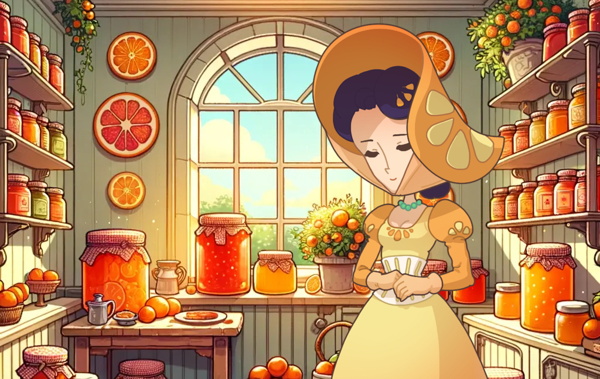
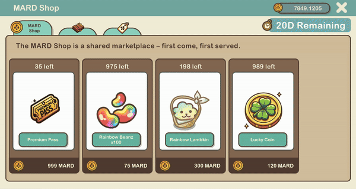
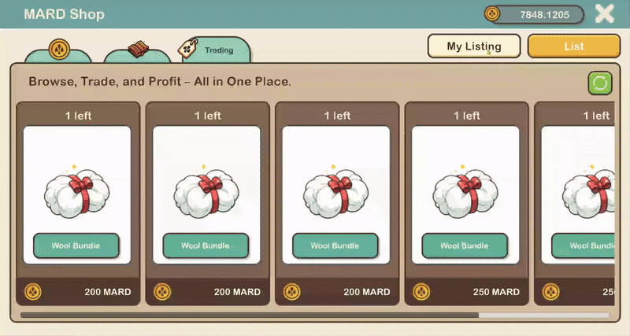

# MARD Shop

<figure><figcaption></figcaption></figure>

Nestled within the heart of the Marmalade Kingdom lies the MARD Shop, a treasure trove of opulence and extraordinary discoveries. This establishment is a testament to impeccable taste, where every item is carefully chosen to meet the highest standards of quality and uniqueness.

##

## **MARD Shop:**

<figure><figcaption></figcaption></figure>

The MARD Shop is a bustling **shared** marketplace where players strive to acquire one-of-a-kind treasures. Operating on a _first-come, first-serve_ basis, this lively marketplace infuses every visit with a sense of excitement. Lady Amberworth ensures that only the finest and most sophisticated items are available. Regularly checking back will lead to the discovery of exceptional items, ensuring each trip is an enjoyable adventure of unique finds.

## Crafting

<figure><figcaption></figcaption></figure>

At the MARD Shop, you'll encounter more than just a marketplace; it houses a crafting feature that empowers you to craft in-game items. Through resource gathering and the application of your crafting skills, you can manufacture items that elevate your in-game adventures on your sheep-raising odyssey.

Currently, a **limited** selection of craftable items includes a [<mark style="color:blue;">wool bundle</mark>](consumable-items.md), created by combining wool from [<mark style="color:blue;">NFT sheep</mark>](../web-3.0/playing-sheepfarm-with-nfts.md), and [<mark style="color:blue;">Minting Vouchers</mark>](consumable-items.md), which facilitate the transformation of regular sheep into [<mark style="color:blue;">NFT Sheep</mark>](../web-3.0/playing-sheepfarm-with-nfts.md).

Assisting you in your crafting endeavours is Deolize, a reclusive potions expert in the mystical realm of Meta-land. With extensive knowledge and centuries of experience, she is the ultimate resource for crafting assistance. Her magical brews and crafts are known for enhancing the abilities of the village's sheep, aiding them in their quest to become masters of sheep racing.

### Guide: How To Craft An Item

<figure><figcaption></figcaption></figure>

1. **Visit the MARD Shop**: Start by accessing the MARD Shop in the game. This can be found in the game's expandable menu.
2. **Navigate to Crafting**: Once you're in the MARD Shop, look for the crafting tab. This tab is where you'll find options for crafting various items within the game.
3. **Select Your Item**: From the available options in the crafting tab, select the specific item you want to craft.&#x20;
4. **Required Components**: After selecting the item you want to craft, you'll see a list of items required as fuel to power the crafting process.&#x20;
5. **Choose Manual or Auto Selection**: You have the option to manually select the required items from your inventory or click the "Auto" button. Choosing "Auto" will automatically fill in the necessary components for crafting your item based on what you have available.
6. **Start Crafting**: After confirming your selection, the crafting process will commence. Keep in mind that crafting an item involves a cost in MARD currency, which varies depending on the item you're crafting. Make sure you have enough MARD to cover the cost before starting the crafting process.
7. **Congratulations!**: Once the crafting process is complete, you've successfully crafted your desired item.

## **Trading**

<figure><figcaption></figcaption></figure>

This hub is your gateway to listing your items, exploring what others have available, and making purchases to enhance your gameplay. Listings, however, come with an expiration date, ensuring that the marketplace remains fresh and relevant.

Items available for sale are thoughtfully organized, with listings sorted by price for your convenience. This allows you to easily discover the best deals and valuable treasures that fit your budget. Whether you're looking to part ways with some of your in-game items or on a quest to find new ones, the _MARD Trading Hub_ is where it all happens.

### Guide: How To List an Item For Sale

<figure><figcaption></figcaption></figure>

1. **Visit the MARD Shop**: Start by accessing the MARD Shop within the game. You can find this in the game's expandable menu.
2. **Navigate to Trading**: Once you're in the MARD Shop, look for the trading hub tab. This tab is where you'll find options for trading various items within the game. Click on the trading hub tab to proceed.
3. **List Item**: Click on the "List" button located in the top right corner of the trading hub interface. This will initiate the process of listing an item for sale.
4. **Select Your Item**: After clicking "List", from the available options in your inventory, select the specific item you want to list for sale. This could be any item that you own and are willing to sell to other players in the game.
5. **Set Sale Details**: Once you've selected the item, choose the amount you want to sell and specify the price you want to sell it for. You'll also have the option to choose when you want your listing to expire, allowing you to control the duration of your item's availability on the market.
6. **View Profit**: As you set the selling details, you'll be able to see how much profit you will make from this sale. This will help you make informed decisions about pricing and listing your item.
7. **Confirm Listing**: Once you've set all the selling details and reviewed the potential profit, confirm your listing. This will finalize the process of listing your item for sale in the trading hub.
8. **Finalize Sale**: If your item sells, you'll receive the proceeds in your in-game currency. If your item doesn't sell and the listing expires, it will be returned to you. You can retrieve expired items from your post box, ensuring you don't lose any inventory.
9. **View Your Listings**: You can view your listings at any time by clicking on "My Listing" located in the top right corner of the trading hub interface. This allows you to keep track of the items you have listed for sale.
