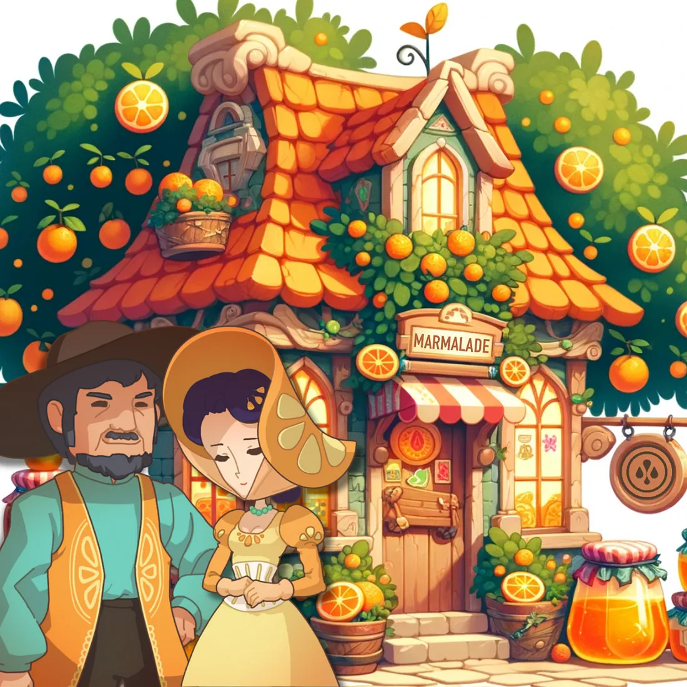

# MARD Shop

<figure><figcaption></figcaption></figure>

Nestled within the heart of the Marmalade Kingdom lies the MARD Shop, a treasure trove of opulence and extraordinary discoveries. This establishment is a testament to impeccable taste, where every item is carefully chosen to meet the highest standards of quality and uniqueness.

##

## **MARD Shop:**

<figure><figcaption></figcaption></figure>

The MARD Shop is a bustling **shared** marketplace where players strive to acquire one-of-a-kind treasures. Operating on a _first-come, first-serve_ basis, this lively marketplace infuses every visit with a sense of excitement. Regularly checking back will lead to the discovery of exceptional items, ensuring each trip is an enjoyable adventure of unique finds.

## Crafting

<figure><figcaption></figcaption></figure>

At the MARD Shop, you'll encounter more than just a marketplace; it houses a crafting feature that empowers you to craft in-game items. Through resource gathering and the application of your crafting skills, you can manufacture items that elevate your in-game adventures on your sheep-raising odyssey.

Currently, a **limited** selection of craftable items includes a[ <mark style="color:blue;">wool bundle</mark>](broken-reference), created by combining wool from [<mark style="color:blue;">NFT sheep</mark>](../web-3.0/playing-sheepfarm-with-nfts.md), and [<mark style="color:blue;">Minting Vouchers</mark>](broken-reference), which facilitate the transformation of regular sheep into [<mark style="color:blue;">NFT Sheep</mark>](../web-3.0/playing-sheepfarm-with-nfts.md).

Assisting you in your crafting endeavours is Deolize, a reclusive potions expert in the mystical realm of Meta-land. With extensive knowledge and centuries of experience, she is the ultimate resource for crafting assistance. Her magical brews and crafts are known for enhancing the abilities of the village's sheep, aiding them in their quest to become masters of sheep racing.

### Guide: How To Craft An Item

<figure><figcaption></figcaption></figure>

1. Visit the MARD Shop and navigate to the crafting tab.
2. Select the specific item you want to craft from the available options.
3. You will then see a list of items required as fuel to power the crafting process.
4. You have the option to manually select the required items or click the "Auto" button, which will automatically fill in the necessary components for crafting your item.
5. Once you've confirmed your selection, the crafting process will commence.
6. Keep in mind that crafting an item involves a cost in MARD, which varies depending on the item you're crafting.
7. Congratulations! You've successfully crafted your desired item.

## **Trading**

<figure><figcaption></figcaption></figure>

This hub is your gateway to listing your items, exploring what others have available, and making purchases to enhance your gameplay. Listings, however, come with an expiration date, ensuring that the marketplace remains fresh and relevant.

Items available for sale are thoughtfully organized, with listings sorted by price for your convenience. This allows you to easily discover the best deals and valuable treasures that fit your budget. Whether you're looking to part ways with some of your in-game items or on a quest to find new ones, the _MARD Trading Hub_ is where it all happens.

### Guide: How To List an Item For Trading

_Coming Soon..._

### Guide: How To Purchase An Item

_Coming Soon..._
