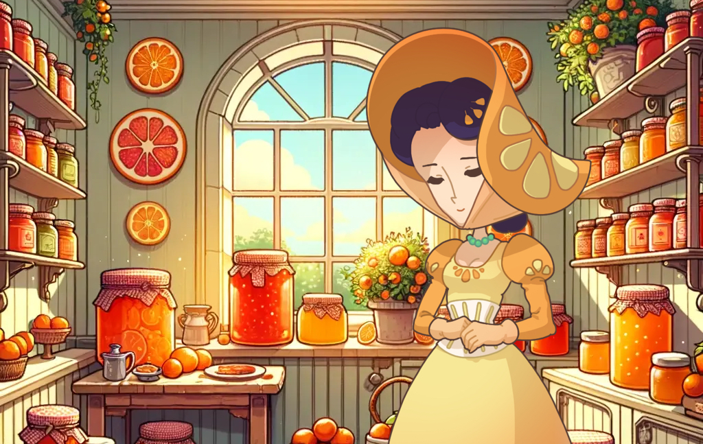
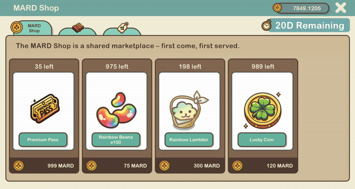
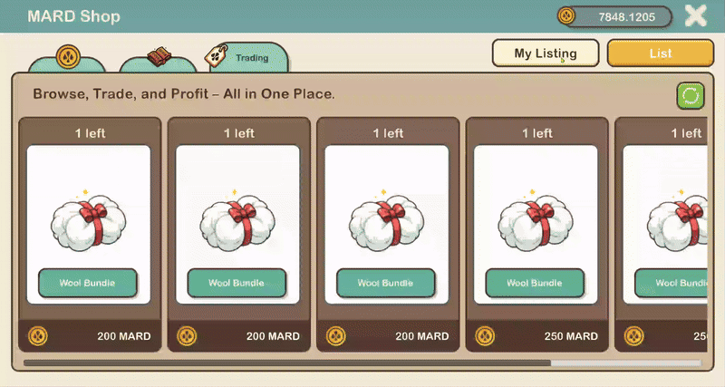

# MARD Shop

<figure><figcaption>
MARD Shop - A Gateway to Luxury and Unique Finds
</figcaption></figure>

Nestled in the heart of the Marmalade Kingdom, the MARD Shop is a haven of luxury and rare finds. Each item in the shop is meticulously selected for its quality and uniqueness, making it the perfect destination for those with impeccable taste. A one-of-a-kind shopping experience for those who appreciate the finer things.&#x20;

##  **MARDket**

<figure><figcaption></figcaption></figure>

The <mark style="color:orange;">**MARDket**</mark> is a bustling _**shared**_ marketplace where players race to acquire rare and unique treasures. With a first-come, first-served system, each visit brings a sense of excitement and urgency. Overseen by Lady Amberworth, only the finest, most sophisticated items make it to the shelves. Frequent visits will reward you with exceptional finds, turning every trip into a new adventure filled with rare discoveries.

##  Crafting

<figure><figcaption>
Deolize, mysterious potions expert
</figcaption></figure>

The MARD Shop isn’t just your average marketplace—it’s where you can flex your crafting skills and create game-changing items. By gathering the right resources and putting them to good use, you’ll be able to craft everything you need to keep your sheep-raising journey on track.

Currently, the selection of craftable items includes  [wool bundles](consumable-items.md)—made from combining wool of your [NFT sheep](../web-3.0/playing-sheepfarm-with-nfts.md)—and [Minting Vouchers](consumable-items.md), the key to turning your regular sheep into NFT champions.

And who’s there to help you in your crafting quest? None other than _Deolize_, the village’s mysterious potions expert. She may be a bit of a recluse, but with centuries of magical brewing under her belt, she’s the ultimate crafting partner. Her concoctions not only boost your sheep’s abilities but can also give them that extra edge on the racetrack.

### Guide: How To Craft An Item

<figure><figcaption></figcaption></figure>

1. **Visit the MARD Shop**: Start by opening the <mark style="color:orange;">**MARD Shop**</mark> from the game's expandable menu. It’s your one-stop shop for all things crafting and shopping.
2. **Navigate to Crafting**: Once inside, head to the crafting tab—this is where all the crafting magic happens.
3. **Select Your Item**: From the options available, pick the item you want to craft. Whether it’s wool bundles or something fancier, the choice is yours.
4. **Required Components**: After choosing your item, you’ll see a list of ingredients—your crafting fuel. These are the resources you’ll need to make it happen.
5. **Choose Manual / Auto Selection**: You can either manually select the required components or hit the trusty "Auto" button to let the game fill in the blanks for you.&#x20;
6. **Start Crafting**: Confirm your selection, and the crafting process will begin. Just make sure you have enough MARD currency to cover the crafting cost—different items come with different price tags.
7. **Congratulations!**: Once crafting is complete, you’ll have your shiny new item ready to use. Time to put it to good use on your farm!

##  **Trading**

<figure><figcaption></figcaption></figure>

The Trading Hub is your go-to spot for listing items, browsing what others have to offer, and grabbing those must-have treasures to boost your game. But don’t wait too long—listings come with an expiration date to keep the marketplace fresh and buzzing with activity.

Items for sale are neatly organized, with listings sorted by price to make deal-hunting a breeze. Whether you’re ready to part ways with some items or hunting for new ones, the _MARD Trading Hub_ is where the action unfolds.

### Guide: How To List an Item For Sale

<figure><figcaption></figcaption></figure>

1. **Visit the MARD Shop**: Start by accessing the <mark style="color:orange;">**MARD Shop**</mark> through the game's expandable menu. It’s where all the trading begins.
2. **Navigate to Trading**: Once inside the MARD Shop, head to the trading hub tab. This is your gateway to buying, selling, and browsing the marketplace.&#x20;
3. **List Item**: Ready to sell? Click the "List" button in the top right corner of the trading hub. This kicks off the process of listing your item for sale.
4. **Select Your Item**: Choose the item you want to part with from your inventory. It can be anything you own that you’re willing to sell to other players.
5. **Set Sale Details**: Now, set the quantity and price for your item. You can even decide how long your listing stays active by choosing an expiration date.
6. **View Profit**: As you enter your sale details, you’ll see a handy preview of your potential profit. This helps you make smart pricing choices for maximum returns.
7. **Confirm Listing**: Happy with your listing? Hit "Confirm" to finalize it, and your item will officially be up for sale in the trading hub.
8. **Finalize Sale**: If your item sells, the earnings will arrive in your post box, ready for you to collect. If the listing expires without a sale, your item will be returned safely to your post box—no inventory lost!
9. **View Your Listings**: Want to check what you’ve got listed? Just click "My Listings" in the top right corner of the trading hub to keep an eye on your items.

