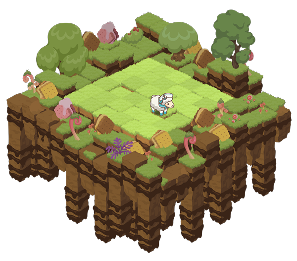

# Pastures

Sheep farmers start off by owning virtual pastures based on real-world environments and at least one pasture is needed for gameplay. Players can raise sheep and use various items to decorate their pastures.

Your efforts will have a direct impact on the overall prosperity of your pasture. A well-managed farm will be profitable in the long run and will have the potential to generate a consistent stream of income.

### Location

We've chosen New Zealand as the location for our first Meta-land. Sheep farming is an agricultural staple in New Zealand and has played a huge part in the country's economy. All of New Zealand's regions will be open to players in the future, starting with Stewart Island in the southernmost region.

.png>)

Each pasture contains information regarding its exact location. The location data is displayed in the form of letters A, B, and C. The letter 'A' denotes the location of the pasture, and in this example, Stewart Island corresponds to the number zero (0). The letters 'B' and 'C' represent the island's horizontal and vertical orientations. Players can find their pastures by using [the Inventory menu](https://sheepfarm.io/inventory).

.png>)

### Capacity

Pastures are classified into three groups based on their size (see the table below). Size refers to the number of tile units in the pasture, while capacity indicates the maximum number of sheep that can be accommodated.

<table><thead><tr><th>Type</th><th>Size</th><th data-type="number">Capacity</th></tr></thead><tbody><tr><td>Small</td><td>5x5</td><td>3</td></tr><tr><td>Medium</td><td>6x6</td><td>4</td></tr><tr><td>Large</td><td>7x7</td><td>5</td></tr></tbody></table>

.png>)

The capacity for sheep and decoration items increases in direct proportion to the size of the pasture. Being able to combine larger groups of compatible sheep will be beneficial because it will enable the activation of powerful combo effects.

Placing decorations on a small pasture can only benefit up to three sheep; whereas placing decorations on a large pasture will benefit up to five sheep. If you have a unique decoration item, it may be more beneficial to place it on a large pasture rather than a small pasture in order to boost the overall efficiency of that item.

