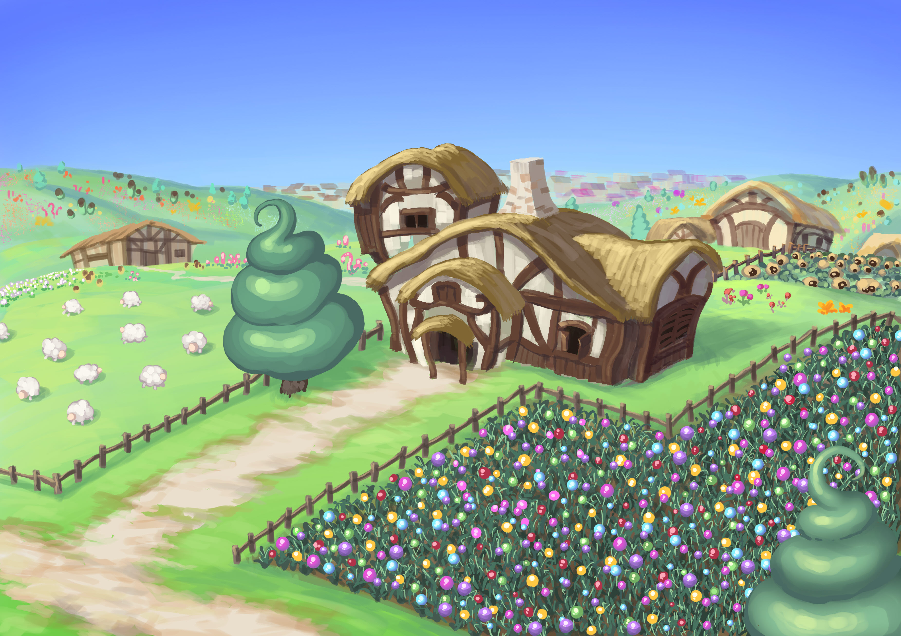

# How to Play

The game requires users to have a Kaikas, KLIP, or Metamask wallet to connect to the Klaytn blockchain. Sheepfarm in Meta-land is a browser-based game, so all you need to get started is a compatible browser and a supported wallet. In order to join the game, players must own at least one pasture and one sheep.

During the pre-sale period in January 2022, a total of 6,315 pastures were sold out. Pastures and sheep are still available for purchase on Opensea if you haven't acquired any yet. Purchasing lucky boxes would also prove useful if you want to start collecting sheep.

