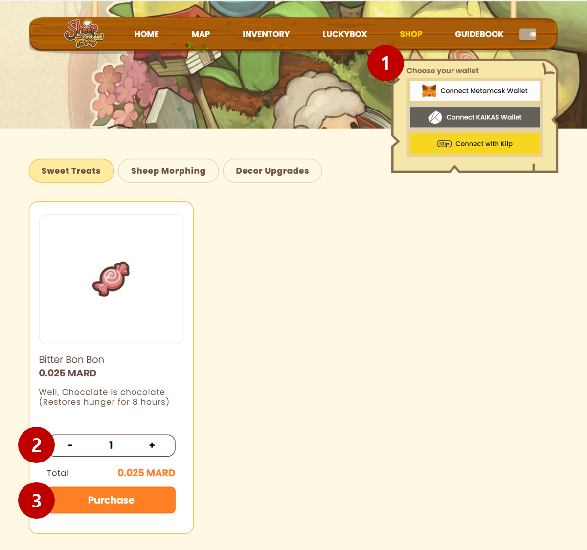

# Feeding

Sheep require sweet treats on a regular basis in order to be happy and produce wool.

### Purchasing Treats

* Sweet treats are available for purchase on our [website](https://sheepfarm.io).

* The treats you purchased can immediately be found in Meta-land.

### Feeding Sheep

* You can individually feed treats to each of your sheep when they are hungry.

### Auto-feeding

* On some pastures, auto-feeding is available. If the auto-feeding function is enabled, the sheep will consume a new sweet treat anytime their hunger level falls below 50%.
* This function can be individually regulated for each sheep.&#x20;

