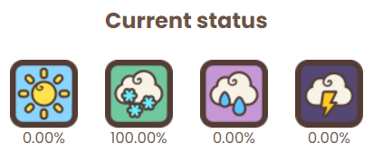

# Sheep Racing

<figure><figcaption></figcaption></figure>

Experience sheep competitions like never before, hosted by the charming Micayla. As the most famous singer from the Marmalade Kingdom, Micayla brings her exceptional talent to the role of announcer, providing lively commentary and entertainment for the audience.

Whether you're an ambitious [<mark style="color:blue;">bettor</mark>](betting-on-sheep-races.md) or just curious, this place has something for everyone. Here, you can bet on sheep or even enroll your own fluffy athletes by placing them in the [Racing Barn](../racing-barn.md). These sheep automatically compete in races, and if they perform well, you can earn [<mark style="color:blue;">Seasonal Beanz</mark> ](../currency.md)or [<mark style="color:blue;">MARD</mark>.](../currency.md)

You also have a say in race dynamics. You can cast your [<mark style="color:blue;">vote for the weather</mark>](https://app.gitbook.com/o/tXSKWduEctYxhdLiAwNA/s/yQKSV2lZmE3mGWQ30WzA/\~/changes/841/web-3.0/sheepfarm-dao) conditions that will prevail during the races, adding an enjoyable strategic aspect to the competitions. Whether you prefer sunny skies or a touch of rain for added tension, your choices matter.

If betting or raising sheep isn't your thing, don’t worry. Sheep Racing is also a fantastic spot to just soak up the atmosphere by simply kicking back and watch the action from the sidelines. Everyone is welcome to enjoy the races.

##

## In Race Mechanics

### Interface

<figure><figcaption></figcaption></figure>

* **Position Bar (Top Left Corner):** This bar shows the current placement of the sheep in the race and how close they are to the finish line. It helps you track the progress of the competing sheep.
* **Weather and Weather Buff (Top):** At the top of the screen, you can check the current weather condition and the corresponding buff it bestows upon the sheep. This weather buff can have a significant impact on the race's outcome.
* **Status Effects Display (Left Side):** This area on the left side of the screen shows any status effects that are currently affecting the sheep in the race. It provides important information about their conditions and any active effects.
* **Bottom Tray (Bottom Right Corner):**
  * **Fast Forward Button:** This button allows you to speed up the race, advancing in time to get results more quickly.
  * **Camera Button:** You can use this button to switch between different sheep and follow them on the screen. It displays the selected sheep's position and pace.
  * **Gear Button:** By clicking on the gear button, you can adjust the audio settings to your preference.

These elements help you monitor the race, control the pace, and stay informed about the sheep's statuses and positions for a more interactive experience.

### Status Effects

<figure><figcaption></figcaption></figure>

Status effects are dynamic conditions that can influence a sheep's performance during a race. These effects come in varying durations and can either be advantageous or detrimental to your sheep's abilities and attributes.

These effects can be triggered by multiple factors, ranging from the race environment to specific abilities, and they play a pivotal role in shaping the outcome of a race. Understanding and managing these effects is key to gaining an edge in sheep racing.

**Examples of common status effects include:**

**Uphill:** When racing uphill, your sheep's speed decreases by 20%. It becomes harder for them to maintain their usual pace due to the incline of the track.

**Downhill:** Going downhill provides a 20% speed boost to your sheep. The slope helps them pick up speed and move faster than usual.

**Ice Lane:** When your sheep races on an icy lane, they experience a 10% speed reduction, making it slippery and challenging to run. Additionally, they endure a 12% faster health decline due to the icy conditions.

**Slipstream:** Sheep racing in a slipstream enjoy a 30% reduced rate of health decline. This effect makes it easier for them to maintain their health throughout the race.

**Puddle (Coming Soon):** While this effect is not yet active, it will cause a 30% decrease in speed when your sheep encounters puddles on the track. Puddles will slow them down significantly when introduced.

### Health Bar

<figure><figcaption></figcaption></figure>

Keep tabs on a sheep's well-being during a race with the Health Bar, conveniently located on the left side of the screen. Sheep, especially when pushed to their physical limits, will gradually lose health and energy as they sprint. When a sheep's health diminishes, it will struggle to maintain top speed and utilize its Dash-time effectively.

### Stumbling

<figure><figcaption></figcaption></figure>

Occasionally, during a race, random stumbling events can occur. When a sheep stumbles, its speed temporarily decreases. The likelihood of stumbling is influenced by the sheep's Balance and Spirit stats. The faster a sheep runs, the higher the chance of it becoming disoriented and stumbling. A higher Balance stat enhances a sheep's ability to stay on its feet and avoid these mishaps.

### Dash-time

<figure><figcaption></figcaption></figure>

You can determine when a sheep reaches its maximum speed, referred to as Dash-time. This happens when a sheep believes it's the ideal moment to give it their all. However, during the dash, a sheep will experience a significant decrease in stamina reserves. Dash-time automatically ends when a sheep depletes its stamina.

### Overtaking

<figure><figcaption></figcaption></figure>

A sheep with a high Power stat has a better shot at overtaking competitors in front of it. This allows the sheep to move more swiftly and even nudge its way past others. Keep in mind that the likelihood of overtaking may also be influenced by various factors, including the behaviour of the other sheep in the race.

## Weather

<figure><figcaption></figcaption></figure>

During a sheep race, the weather plays a crucial role in determining the race's outcome. The skills of the sheep can be influenced by various weather conditions, resulting in different advantages:

**Weather Effects:**

* **Sunny:** Speed increases by 10%.
* **Rainy:** Stamina and Balance both receive a 10% boost.
* **Snowy:** A 10% increase in both Power and Spirit.
* **Stormy:** Grants a 6% increase to all stats.

Understanding these weather effects can help you make informed betting decisions in betting.

