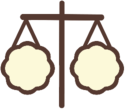
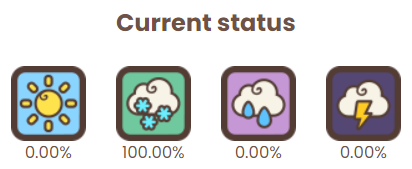
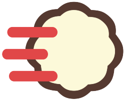

# Sheep Racing

<figure><figcaption>
Sheep Racing
</figcaption></figure>

Experience sheep racing at its best, hosted by the charming Micayla. As the most famous singer from the Marmalade Kingdom, Micayla brings her lively personality and vocal talents to the role of announcer, making each race a little more exciting.

Whether you're an ambitious [<mark style="color:blue;">bettor</mark>](betting-on-sheep-races.md) or just curious, this place has something for everyone. Here, you can bet on sheep or even enroll your own fluffy athletes by placing them in the [Racing Barn](../racing-barn.md). These sheep automatically compete in races, and if they perform well, you can earn [<mark style="color:blue;">Seasonal Beanz</mark> ](../currency.md)or  [<mark style="color:blue;">MARD</mark>.](../currency.md)&#x20;

Keeping tabs on your sheep’s stats is easy. Head to the website’s racing menu and check the **Statistics** tab for details like race earnings and total races entered or won. All players' sheep are shown by default, but you can focus on your own by using the **“my sheep”** filter if your wallet is connected. Not connected? No worries—you can still search using your sheep’s unique token ID. Just remember, sheep will only appear in the **Statistics** menu after participating in at least one _Beanz Race_ or _Ticket Race_. Arena Races are tracked separately.

You also have a say in race dynamics. You can cast your  [<mark style="color:blue;">vote for the weather</mark>](https://app.gitbook.com/o/tXSKWduEctYxhdLiAwNA/s/yQKSV2lZmE3mGWQ30WzA/\~/changes/841/web-3.0/sheepfarm-dao) conditions that will prevail during the races, adding an strategic aspect to the competitions.&#x20;

Even if you’re not racing or betting, Sheep Racing is a great place to sit back, watch the action, and soak up the atmosphere. There's always something going on!

##  In Race Mechanics

Understanding the race interface is key to keeping track of the action and making the most of your experience. Here’s a breakdown of the important elements you’ll want to keep an eye on:

<figure><figcaption>
Race Interface 
</figcaption></figure>

###  Interface

* **Position Bar (Top Left Corner):** This bar shows the current placement of the sheep in the race and how close they are to the finish line. It helps you track the progress of the competing sheep.
* **Weather and Weather Buff (Top):** At the top of the screen, you can check the current weather condition and the corresponding buff it bestows upon the sheep. This weather buff can have a significant impact on the race's outcome.
* **Status Effects Display (Left Side):** This area on the left side of the screen shows any [status effects](./#status-effects) that are currently affecting the sheep in the race. It provides important information about their conditions and any active effects.
*   **Bottom Tray (Bottom Right Corner):**

    *  **Fast Forward Button**: Want to skip ahead? The fast forward button lets you speed up the race to see the results more quickly.
    *  **Camera Button**: Switch between different sheep by using the camera button. It helps you follow specific sheep, showing their current position and pace in the race.
    *  **Gear Button**: Need to adjust the audio settings? Just click the gear button to make changes to suit your preferences.

    These tools keep you in control and informed, helping you follow the race action, manage the pace, and track your sheep’s performance for a more interactive and enjoyable experience.

###  Status Effects

<table><thead><tr><th width="193" align="center">Icon</th><th align="center">Name</th><th align="center">Effect</th></tr></thead><tbody><tr><td align="center"></td><td align="center"><strong>Uphill</strong></td><td align="center">-20% speed</td></tr><tr><td align="center"></td><td align="center"><strong>Downhill</strong></td><td align="center">+20% speed</td></tr><tr><td align="center"></td><td align="center"><strong>Ice Lane</strong></td><td align="center">-10% speed +12% health decline</td></tr><tr><td align="center"></td><td align="center"><strong>Slipstream</strong></td><td align="center">-30% health decline</td></tr><tr><td align="center"></td><td align="center"><strong>Mud Puddle</strong></td><td align="center">-70% speed</td></tr><tr><td align="center"></td><td align="center"><strong>Water Puddle</strong> <em><mark style="color:green;">(Coming Soon)</mark></em></td><td align="center">-25% speed -5% health decline</td></tr></tbody></table>

During races, your sheep will face various conditions that impact their performance. Here are some of the most common status effects to watch out for:

* **Uphill**: Racing uphill causes your sheep’s speed to drop by 20%. The incline makes it harder to maintain their usual pace, so expect a bit of a slowdown.
* **Downhill**: Going downhill gives your sheep a 20% speed boost. The slope works in their favor, helping them pick up speed and move faster than normal.
* **Ice Lane**: Racing on an icy lane slows your sheep’s speed by 10%. The slick surface makes it tricky to run, and they’ll experience a 12% faster health decline due to the cold conditions.
* **Slipstream**: In the slipstream, your sheep benefit from a 30% reduced rate of health decline. This helps them maintain their health and stay in good shape for longer stretches of the race.
* **Water Puddle (Coming Soon)**: When your sheep hits a water puddle, their speed decreases by 25%. While the splash slows them down, it also provides a slight cooling effect, reducing their health decline by 5%.
* **Mud Puddle**: Encountering a mud puddle slows your sheep by a massive 70%. The thick, sticky mud makes it tough to move quickly, turning the race into a real challenge.

###  Health Bar

<figure><figcaption></figcaption></figure>

Keep an eye on your sheep’s well-being during the race with the Health Bar, conveniently located on the left side of the screen. As your sheep push their limits, they’ll gradually lose health and energy. Once their health dips, they’ll struggle to keep up their top speed and make the most of their  [Dash-time.](./#dash-time)

###  Stumbling

<figure><figcaption></figcaption></figure>

Every so often, a sheep might stumble during a race, causing a brief drop in speed. The likelihood of stumbling is tied to their  **Balance** and  **Spirit** stats. The faster they run, the more likely they are to lose their footing. A higher Balance stat gives your sheep a better shot at staying on their feet and avoiding these mishaps.

###  Dash-time

<figure><figcaption></figcaption></figure>

When a sheep hits its maximum speed—known as  **Dash-time**—it’s going all out. But Dash-time comes with a cost: it drains stamina quickly. The Dash-time ends automatically when a sheep’s stamina runs out, so it’s a burst of speed with a trade-off.

###  Overtaking

<figure><figcaption></figcaption></figure>

Sheep with a high  **Power** stat have a better chance of overtaking those ahead of them. They’ll be able to move faster and may even nudge past their competitors. Other factors, like the behavior of the other sheep, can also affect the likelihood of overtaking.

##  Weather

Weather plays a big role in how races unfold. Each type of weather affects the sheep’s skills in different ways:

<figure><figcaption></figcaption></figure>

* **Sunny**:  Speed increases by 10%.
* **Rainy**:  Stamina and  Balance both get a 10% boost.
* **Snowy**:  Power and  Spirit increase by 10%.
* **Stormy**: _All stats_ get a 6% increase.

Understanding these weather effects can help you plan your strategy and make smarter bets in the races.

