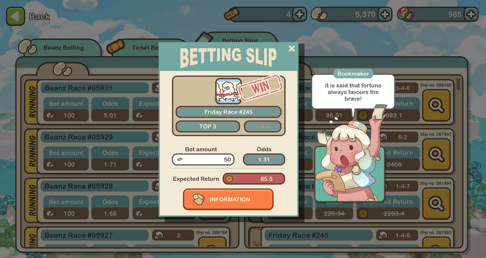
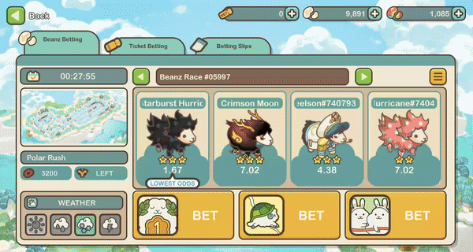

# Betting On Sheep Races

<figure><figcaption></figcaption></figure>

Ready to try your luck and test your instincts? Within Sheep Racing, Betting serves as the gateway to a deeper engagement with the races. Whether you're an experienced bettor or new to the concept, this section allows you to participate actively in the races.

##

## Practice Runs

Before the actual race, you have the option to watch a practice run, providing valuable insights into what to expect. For a single [Scope](../consumable-items.md), you can access this feature and view demo versions of races. Utilize this opportunity to familiarize yourself with the tracks, refine your skills, and adapt strategies to improve your racing proficiency.

The odds for each individual sheep are also factored into practice runs, taking into account their attributes and the prevailing weather conditions. However, it's important to keep in mind that the results of the real event may differ from those of the simulation.

## Odds

The concept of odds is essential in Sheep Racing, and it's important to understand how they work.

<figure><figcaption></figcaption></figure>

**Initial Odds:** Initial Odds represent the game's default setting and serve as the starting point for the race. These opening odds are calculated based on what the bookmaker predicts will happen, drawing from approximately 50 Practice Runs. As such, they offer a reliable initial reference point for the race.

**Changing Odds:** As more players place their bets, the dynamics of the book change. Consequently, the bookmaker must adjust the odds to reflect the evolving betting patterns. You can track these changes by toggling the "Current Odds" indicator, which provides real-time updates on the odds for each contender in the race.

## Placing Bets

In Sheep Racing, there are two exciting ways to try your luck and potentially earn valuable rewards:

### Beanz Betting

<figure><figcaption></figcaption></figure>

Beanz Betting lets you put your[ <mark style="color:blue;">Seasonal Beanz</mark>](../currency.md) on the line, offering a chance to grow your Beanz stash. It's a fun way to engage in the races and reap rewards based on your predictions. Beanz Betting is a lively and accessible option, perfect for active participation in the races. Keep in mind that there's a betting limit – you can wager a maximum of 100 Seasonal Beanz on a single race. So, choose your bets wisely!

### Ticket Betting&#x20;

<figure><figcaption></figcaption></figure>

Ticket Betting uses specialized betting tickets as your currency for wagers. By using these tickets, you can potentially win [<mark style="color:blue;">MARD tokens</mark>](../currency.md), elevating the excitement of your betting strategy. It's important to know that Ticket Races are less common than Beanz Races, but they come with more substantial rewards, making them a top choice for those aiming to maximize their winnings. There's no betting limit on Ticket Races, as long as you have enough tickets to place your bets!

### Guide: Buying Tickets

To participate in ticket betting, you'll need to purchase tickets, and it's a straightforward process on the <mark style="color:blue;">Klaytn Network</mark>:

<figure><figcaption></figcaption></figure>

1. **Initiate Purchase**: Start by clicking the + button next to your current ticket balance.&#x20;
2. **Input Number**: Once you've initiated the purchase procedure, you'll be prompted to input the number of tickets you wish to buy. Each ticket is priced at just 1 MARD, so simply enter the desired quantity of tickets you want to purchase.
3. **Confirm Purchase**: After inputting the number of tickets, confirm your purchase to finalize the transaction.
4. **Complete Transaction**: Once you've acquired the tickets, you're ready to proceed with placing your bet.&#x20;
5. **Alternative:** If you attempt to place a bet without any tickets in your possession, the system will automatically prompt you to acquire tickets before proceeding. Follow the prompts to purchase the necessary tickets using your in-game MARD currency.

### Guide: Placing a Bet

1. **Explore Upcoming Races:** Start by accessing the Betting section of either Ticket Betting or Beanz Betting. Here, you'll find a list of upcoming races with details like race titles, start times, participating sheep, and various betting options.
2. **Check the Countdown Timer:** Each race comes with a countdown timer, displaying the time remaining until it begins. You can place your bets right up to the start of the race.
3. **Place Your Bets:** When you're ready to bet, click the 'Bet' button. Inside, you'll discover essential race information, including sheep attributes, track maps, race distance, and the running direction. Even weather conditions can affect the outcome.
4. **Review and Confirm:** After making your selections, confirm your bets. Any previously placed bets will be clearly marked for your reference.
5. **Monitor Your Bets:** Keep track of your bets conveniently as they are neatly listed.
6. **Watch the Race:** Once the race concludes, use the replay button to revisit the event. This feature provides a comprehensive race analysis for those interested in a deeper understanding of the race's dynamics.

## Cashing-out Winnings

<figure><figcaption></figcaption></figure>

You have two convenient options for cashing out your winnings in Sheep Racing.

1. **Within Race Information:** If you've secured any winnings during a race, you can easily cash out directly from the race information screen. Simply follow the steps to claim your rewards effortlessly.
2. **Betting Slips Tab:** Alternatively, you can access comprehensive information about all your bets and winnings by navigating to the _Betting Slips_ tab. Here, you'll find an informative overview of your betting history. When you're ready to cash out, simply locate the "Cash Out" button and proceed with the process.
