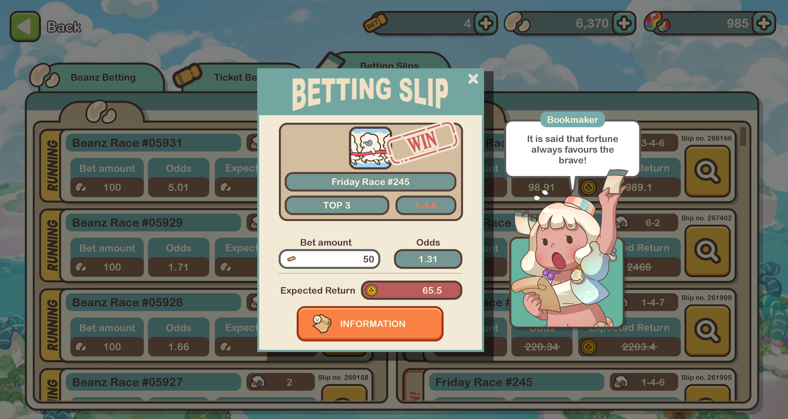
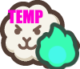
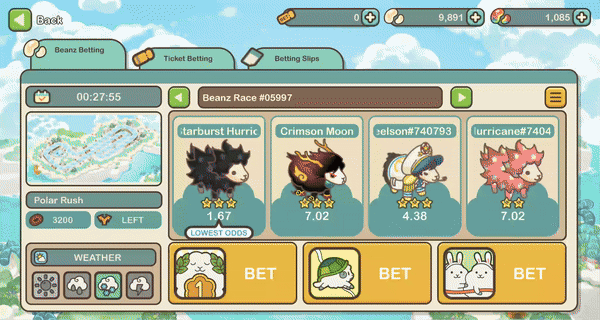

# Betting On Sheep Races

<figure><figcaption>
Betting On Races
</figcaption></figure>

Confident in your picks, or just feeling adventurous? Betting in Sheep Racing cranks up the excitement and pulls you deeper into the action. From seasoned bettors to curious newcomers, there’s something for everyone to enjoy and plenty of chances to win big!

##  Practice Runs

Before the actual race, you can watch a _Practice Run_ for just one  [**Scope**](../consumable-items.md). This feature lets you preview races and gain valuable insights. It’s a great way to familiarize yourself with the tracks and refine your strategies. Keep in mind that while practice runs offer a glimpse, the real race can still surprise you!

##  Odds

Understanding the odds is key to betting in Sheep Racing:

<figure><figcaption>
Racing Odds
</figcaption></figure>

* **Initial Odds**: These represent the starting point for the race, based on predictions from around 50 Practice Runs. They’re a reliable indicator of what the bookmaker expects.
* **Changing Odds**: As more players place bets, the odds shift. You can track these changes by toggling the **“Current Odds”** indicator to get real-time updates.

##  Placing Bets

In Sheep Racing, there are two exciting ways to try your luck and potentially earn valuable rewards:

###  Beanz Betting

<figure><figcaption></figcaption></figure>

Beanz Betting lets you put your [ <mark style="color:blue;">Seasonal Beanz</mark>](../currency.md) on the line, offering a chance to grow your Beanz stash. It's a fun way to engage in the races and reap rewards based on your predictions. Beanz Betting is a lively and accessible option, perfect for active participation in the races. Keep in mind that there's a betting limit – you can wager a **maximum of 100 Seasonal Beanz** on a single race. So, choose your bets wisely!&#x20;

###  Ticket Betting&#x20;

<figure><figcaption></figcaption></figure>

Use special betting tickets for a shot at winning  [<mark style="color:blue;">MARD tokens</mark>](../currency.md)<mark style="color:blue;">.</mark> While Ticket Races are less frequent than Beanz Races, the rewards are much higher. There’s no limit on how many tickets you can wager—just make sure you have enough tickets to place your bets.

### Guide: Buying Tickets

Here’s how to purchase tickets using MARD:

<figure><figcaption>
Purchasing Betting Tickets
</figcaption></figure>

1. **Initiate Purchase**: Click the + button next to your current ticket balance.
2. **Input Number**: Enter how many tickets you want to buy (each ticket costs 1 MARD).
3. **Confirm Purchase**: Review and confirm your purchase.
4. **Complete Transaction**: After acquiring your tickets, you’re ready to bet! If you try placing a bet without tickets, the system will prompt you to buy some before continuing.

### Guide: Placing a Bet

1. **Explore Upcoming Races**: In either Beanz or Ticket Betting, view the list of upcoming races with details like start times, track maps, and betting options.
2. **Check the Countdown Timer**: Each race has a countdown timer showing how long you have until the race starts.
3. **Place Your Bets**: Click the **Bet** button to view important details like sheep stats, race distance, and weather conditions. Make your selections and confirm.
4. **Monitor Your Bets**: Keep an eye on your bets—they’ll be listed for easy tracking.
5. **Watch the Race**: Once the race ends, use the replay feature to review the action and analyze the race dynamics.

##  Cashing-out Winnings

<figure><figcaption></figcaption></figure>

You’ve got two options for cashing out:

* **Race Information**: After a race, if you’ve won, you can cash out directly from the race information screen.
* **Betting Slips Tab**: Alternatively, head to the **Betting Slips** tab to see a full overview of your bets and winnings. Just hit **Cash Out** when you’re ready to claim your rewards.

