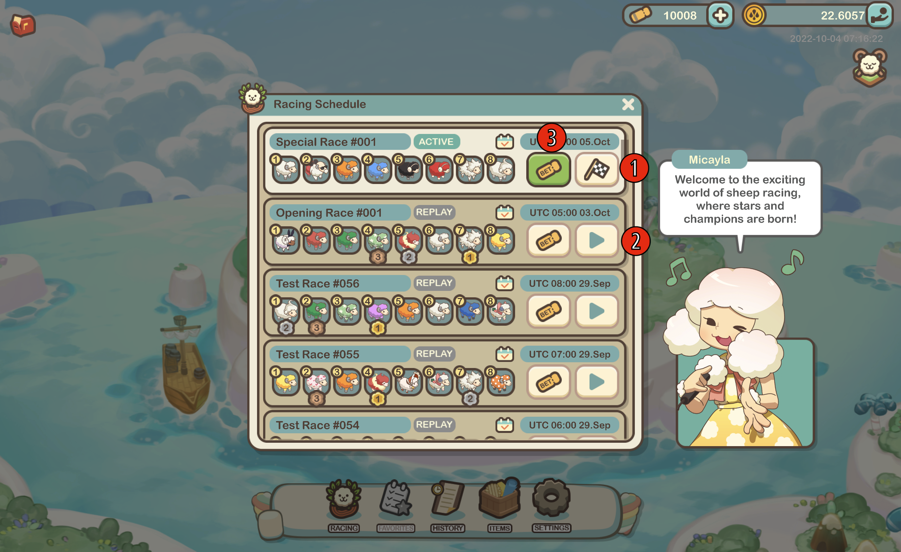

# Racing

### Schedule

The Racing Schedule contains a list of all available races, including their titles, start times, live statuses, and the sheep that will be competing in them.

<figure><figcaption></figcaption></figure>

1. A checkered flag indicates that the race has not yet started but that betting is already open.
2. Once a race has ended, you can watch it again by selecting the _replay_ button.
3. Selecting the Bet button will give you access to more specific information about a particular race, including the option to place bets on that event.

### Race Information

The attributes of the sheep that will be competing are detailed on the information page for the race, along with a map of the track, its distance, and the direction in which competitors will proceed.

<figure><figcaption></figcaption></figure>

1. The performance of the sheep participating in a race is impacted by the weather during the event and can be voted for using our DAO service.
2. You can get simulated race results that give you an idea of what the outcome might be.
3. You also have the option of choosing from a variety of different bet types down below.

