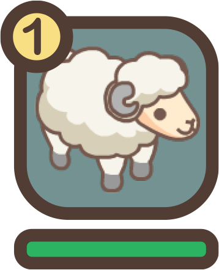

# In-Race Mechanics

### Interface

<figure><figcaption></figcaption></figure>

1. A position bar that depicts the placement of sheep and their proximity to the finish line is displayed in the top left corner of the screen.
2. The bottom tray contains a fast forward button that allows you to advance in time. It also includes a camera button that enables you to toggle between sheep and follow them on screen. This will display their position as well as their pace. Additionally, you can modify the audio settings by clicking on the gear button.

### Status Effects

Status effects are conditions that can affect the abilities or attributes of a sheep in a race. These effects can be temporary or permanent, and can be positive or negative.

Status effects can be activated by various factors, including the environment or certain abilities and can have a significant impact on gameplay, as they can either be an advantage or disadvantage for any sheep participating in a race.

Examples of common status effects include:

|   Name   |                   Effect                  |
| :------: | :---------------------------------------: |
|  Uphill  |                 -20% speed                |
| Downhill |                 +20% speed                |
| Ice Lane | 
-20% speed  +20% health decline
 |
|  Puddle  |                 -30% speed                |

### Health Bar

<figure><figcaption></figcaption></figure>

You can monitor sheep's current health during a race by looking at their Health Bar, which are located on the left of the screen. Sheep, especially when pushed to their physical limits, will gradually lose health and energy as they run. When their health is low, sheep lose their ability to run at full speed or use their _Dash-time_.

### Stumbling

<figure><figcaption></figcaption></figure>

Stumbling is a random event that occurs during a race. When a sheep stumbles, its speed decreases for a short period of time. The frequency of sheep stumbling is influenced by both their Balance and Spirit stats. The faster a sheep is running, the greater its chance of becoming disoriented and stumbling. A better Balance stat gives sheep a better chance of staying on their feet and avoiding stumbling.

### Dash-Time

<figure><figcaption></figcaption></figure>

You will be able to tell when a sheep has reached its top speed, which is referred to as its **Dash-time** and occurs when sheep have reached what they think to be the best moment to do so. During the dash, a sheep will experience a severe decrease in their reserves of stamina. **Dash-time** will automatically stop when a sheep has run out of stamina.

