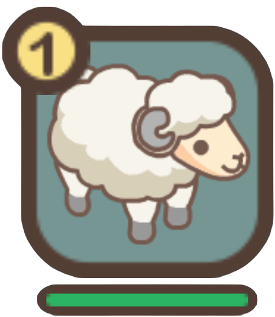

# Sheep Attributes

### **Attributes**

|                          Icon                          | Attribute | Description                                                                                                                                                        |
| :----------------------------------------------------: | :-------: | ------------------------------------------------------------------------------------------------------------------------------------------------------------------ |
|          |   Speed   | The speed stat indicates how fast a sheep is capable of running.                                                                                                   |
| .png>) |  Stamina  | Stamina determines the length of time a sheep can continue to run at top speed.                                                                                    |
|          |   Power   | A sheep's power represents its ability to outrun and overtake other sheep, as well as to maintain its position once it has gained ground.                          |
|        |  Balance  | Balance affects the running stability of sheep. It not only helps your sheep get a strong start in the race, but it also reduces the chance that they may stumble. |
|      |   Spirit  | Spirit is an indicator of a sheep's capacity to better withstand fatigue and enables them to make more frequent use of their skills.                               |

__

### **Dash-Time**

<figure><figcaption></figcaption></figure>

At some point during a race, a sheep will reach its top speed, which is known as its _Dash-time_, and is represented by a Dashometer bar alongside the other attributes of a sheep. This bar shows at what point during a race a sheep will activate its _Dash-time_ in order to boost their speed at the optimal moment. The stamina of a sheep will always be depleted while it is running, but during _Dash**-**time_, it will be consumed significantly more.\

### Stumbling

<figure><figcaption></figcaption></figure>

Stumbling is a random event that occurs during a race. When a sheep stumbles, its speed decreases for a short period of time. The frequency of sheep stumbling is influenced by both their Balance and Spirit stats. The faster a sheep is running, the greater its chance of becoming disoriented and stumbling. A better Balance stat gives sheep a better chance of staying on their feet and avoiding stumbling.

### Health Gauge

<figure><figcaption></figcaption></figure>

You can monitor sheep's current health during a race by looking at their Health Gauges, which are located on the left of the screen. Sheep, especially when pushed to their physical limits, will gradually lose health and energy as they run. When their health is low, sheep lose their ability to run at full speed or use their dash-time.

