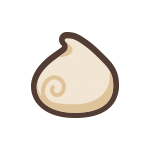

# Sheep

Farmers that sell the wool from their sheep can earn MARD tokens in exchange for their goods. The rarity rating of a sheep influences the value of the wool it produces, and in general, rarer sheep generate more valuable wool.

An important part of caring for healthy and happy sheep is harvesting their fleece. Shearing is essential for the health of sheep, and if it is not done, the fleece can become overgrown and have an adverse effect on the sheep's general well-being and productivity. The amount of wool produced by sheep will also be greatly influenced by their degree of happiness.

### **Placement**

You can view your inventory by clicking on the inventory icon in the game menu. Select the sheep you wish to place from the item section. The placement symbol will then appear, and when clicked, your sheep will be added to the pasture. Certain sheep are more effective when placed together and by grouping compatible sheep you can achieve synergy and activate a combo effect. You may need to replace some sheep in order to accomplish this; simply move them to the warehouse and replace them with another.&#x20;

### **Harvesting**

Sheep's wool begins to grow after they have been on a pasture for a certain amount of time. You can see how much of a sheep's wool gauge has been filled by clicking on it. Once the gauge is entirely full, the wool is ready to be collected. At this point, you will be able to claim MARD tokens and the wool gauge will be reset. The number of tokens you earn is determined by the type of sheep you use. By clicking on a sheep, you can learn how much money you can make from it.

The pastures on Stewart Island have an auto-farming feature that are not present in other regions. If your pasture doesn't support auto-farming, you will have to manually collect wool once the gauge is full.

### **Petting and Cleaning**

Sheep are very sociable and love to be petted! Interaction has a variety of notable benefits, and it also helps to strengthen the bond that you have with your sheep. Bathing your sheep is another vital aspect of caring for the health and well-being of your flock, and if you make a point of keeping your sheep clean by washing them as often as they require it, they may even produce wool quickly. Certain functional decoration items can be installed on your pasture that will allow your sheep to pet or cleanse themselves as needed. &#x20;

### Feeding

It goes without saying that you'll need to purchase "Sweet treats" for your sheep, which you can do with the MARD tokens that you earn. Alternatively, automatic feeding can be enabled to save both time and effort on your part. When the level of hunger in sheep falls below 50%, this mechanism kicks in to provide sweets for them. The amount of wool produced by a sheep decreases dramatically when its hunger level falls below 50%. If it reaches 0%, the sheep will no longer be able to generate any wool at all until it has been fed again.

|              Sweet treats              |         Name         |                              |
| :------------------------------------: | :------------------: | :--------------------------: |
|  |    Bitter bon bon    |  Restores hunger for 8 hours |
|  | Soft Meringue Cookie | Restores hunger for 24 hours |
|  |   Green Apple Jelly  |  Restores hunger for 3 days  |

