# Sheep

In Meta-land, sheep are the heart and soul of your pastoral adventure, aspiring to become racing champions. These woolly contenders come in three rarities: **Normal**, <mark style="color:blue;">**Rare**</mark>, and <mark style="color:red;">**Epic**</mark>. As a shepherd, your role is to nurture and raise these ambitious sheep, leading them towards racing excellence. They thrive on your care, attention, and occasional sweet treats. Your dedication shapes their journey from ordinary to extraordinary.

##

## **Lambkins**

<figure><figcaption></figcaption></figure>

Lambkins, cute baby sheep in a cozy basket, is a special addition to your virtual farm. Over time, it will grow into a unique adult sheep that you can add to your flock.&#x20;

**There are two distinct types of Lambkins:**

**White Lambkin:** This adorable Lambkin will transform into a random sheep breed as you nurture and care for it.

**Rainbow Lambkin:** An enhanced Lambkin with superior qualities. Raise it with love, and you'll witness it transform into a random rare or epic sheep.

As with all your sheep, proper care is crucial for your Lambkin, as a well-cared-for Lambkin has a higher chance of evolving into a rarer sheep. Regularly tending to tasks like [<mark style="color:blue;">washing, feeding, petting</mark>, and <mark style="color:blue;">engaging in conversations</mark>](../sheep-farming/sheep-care.md) with your Lambkin can lead to a remarkable transformation – you may even notice a subtle yet exciting change as your Lambkin begins to emit a radiant <mark style="color:yellow;">glow</mark>! This aura signals that your Lambkin is overflowing with potential, significantly enhancing its odds of maturing into a rarer breed.&#x20;

<figure><figcaption>
A Glowing Lambkin!
</figcaption></figure>

If you're eager to speed up your Lambkin's growth, consider using [<mark style="color:blue;">Lambooster potions</mark>](broken-reference), which can provide a helpful boost. And if you want to take your Lambkin to the next level, simply administer a dose of our specially formulated [<mark style="color:blue;">Glow-up Tonic</mark>](../consumable-items.md) to instantly ignite its glow!

### Guide: Transforming a Lambkin

<figure><figcaption></figcaption></figure>

1. **Select Your Lambkin**: Begin by selecting the lambkin you want to transform.&#x20;
2. **Check Age**: Look at the sheep care panel. If the lambkin is ready for transformation, the transform button will be clickable. If not, you'll need to accelerate its growth using a Lambooster potion or wait until it is old enough to transform.
3. **Lambooster Potion**: If the lambkin isn't ready for transformation, click on the feed button on the sheep care panel. This will open the treat options. Select the Lambooster potion from the available feed items.
4. **Confirm Feeding**: Confirm that you want to feed the lambkin the Lambooster potion. Once confirmed, the lambkin will consume the potion, and its growth will be accelerated.
5. **Transformation**: After feeding the lambooster potion, the transform button on the sheep care panel will become clickable.
6. **Click Transform Button**: Once the transform button becomes clickable, click on it to initiate the transformation process.
7. **Transformation Complete**: Once the transformation is complete, you'll have your very own adult sheep of a random breed. Take care of it just like you did with the Lambkin and enjoy your new companion!

***

##

## Sheep Collection

A comprehensive compilation of all Sheep Breeds discovered within the realm of Meta-land to date:



Regular ol' sheep that's all about keeping things simple.

| Image                                                                         | Name                        | Lambkin |
| ----------------------------------------------------------------------------- | --------------------------- | ------- |
|          | Plain White                 | None    |
|          | Plain Brown                 | White   |
|      | Plain Grey                  | White   |
|      | Plain Pink                  | White   |
|      | Plain Red                   | None    |
|          | Plain Sky-Blue              | White   |
|      | Plain Lemon                 | White   |
|      | Plain Green                 | None    |
|      | Plain Cobalt                | None    |
|      | Plain Black                 | None    |
|      | Plain Mint                  | None    |
|          | Plain Blush                 | None    |
|          | Plain Melon                 | None    |
|  | Plain Teal                  | White   |
|      | Plain Cyan                  | White   |
|          | Plain Cherry                | None    |
|          | Plain Yellow                | None    |
|          | Plain Indigo                | None    |
|      | Plain Butterscotch          | White   |
|          | Plain Blue                  | None    |
|      | Plain Violet                | None    |
|      | Plain Orange                | None    |
|          | Plain Dusk Stargazer        | White   |
|      | Plain Sage Stargazer        | None    |
|      | Plain Red Sweetheart        | None    |
|          | Plain Pink Sweetheart       | None    |
|      | Plain White Tailored        | None    |
|          | Plain Onyx Tailored         | None    |
|      | Plain Black Tailored        | None    |
|          | Plain Brown Tailored        | White   |
|          | Plain White Benedict        | None    |
| 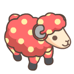         | Plain Red Polka             | White   |
|      | Plain Orange Polka          | None    |
|          | Plain Blue Polka            | White   |
| 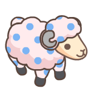         | Plain Cotton Candy Polka    | White   |
|          | Plain Limeade Polka         | White   |
|          | Plain Lavender Polka        | White   |
|          | Plain Daylight Raindancer   | White   |
|          | Plain Limegarden Raindancer | White   |
|          | Plain Jungle Raindancer     | White   |
|          | Plain Sunfade Raindancer    | White   |
|          | Meryl                       | None    |
|          | Physical Sheep              | None    |
|          | Metalamb                    | None    |
|          | Lambosaurus                 | None    |
|      | Marshmallow Chantilly       |         |
|          | Chocolate Chantilly         | White   |
|          | Earl Grey Chantilly         | White   |
|          | Strawberry Milk Chantilly   | White   |
|          | Red Velvet Chantilly        | White   |
|          | Bubblegum Milk Chantilly    | White   |
|          | Buttercream Chantilly       | White   |
|          | Blue Velvet Chantilly       | White   |
|          | Caramel Chantilly           | White   |
|          | Mochaccino Chantilly        | White   |
|          | Honey Butter Chantilly      | White   |
|          | Tropicana Chantilly         | White   |
|          | Cherry Cheesecake Chantilly | White   |
|      | Apple Crunch Chantilly      | White   |
|          | Ice-berry Chantilly         | White   |
|          | Apricot Chantilly           | White   |
|          | Pomegranate Chantilly       | White   |
| 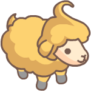         | Custard Chantilly           | White   |
|          | Sugarplum Chantilly         | White   |
|  | Alabaster Hurricane         | None    |
|  | Marigold Hurricane          | White   |
|  | Vermilion Hurricane         | White   |
|          | Hillier Hurricane           | White   |
|          | Indiviolet Hurricane        | White   |
|          | Honeycomb Hurricane         | White   |
|          | Abyssal Hurricane           | White   |
|          | Anemone Hurricane           | White   |
|          | Andara Hurricane            | White   |
|          | Evergreen Hurricane         | White   |
|          | Crimson Hurricane           | White   |
|          | Kalahari Hurricane          | White   |
|          | Limelight Hurricane         | White   |
|          | Spring Rose Cherub          | None    |
|          | Summer Rose Cherub          | None    |
|     | Miss Sommelier              | None    |
|     | Cotton Cloud Ragdoll        | None    |
|         | White Dapperhorn            | None    |
| 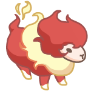        | Scarlet Wildfire            | None    |
|     | Hawthorn Bonnebell          | None    |
|     | Sunset Bonnebell            | None    |
|         | Muscadine Bonnebell         | None    |
|    | Obsidian Wooligan           | None    |
|         | Magma Wooligan              | None    |



Rarer sheep that stands out from the crowd.

| Image                                                                      | Name                           | Lambkin       |
| -------------------------------------------------------------------------- | ------------------------------ | ------------- |
|       | Plain Midnight Stargazer       | White/Rainbow |
|       | Plain Jade Tailored            | White         |
| 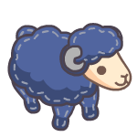      | Plain Sapphire Tailored        | White         |
|       | Plain Ruby Tailored            | White         |
|       | Plain Radiant White            | White/Rainbow |
| 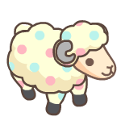      | Plain Confetti Polka           | White         |
| 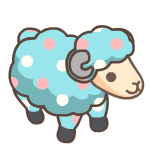      | Plain Skyan Polka              | White         |
| 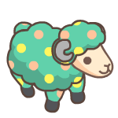      | Plain Tropical Polka           | White         |
|       | Plain Springbreeze Raindancer  | White         |
| 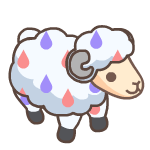      | Plain Arctic-Meadow Raindancer | White         |
|       | Plain Midsummer Raindancer     | White         |
|   | Splasheep                      | None          |
| 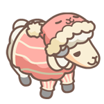      | Pink Baa-jama Lamb             | None          |
| 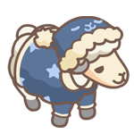      | Blue Baa-jama Lamb             | White/Rainbow |
|       | Rebel Sheepster                | None          |
|       | Vogue Sheepster                | None          |
|       | Urban Sheepster                | None          |
| 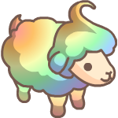      | Rainbow Chantilly              | None          |
|       | Spiceberry Chantilly           | White/Rainbow |
|       | Meadowtail Chantilly           | White/Rainbow |
|   | Tangerine Gummy Chantilly      | White/Rainbow |
| 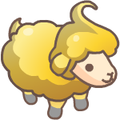      | Pineapple Gummy Chantilly      | White/Rainbow |
|       | Peach Gummy Chantilly          | None          |
| 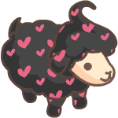      | Black Sweetheart Chantilly     | None          |
|       | Pink Sweetheart Chantilly      | None          |
|       | Yellow Sweetheart Chantilly    | None          |
|       | Radiant Chantilly              | White/Rainbow |
|       | Sweet Pea Hurricane            | White/Rainbow |
|   | Arctic Hurricane               | White/Rainbow |
| 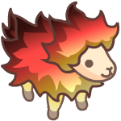      | Ember Hurricane                | None          |
|       | Sunlit Hurricane               | White/Rainbow |
|       | Pacific Hurricane              | White/Rainbow |
|   | Majorca Hurricane              | White/Rainbow |
| 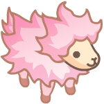      | Camellia Hurricane             | None          |
|       | Red Starburst Hurricane        | White/Rainbow |
|       | Silver Starburst Hurricane     | White/Rainbow |
|       | Ruby Starburst Hurricane       | White/Rainbow |
|       | Ominous Nocturne               | None          |
|   | Vanilla Creme Nocturne         | Rainbow       |
|       | Winter Rose Cherub             | None          |
|       | Jadelight Cherub               | Rainbow       |
| 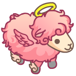      | Autumn Rose Cherub             | None          |
| 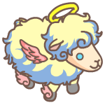      | Opallight Cherub               | Rainbow       |
|       | Sealight Marino                | None          |
|       | Sable Marino                   | Rainbow       |
|       | Sunbleached Yarn-Matey         | Rainbow       |
|   | Bluebeard Yarn-matey           | None          |
|      | Violeta Rambouillet            | None          |
|      | Miss Rouge                     | Rainbow       |
|      | Candyfloss Ragdoll             | Rainbow       |
|      | Pistachic Ragdoll              | Rainbow       |
|      | Carmine Ragdoll                | None          |
|      | Cerulean Ragdoll               | None          |
|      | Crimson Dapperhorn             | Rainbow       |
|      | Dusty Dapperhorn               | Rainbow       |
|      | Zephyr Dapperhorn              | None          |
| 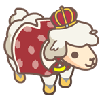     | Red Prince                     | None          |
| 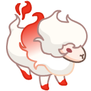     | Blazen Wildfire                | Rainbow       |
|  | Sylvan Wildfire                | Rainbow       |
| 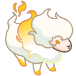     | Lumiglo Wildfire               | Rainbow       |
|      | Ruby Streaked Wildfire         | None          |
|  | Black Linen-Lamb               | None          |
|      | Flamboyant Bonnebell           | None          |
|      | Chiffon Bonnebell              | None          |
| 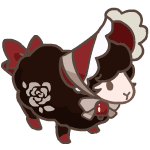     | Rosewood Bonnebell             | Rainbow       |
|      | Rosette Bonnebell              | None          |
|      | Reggae Wooligan                | None          |



Epic sheep that's the talk of the barn, making your pasture the place to be with its exceptional presence.

| Image                                                                           | Name                      | Lambkin       |
| ------------------------------------------------------------------------------- | ------------------------- | ------------- |
|            | Plain Snowbelly           | White/Rainbow |
| 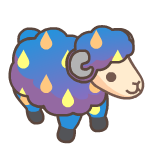           | Plain Twilight Raindancer | White/Rainbow |
|        | Prime Splasheep           | None          |
|            | Black Starburst Hurricane | White/Rainbow |
|            | Infernal Nocturne         | Rainbow       |
| 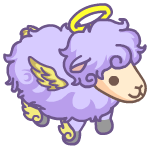           | Periwinkle Cherub         | None          |
| 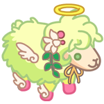           | Apple Blossom Cherub      | None          |
|            | Luminova Cherub           | None          |
|        | Captain Keelson           | None          |
|            | Captain Sternway          | Rainbow       |
|            | Captain Pegleg            | Rainbow       |
| 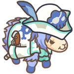           | Captain Hightide          | None          |
|            | Strawberry Gateau         | None          |
|            | Choc-Matcha Gâteau        | None          |
|            | Blueberry Gateau          | None          |
|            | Sweet Orange Gâteau       | Rainbow       |
|            | Lemon-Crème Gâteau        | Rainbow       |
|       | Miss Chambermaid          | None          |
|           | Nurse Meadowsweet         | Rainbow       |
|           | Black Marching Lamb       | Rainbow       |
|       | Green Marching Lamb       | Rainbow       |
|           | Pink Marching Lamb        | Rainbow       |
| 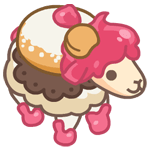          | Pinkpuff Glazewool        | None          |
|           | Moonfrost Enchantica      | None          |
|           | Peppermint Prince         | None          |
|       | Blue Prince               | None          |
|           | Flamenco Wildfire         | Rainbow       |
|           | Inferno Wildfire          | None          |
|           | White Streaked Wildfire   | Rainbow       |
|           | Ice Moon Draconic         | None          |
|  | Crimson Moon Draconic     | None          |
|           | Spring Blossom            | None          |
|           | Frost Blossom             | None          |
|           | Wispy Bonnebell           | Rainbow       |
|       | Madame Mille-feuille      | None          |
|           | Madame Marzipan           | None          |
| 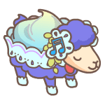          | Violet Sugarsong          | Rainbow       |
|           | Vanilla Sugar-Cupid       | None          |
| 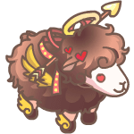          | Cocoa Sugar-Cupid         | None          |


