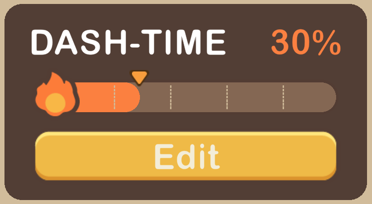
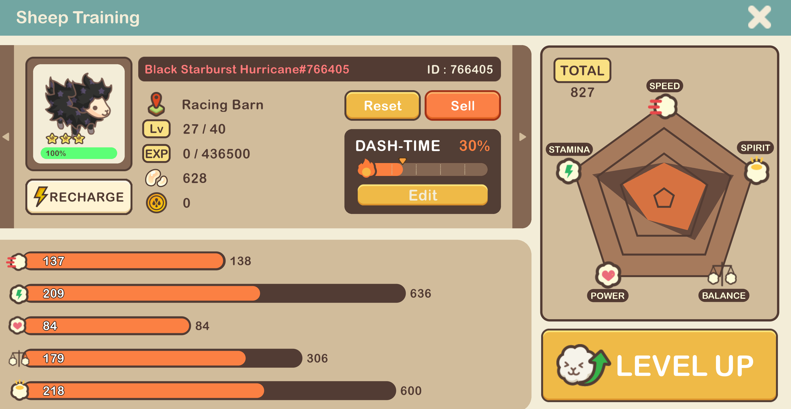
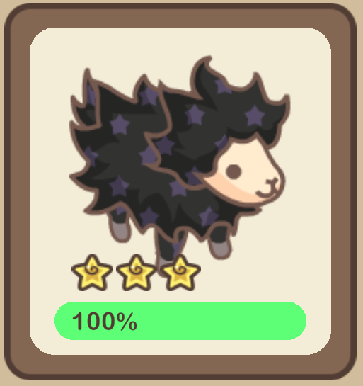

# Attributes & Training

## **Sheep Attributes**

Your sheep are more than just fluffy companions; they come with unique attributes that significantly influence their performance on the racetrack. These attributes are the key to success in the competitive world of [<mark style="color:blue;">sheep racing</mark>](../sheep-racing/).

The rarity of your sheep determines the range of attributes they can potentially unlock. Explore the table below for an overview of the minimum and maximum attribute values corresponding to each rarity:

| Rarity | MIN | MAX |
| ------ | --- | --- |
| Normal | 200 | 240 |
| Rare   | 240 | 280 |
| Epic   | 280 | 320 |

**Attributes:**

<table><thead><tr><th width="84" align="center">Icon</th><th width="122" align="center">Attribute</th><th>Description</th></tr></thead><tbody><tr><td align="center"></td><td align="center">Speed</td><td>Represents the speed at which a sheep can run.</td></tr><tr><td align="center"></td><td align="center">Stamina</td><td>Determines how long a sheep can maintain peak running speed.</td></tr><tr><td align="center"></td><td align="center">Power</td><td>Represents a sheep's ability to outrun and overtake other sheep, as well as to maintain its position once it has gained ground.</td></tr><tr><td align="center"></td><td align="center">Balance</td><td>Affects the running stability of sheep. It not only helps your sheep get a strong start in the race, but it also reduces the chance that they may stumble.</td></tr><tr><td align="center"></td><td align="center">Spirit</td><td>Determines a sheep's capacity to better withstand fatigue and enables them to make more frequent use of their skills.</td></tr></tbody></table>

###

### **Dash-Time**

<figure><figcaption></figcaption></figure>

During a sheep race, every woolly contender has a moment of glory – their Dash-time. This is when a sheep reaches its peak speed, represented by a Dashometer bar alongside other attributes. The Dashometer bar provides insight into the precise timing of this speed surge, allowing shepherds to strategically boost their sheep's performance at the perfect moment. Using the Dashometer, you can precisely set at what percentage of the race your sheep will begin their Dash-time.

However, it's essential to keep in mind that while running, a sheep's stamina gradually depletes. During Dash-time, this depletion accelerates significantly as the sheep pushes its limits to outpace the competition. Understanding this crucial attribute and timing its activation can be the key to victory on the racetrack.

***

## Sheep Training&#x20;

<figure><figcaption></figcaption></figure>

Although every sheep in Meta-Land aspires to be a racing champion, but not all are equally talented. To unlock their full potential, you must train your sheep, transforming them into racing champions. Guiding you on this journey is Shepherd, a sheeplike figure cloaked in a timeworn hood that conceals his true identity. He appears as if descended from the heavens—a mysterious guardian overseeing aspiring shepherds and guiding their hearts.

Upon clicking the Sheep Training button, you can initiate training to enhance their attributes. Rarity affects a sheep's attributes, with rarer sheep possessing better traits. The training screen offers a wealth of information about your sheep. Here, you can access vital details such as the sheep's name, rarity, current location, level and more. Use the left or right arrows to scroll through your sheep easily.

The right side of the screen features an **attribute diagram**, offering a visual representation of your sheep's attribute balance. While sheep are born with unique attributes, you can alter these stats using [<mark style="color:blue;">Mystery Cubes</mark>](../consumable-items.md), which grant a sheep random stats every time you use them.

Also on the training screen, you'll notice that your sheep don't just race for glory; they also earn currency when placed in the [<mark style="color:blue;">racing barn</mark>](../racing-barn.md) and competing in races. Their performance directly impacts your rewards.

### **Managing Energy**

<figure><figcaption></figcaption></figure>

Each sheep has an energy bar that depletes as they participate in arena races. Recharge them with [<mark style="color:blue;">recharge potions</mark>](../consumable-items.md) to keep them in peak racing condition!

### Levelling Up Sheep

<figure><figcaption></figcaption></figure>

To level up your sheep, you can infuse their strength with the wool you've collected in your [<mark style="color:blue;">inventory</mark> ](../inventory-and-gifting.md)or use[ <mark style="color:blue;">EXP potions</mark>](../consumable-items.md). These potions come in three different sizes, each offering varying levels of experience points. Rarer sheep wool provides more experience, making them valuable assets in your training efforts. The "Auto" button simplifies the process by automatically calculating and adding the required EXP potions or wool to level up your sheep.

#### **Guide: How to Level Up Your Sheep**

1. Access the sheep training button located in the selected sheep's care panel within sheep farm mode.
2. Click on the level up button positioned on the right-hand side.
3. Review the list of items required as fuel to level up your sheep.
4. Choose between manually selecting the necessary items or utilizing the "Auto" button for automatic selection.
5. Confirm your selection to initiate the leveling up process.
6. After leveling up your sheep, you have the option to reroll its stats using mystery cubes.
7. Congratulations! You've completed the training process and successfully enhanced your sheep's abilities.

### **Setting Dash-time**

<figure><figcaption></figcaption></figure>

In a sheep race, each sheep experiences a moment called <mark style="color:blue;">Dash-time</mark> when they reach their maximum speed. The Dashometer bar, including other attributes, indicates the precise timing of this speed boost. You can use the Dashometer to set when your sheep begins their Dash-time.

### **Selling and Resetting Sheep**

When your flock has grown so large that there's not much room for new members, you can find a new home for your sheep by hitting the "sell" button. Just keep in mind that this decision is permanent, so be ready to say goodbye to your fluffy friend. In exchange, you'll receive the EXP you've invested in that sheep in the form of[ <mark style="color:blue;">EXP potions</mark>](../consumable-items.md).

Alternatively, you can give your sheep a fresh start by making them forget their past experiences with a sprinkle of [<mark style="color:blue;">Amnesia dust</mark>](../consumable-items.md). This lets them start over at level one, and any EXP you've invested in them will be refunded to you as [<mark style="color:blue;">EXP potions</mark>](../consumable-items.md).

