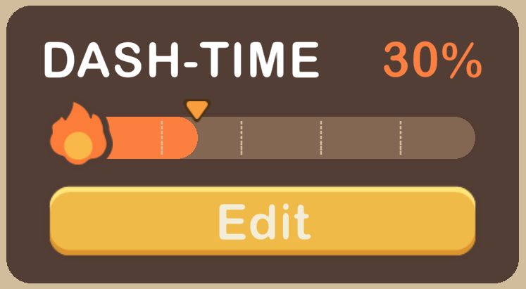
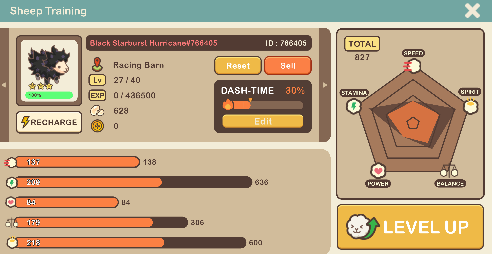
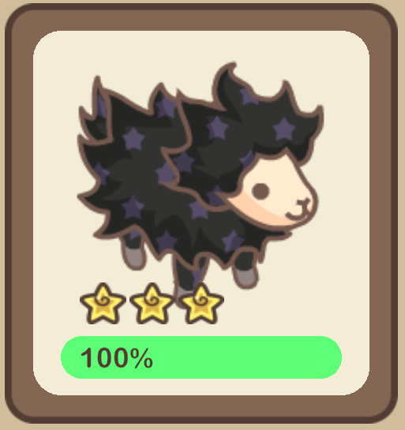

# Attributes & Training

##  **Sheep Attributes**

Your sheep aren’t just adorable—they’re built for racing. Each sheep comes with unique attributes that directly affect their performance on the track. These attributes are what separate the champions from the rest, making them crucial to your success in the competitive world of [sheep racing](../sheep-racing/).

The rarity of your sheep—whether **Normal**, <mark style="color:blue;">**Rare**</mark>, or <mark style="color:red;">**Epic**</mark>—determines the range of attributes they can unlock. The rarer the sheep, the higher the potential for better attributes. Check out the table below to see the minimum and maximum attribute values for each rarity:

| Rarity | MIN | MAX |
| ------ | --- | --- |
| Normal | 200 | 240 |
| Rare   | 240 | 280 |
| Epic   | 280 | 320 |

####  **Attributes:**

<table><thead><tr><th width="84" align="center">Icon</th><th width="122" align="center">Attribute</th><th>Description</th></tr></thead><tbody><tr><td align="center"></td><td align="center">Speed</td><td>How fast your sheep can sprint.</td></tr><tr><td align="center"></td><td align="center">Stamina</td><td>How long they can maintain their pace.</td></tr><tr><td align="center"></td><td align="center">Power</td><td>Increases their chances of overtaking other sheep.</td></tr><tr><td align="center"></td><td align="center">Balance</td><td>Helps sheep avoid stumbling or tripping during races.</td></tr><tr><td align="center"></td><td align="center">Spirit</td><td>Boosts their drive and determination, especially in tough races.</td></tr></tbody></table>

### &#x20; **Dash-Time**

<figure><figcaption></figcaption></figure>

During every sheep race, each woolly contender has their moment of glory—**Dash-Time**. This is when a sheep hits its peak speed, and it’s represented by a **Dashometer** bar alongside their other attributes. The Dashometer gives you real-time insight into when your sheep will surge ahead, allowing you to strategically plan their performance.

***

##  Sheep Training&#x20;

<figure><figcaption></figcaption></figure>

Every sheep in Meta-Land dreams of racing glory, but not all are equally gifted. To unlock their full potential, you’ll need to train them, turning your sheep into true champions. Guiding you on this journey is the mysterious **Shepherd**, a cloaked figure who seems to have descended from the heavens. With a hood that conceals his true identity, this guardian watches over aspiring shepherds, offering wisdom as you shape your sheep's future.

#### Initiating Training

<figure><figcaption></figcaption></figure>

Click the  **Sheep Training** button to start boosting your sheep’s abilities. Training helps enhance their attributes, with rarer sheep naturally starting with better traits. The training screen provides all the key details—name, rarity, location, and level—plus easy navigation with left and right arrows to scroll through your flock.

#### Attribute Diagram & Mystery Cubes

On the right side of the screen, you’ll find the **attribute diagram**, a visual map of your sheep’s stats. Every sheep is born with unique attributes, but using [**Mystery Cubes**](../consumable-items.md), you can mix things up. Mystery Cubes give your sheep random stat boosts before you lock in its level up, so you never know what new strengths might emerge.

#### Racing & Rewards

Your sheep aren’t just racing for fun—they’re earning rewards too! Each time they’re placed in the [Racing Barn](../racing-barn.md) and compete, their performance determines the currency they bring in. Train well, race hard, and watch your rewards stack up!

### **Managing Energy**

<figure><figcaption></figcaption></figure>

Each sheep has an **energy bar** that depletes with every race in the Arena. To keep them in peak racing condition, you’ll need to recharge their energy. Use  [**Recharge Potions**](../consumable-items.md) to refill their energy bar and get them back on the track, ready for the next race!

###  Levelling Up Sheep

<figure><figcaption></figcaption></figure>

To enhance your sheep’s abilities, you’ve got two main options: infuse them with the wool you’ve collected or use  [**EXP Potions**](../consumable-items.md). These potions come in three different sizes, each providing a different amount of experience points. Remember, rarer sheep wool offers more experience, making it a valuable resource for leveling up.

For convenience, there’s an **Auto** button that makes the process simple by automatically calculating and adding the required EXP potions or wool to level up your sheep. Each sheep has a **current stat level** and a **maximum stat level**, represented visually with a _dark brown_ area for the max level and an _orange_ area for the current level. Keep in mind, no stat can be increased beyond its maximum—so if your sheep’s max Balance stat is 170, leveling up won’t ever push it higher than that.

### **Guide: How to Level Up Your Sheep**

1. **Access Sheep Training**: Enter  **Sheep Farm mode** and select the sheep you want to level up. Look for the **Sheep Care** panel and click the   **Training** button to access the training options.
2. **Level Up**: In the training interface, locate the  **Level Up** button on the bottom right. Click to proceed.
3. **Manual or Auto Selection**: A list of required items for leveling up will appear. You can manually choose from your inventory or click the **Auto** button to automatically fill in the necessary components.
4. **Confirm Selection**: After selecting or using the auto-fill option, confirm to begin the leveling up process.
5. **Initiate Leveling Up**: Once confirmed, the leveling up process starts.
6. **Reroll Stats (Optional)**: Once leveling up has started, you can use  **Mystery Cubes** as many times as you want to reroll your sheep’s stat boost, before you finalize the level up.
7. **Lock in Level**: After you’re satisfied with the rerolled stats, click **Confirm** to lock in the new level and finalize the process.
8. **Congratulations**: Your sheep is now stronger, with locked-in stats, and ready for bigger races!

###  **Setting Dash-Time**

<figure><figcaption></figcaption></figure>

#### Using the Dashometer

The Dashometer lets you set exactly when, during the race, your sheep will begin their [Dash-Time](attributes-and-training.md#dash-time). You can choose the optimal percentage of the race where your sheep will unleash its speed. Timing it just right can be the key to outpacing the competition.

#### Managing Stamina

While your sheep runs, its stamina gradually depletes, but during Dash-Time, the drain on stamina accelerates dramatically. Pushing your sheep to their limits will give them a significant speed boost, but if their stamina runs out too quickly, they may not finish strong.

Mastering Dash-Time, by balancing speed with stamina, can be the difference between taking the lead and being left behind!

###  **Selling and Resetting Sheep**

<figure><figcaption></figcaption></figure>

When your flock grows so large that space is tight—or if one of your sheep is, well, not exactly living up to its potential—you can give them a new home elsewhere by hitting the **Sell** button. Just remember, this decision is permanent, so be ready to say goodbye to your fluffy companion. In exchange, you’ll get back the **EXP** you invested, neatly packaged as  [**EXP potions**](../consumable-items.md).

If you’re not quite ready to part ways but need a do-over, sprinkle some  [<mark style="color:blue;">**Amnesia dust**</mark> ](../consumable-items.md)on your sheep. This lets them forget their past experiences and start over at level one, and any EXP you've invested in them will be refunded to you as  [<mark style="color:blue;">**EXP potions**</mark>.](../consumable-items.md) It’s a great way to rework your sheep’s training without waving goodbye to them!

