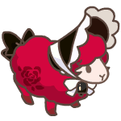
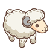
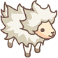
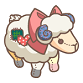
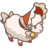

# Collection




<table><thead><tr><th align="center">Image</th><th align="center">Name</th><th data-hidden>Price</th></tr></thead><tbody><tr><td align="center"></td><td align="center">Crimson Moon Draconic</td><td></td></tr><tr><td align="center"></td><td align="center">Vanilla Sugar-Cupid</td><td></td></tr><tr><td align="center"></td><td align="center">Cocoa Sugar-Cupid</td><td></td></tr><tr><td align="center"></td><td align="center">Strawberry Gâteau</td><td></td></tr><tr><td align="center"></td><td align="center">Captain Keelson</td><td></td></tr><tr><td align="center"></td><td align="center">Miss Chambermaid</td><td></td></tr><tr><td align="center"></td><td align="center">Madame Mille-feuille</td><td></td></tr></tbody></table>




<table><thead><tr><th align="center">Image</th><th align="center">Name</th><th data-hidden>Price</th></tr></thead><tbody><tr><td align="center"></td><td align="center">Red Prince</td><td></td></tr><tr><td align="center"></td><td align="center">Pink Baa-jama Lamb</td><td></td></tr><tr><td align="center"></td><td align="center">Blue Pirate</td><td></td></tr><tr><td align="center"></td><td align="center">Ember Hurricane</td><td></td></tr><tr><td align="center"></td><td align="center">Rainbow Chantilly</td><td></td></tr><tr><td align="center"></td><td align="center">Urban Sheepster</td><td></td></tr><tr><td align="center"></td><td align="center">Rebel Sheepster</td><td></td></tr><tr><td align="center"></td><td align="center">Vogue Sheepster</td><td></td></tr><tr><td align="center"></td><td align="center">Ruby Streaked Wildfire</td><td></td></tr><tr><td align="center"></td><td align="center">Autumn Rose Cherub</td><td></td></tr><tr><td align="center"></td><td align="center">Peach Gummy Chantilly</td><td></td></tr><tr><td align="center"></td><td align="center">Camellia Hurricane</td><td></td></tr><tr><td align="center"></td><td align="center">Ominous Nocturne</td><td></td></tr><tr><td align="center"></td><td align="center">Carmine Ragdoll</td><td></td></tr><tr><td align="center"></td><td align="center">Cerulean Ragdoll</td><td></td></tr><tr><td align="center"></td><td align="center">Flamboyant Bonnebell</td><td></td></tr><tr><td align="center"></td><td align="center">Rosette Bonnebell</td><td></td></tr></tbody></table>



<table><thead><tr><th align="center">Image</th><th align="center">Name</th><th data-hidden>Price</th></tr></thead><tbody><tr><td align="center"></td><td align="center">Plain White</td><td></td></tr><tr><td align="center"></td><td align="center">Plain Pink</td><td></td></tr><tr><td align="center"></td><td align="center">Plain Cobalt</td><td></td></tr><tr><td align="center"></td><td align="center">Plain Red</td><td></td></tr><tr><td align="center"></td><td align="center">Plain Orange</td><td></td></tr><tr><td align="center"></td><td align="center">Plain Yelllow</td><td></td></tr><tr><td align="center"></td><td align="center">Plain Green</td><td></td></tr><tr><td align="center"></td><td align="center">Plain Blue</td><td></td></tr><tr><td align="center"></td><td align="center">Plain Indigo</td><td></td></tr><tr><td align="center"></td><td align="center">Plain Violet</td><td></td></tr><tr><td align="center"></td><td align="center">Plain Sage Stargazer</td><td></td></tr><tr><td align="center"></td><td align="center">Plain Pink Sweetheart</td><td></td></tr><tr><td align="center"></td><td align="center">Lambosaurus</td><td></td></tr><tr><td align="center"></td><td align="center">Miss Sommelier</td><td></td></tr><tr><td align="center"></td><td align="center">Scarlet Wildfire</td><td></td></tr><tr><td align="center"></td><td align="center">Magma Wooligan</td><td></td></tr><tr><td align="center"></td><td align="center">Obsidian Wooligan</td><td></td></tr><tr><td align="center"></td><td align="center">Meta-lamb</td><td></td></tr><tr><td align="center"></td><td align="center">Plain Blush</td><td></td></tr><tr><td align="center"></td><td align="center">Plain Melon</td><td></td></tr><tr><td align="center"></td><td align="center">Plain Cherry</td><td></td></tr><tr><td align="center"></td><td align="center">Physical sheep</td><td></td></tr><tr><td align="center"></td><td align="center">Plain Mint</td><td></td></tr><tr><td align="center"></td><td align="center">Plain White Tailored</td><td></td></tr><tr><td align="center"></td><td align="center">Plain Black Tailored</td><td></td></tr><tr><td align="center"></td><td align="center">Plain Orange Polka</td><td></td></tr><tr><td align="center"></td><td align="center">Marshmallow Chantilly</td><td></td></tr><tr><td align="center"></td><td align="center">Alabaster Hurricane</td><td></td></tr><tr><td align="center"></td><td align="center">Cotton Cloud Ragdoll</td><td></td></tr><tr><td align="center"></td><td align="center">Hawthorn Bonnebell</td><td></td></tr><tr><td align="center"></td><td align="center">Sunset Bonnebell</td><td></td></tr></tbody></table>



