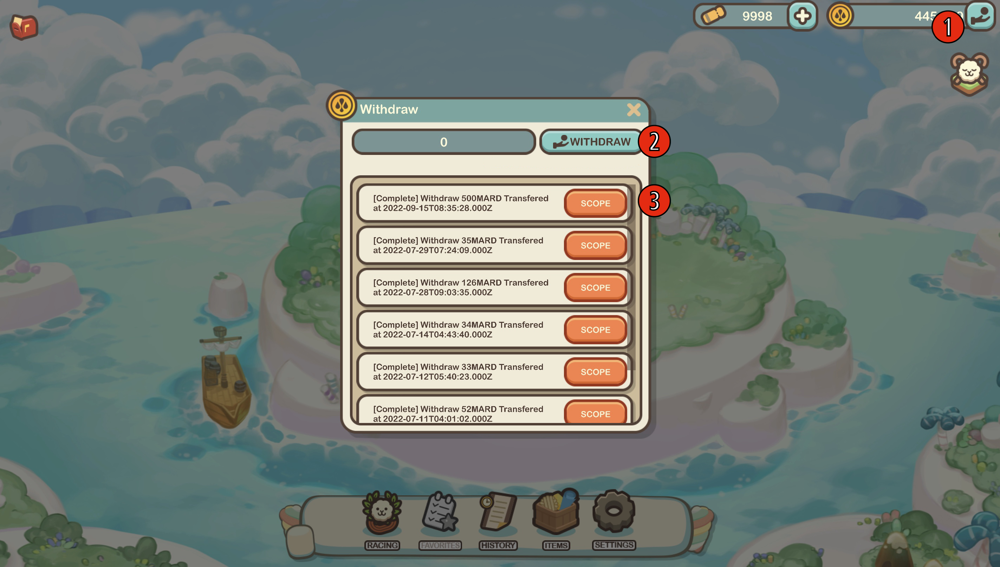

# Withdraw/Deposit MARD

### Withdrawing MARD

Withdrawals can be made directly from the game to your wallet, with a minimum withdrawal amount of 100 MARD.

<figure><figcaption></figcaption></figure>

1. In the upper right corner of the screen, click the cash-out button next to your MARD balance.
2. After inputting the amount you wish to cash-out, click the withdraw button to initiate the transaction.
3. The scope buttons located next to your transactions, will transport you to a more thorough representation of your transaction on the scope itself.

### Depositing MARD

<figure><figcaption></figcaption></figure>

To deposit MARD in your game, navigate to our website's shop menu, and under game items, you may purchase a cheque issued by the _Bank of the Kingdom of Marmalade_ for the amount you would like to deposit. After completing the process, the tokens should be visible in-game.

