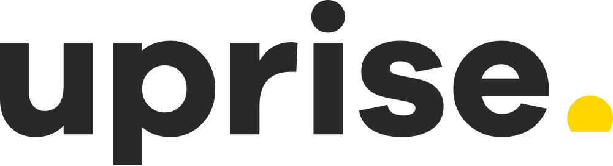
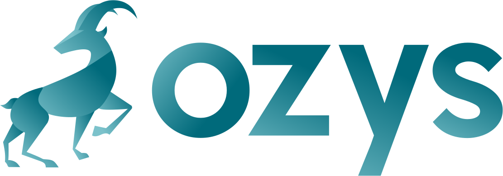
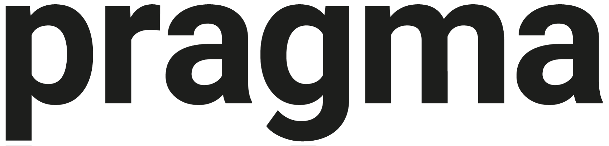

# Partnership

### Nooslab

Nooslab developed the social app game called Sheepfarm in Sugarland which gained widespread popularity in Korea due to its adorable sheep with a variety of appearances, as well as its mouthwatering in-game commodities made from various types of sweets, such as snacks, candy, and chocolate. Nooslab now provides Nightingale Interactive with the IP associated with Sheepfarm.

### Uprise

Uprise provides a crypto robo-advisor service called HEYBIT to make cryptocurrency investment easier, safer, and more affordable for everyone.  Heybit seeks to generate alpha (active return) by beating the market return. Uprise will support Sheepfarm by providing its crypto-business expertise as well as team members with extensive knowledge of the industry.

### Ozys

Ozys is responsible for the operation of the AMM protocol KLAYswap in the Klaytn network. KLAYswap has the highest TVL and transaction volume of any DeFi service on the Klaytn network.  Our goal is to increase the number of new users by promoting our project to the KLAYswap community via Drops.

### Aurora

Aurora is a leading global company that develops character designs, commercializes them, and distributes them to over 80 countries around the world. Aurora is also leveraging established characters to boost its character licensing/merchandising business. In addition, the company will create NFTs that will be used in Sheepfarm as real-life figurines with high collectible value.

### Pragma

Pragma ventures is a global investment firm specializing in early-stage blockchain startups with a diversified crypto portfolio that includes Primex, Portal, Infinity, Waggle, and more.

### **Sky Vision Capital**

****.png>)****

SVC has its focus on P2E games and fosters innovation through technological leadership and assists potential game developers in converting to P2E multichain game projects. They are an established investor in multiplayer online gaming projects such as League of Kingdoms Arena, Forest Knight, and Nine Chronicles.

### **Nolatency**

Nolatency is a P2E game development company known for “Drawshop Kingdom Reverse” that is backed by angel investors Hyunsung Shin, the founder of the public blockchain protocol Terra, and Siwon Lee, the founder of Siwon School.

