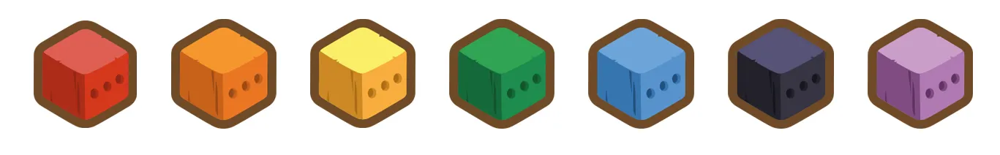

# Legacy NFTs

##

## Aurora Boxes

<figure><figcaption></figcaption></figure>

The [Aurora Boxes](https://twitter.com/i/status/1531969828382449664), created in collaboration with [Crypto.com](https://crypto.com/nft/drops-event/0342ddc847e381f0c45f2dbb536df233?tab=info), were a unique offering available for a limited time on June 1st. Inside these special virtual boxes, you could find various virtual sheep, which could be converted into non-fungible tokens (NFTs) for use on the Klaytn network.

By acquiring NFTs from the Aurora Box, you had the opportunity to exchange them for virtual sheep within the Sheepfarm game, including sought-after sheep like [Splasheep and Prime Splasheep](https://twitter.com/i/status/1526831766316535808). Notably, ten out of the 100 Aurora Boxes could be redeemed for physical figurines provided by Aurora.

All components of the Aurora Box, along with the box itself, were NFTs initially hosted on the **Cronos network**. However, they were eventually burned upon redemption, transforming into gaming NFTs compatible with the **Klaytn network**.

***

## Red Envelopes

<figure><figcaption></figcaption></figure>

Red envelopes were part of a Lunar New Year event (2022) where players could earn rewards by inviting friends to join the event through a referral code. There were two participation levels: Free Pass and Shepherd's Pass. Free Pass holders could earn a maximum of 9 red envelopes, while Shepherd's Pass holders could earn a maximum of 28 red envelopes.

These red envelopes contained vouchers for Marmalade Tokens (MARD), which could be redeemed once the early access version of a game was released.

The event featured a dynamic leaderboard that ranked participants based on the number of pastures they owned. This leaderboard was frequently refreshed and updated, with rewards generously distributed to the top 100 participants. The culmination of this event took place on February 7th, when participants reaped their well-deserved rewards.

***

## MARD Boxes

<figure><figcaption></figcaption></figure>

MARD Boxes were mystery boxes that contained a random NFT, which could include virtual sheep, auto-cleaning decorations, or auto-petting decorations. These items were designed to assist players in caring for their virtual sheep within the game. However, there was also a possibility that a MARD Box might contain _no items at all_.

MARD Boxes were available for purchase on various online marketplaces, with some exclusive offerings on the SheepFarm online marketplace, known as _Mard-ket,_ that has since been discontinued. The pricing of MARD Boxes varied depending on the specific marketplace or promotional events.

***

## Christmas Boxes

<figure><figcaption></figcaption></figure>

Christmas Boxes were a festive feature during a special Christmas event that ran from December 20th to December 24th (2021). These boxes came in three distinct types, each containing 1 rare and 258 normal virtual sheep.

Participants in the event could earn more Xmas boxes by sharing their referral codes with friends and encouraging others to use those codes. When someone utilized a referral code, both the sharer and the user received an additional gift box as a reward. There was no set limit on the number of boxes one could acquire, but there was a restriction on the number of sheep obtainable.

This event provided a delightful way for players to boost their virtual sheep collection and revel in the holiday spirit during the festive season.

***

## Rainbow Boxes

<figure><figcaption></figcaption></figure>

<figure><figcaption></figcaption></figure>

Rainbow boxes were special rewards that players could earn during a 50-day event (2022) by simply owning a pasture. There were seven different types of rainbow boxes, each corresponding to a colour of the rainbow. Each box had a chance of containing normal sheep NFTs matching its colour.

Among these boxes, there was also a rare sheep NFT known as[ Rainbow Chantilly](../gameplay/sheep/). It was exclusively available during this event and couldn't be obtained in any other way. Only **seven** Rainbow Chantilly sheep were available in total, making them quite rare and valuable.

The number of rainbow boxes a player could earn depended on how many pastures they owned. This event provided an excellent opportunity for players to diversify their virtual sheep collection with unique additions.

***

## Redeemable NFTs

<figure><figcaption></figcaption></figure>

Redeemable NFTs were special virtual items that players could exchange for physical toys or other real-world items. To redeem an NFT, players needed to complete a form and transfer the NFT to a dedicated wallet. Once the NFT was verified, the corresponding physical item would be manufactured and sent to the address provided in the application form.

After the redemption process was complete, the NFT would be returned to the user. However, an NFT could only be redeemed once, and the "Redeemable" property of the NFT would change from TRUE to FALSE after redemption.

