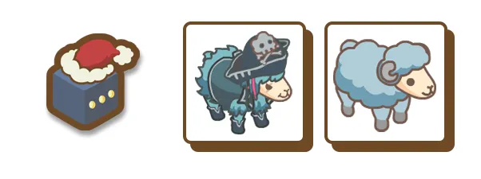
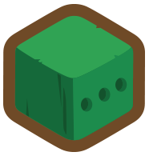
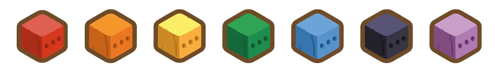
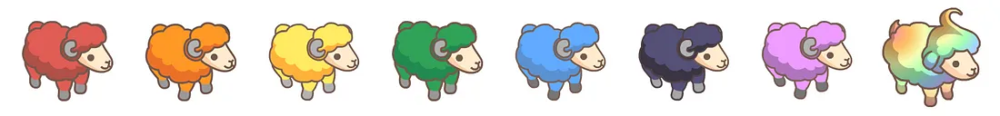
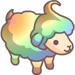

# Past NFT Collections

**Explore earlier chapters of our journey through Sheepfarm’s past NFT collections.**

**These NFTs are no longer obtainable, but they represent important milestones in our game’s history — from early collaborations to limited-time events that helped shape Meta-land as it exists today.**

**Some of these NFTs may still provide in-game utility or special recognition for their holders, reflecting their role in supporting our game during its early stages.**

##  [Aurora](https://auroragift.com/) Boxes

<figure><figcaption></figcaption></figure>

The [**Aurora Boxes**](https://twitter.com/i/status/1531969828382449664), created in collaboration with [**Crypto.com**](https://crypto.com/nft/drops-event/0342ddc847e381f0c45f2dbb536df233?tab=info), were a special, limited-time offering released on June 1st. Inside each of these exclusive boxes were virtual sheep that could be minted as NFTs on the **Kaia network**.

By snagging an **Aurora Box**, players had the chance to unlock rare in-game sheep like the coveted  **Splasheep** and  **Prime Splasheep**. As if that wasn’t exciting enough, 10 out of the 100 boxes contained a golden ticket—a redeemable voucher for a physical figurine from [**Aurora**](https://auroragift.com/).

Originally hosted on the [**Cronos network**](https://cronos.org/), the NFTs in each Aurora Box—along with the boxes themselves—were burned upon redemption, transforming into gaming NFTs ready for use on the [**Kaia network**](https://www.kaia.io/). These NFTs weren’t just collectibles—they became valuable assets within the game.

***

##  Red Envelopes

<figure><figcaption></figcaption></figure>

The **Red Envelopes** event, part of the [**Lunar New Year 2022**](https://sheepfarm.medium.com/may-fortune-favour-you-lunar-new-year-event-28e26ce197f5) celebration, offered players a fun way to earn rewards by inviting friends to join through referral codes. There were two ways to participate: the **Free Pass**, which allowed players to collect up to 9 red envelopes, and the **Shepherd's Pass**, which unlocked up to 28 red envelopes.

Inside these red envelopes, players could find vouchers for  **Marmalade Tokens (MARD)**, which became redeemable when the early access version of the game launched.

The event also featured a dynamic **leaderboard**, ranking participants by the number of pastures they owned. This leaderboard was constantly updated, with rewards generously awarded to the top 100 players. The grand finale took place on **February 7th**, when participants received their well-earned prizes.

***

##  MARD Boxes

<figure><figcaption></figcaption></figure>

The **MARD Boxes** were mystery boxes filled with potential treasures like virtual sheep, auto-cleaning decorations, or auto-petting decorations—handy tools for keeping your flock in tip-top shape. But not every box was a winner; some could leave you empty-handed!

Available for purchase across several online marketplaces, MARD Boxes added some excitement to the game for a while. While they were also offered on our now-discontinued online marketplace, **Mard-ket**, exclusive deals were occasionally available there. Pricing for these boxes varied based on the marketplace or special promotions.

***

##  Christmas Boxes

<figure><figcaption></figcaption></figure>

The **Christmas Boxes** brought holiday cheer during a special event from December 20th to December 24th, 2021. These festive boxes came in three varieties, each packed with virtual sheep—1 rare and 258 normal, to be exact.

Players had the chance to earn more Xmas boxes by sharing their referral codes with friends. Every time a code was used, both the referrer and the new player received an extra gift box as a holiday bonus. While there wasn’t a cap on how many boxes you could collect, the number of sheep up for grabs was limited. It was a fun, festive way to grow your flock and spread some holiday joy!

***

##  Lucky Boxes

<figure><figcaption></figcaption></figure>

**Lucky Boxes** were an exciting way for collectors to get a surprise bundle of goodies. Each box held _seven_ items, including cute sheep and decorations, all randomly selected to make every unboxing an adventure.

There were several types of Lucky Boxes, each offering a different price point and mix of treasures. But no matter which one you grabbed, you were guaranteed at least one adorable sheep. Some items were common finds, while others were rare gems that made the discovery even more thrilling.

Though Lucky Boxes are no longer available, they’ve left a lasting impression on our NFT collectors. They showed just how fun digital collectibles could be and inspired new ways to enjoy the hobby.

***

##  Rainbow Boxes

<figure><figcaption></figcaption></figure>

<figure><figcaption></figcaption></figure>

<mark style="color:red;">**R**</mark><mark style="color:orange;">**a**</mark><mark style="color:yellow;">**i**</mark><mark style="color:green;">**n**</mark><mark style="color:blue;">**bo**</mark><mark style="color:purple;">**w**</mark>**&#x20;Boxes** were a fun feature during a 50-day event in 2022, where owning a pasture earned you some colourful rewards. There were seven types of Rainbow Boxes, each linked to a colour of the rainbow, and inside, players had the chance to find sheep NFTs that matched the box's colour.

The real highlight of the event was the  **Rainbow Chantilly** sheep NFT, an exclusive prize only available during this event. With just seven Rainbow Chantilly sheep ever released, they quickly became rare and sought after by collectors.

The more pastures you had, the more Rainbow Boxes you could earn, offering a great way to expand your sheep collection with some vibrant new additions.

***

##  Redeemable NFTs

<figure><figcaption></figcaption></figure>

**Redeemable NFTs** were special virtual items that players could exchange for physical toys or other real-world collectibles. To redeem one, players would fill out a form and transfer the NFT to a specific wallet. Once the NFT was verified, the physical item would be created and shipped to the address provided.

After the process, the NFT was returned to the player, but it could only be redeemed once. Once redeemed, the _**Redeemable**_ status of the NFT would change from **TRUE** to **FALSE**, ensuring it couldn't be redeemed again.

