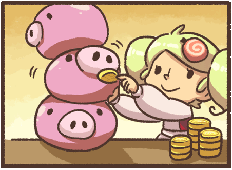
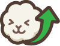
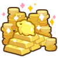
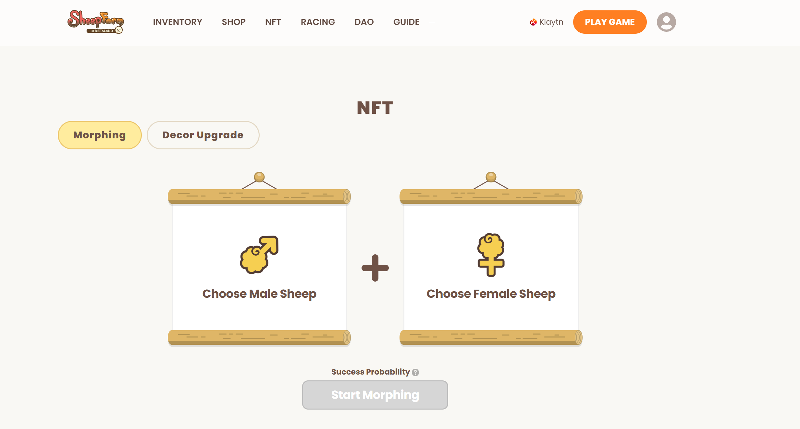

# Playing Sheepfarm with NFTs

<figure><figcaption></figcaption></figure>

Playing with NFTs in the game opens up a world of possibilities. You can acquire NFTs like pastures, sheep, and decorations from platforms like [**Opensea** ](https://opensea.io/collection/sheepfarm)to enhance your in-game experience. These virtual assets can be seamlessly transferred between Meta-land and the real world via our [**website**](https://sheepfarm.io/).

####  Accessing Your Collection

<figure><figcaption></figcaption></figure>

Viewing your **SheepFarm NFTs** is simple—just connect your wallet to the [inventory ](https://sheepfarm.io/inventory)menu on the website. Any item that’s an NFT will have a small badge indicating its network, making it easy to spot which of your in-game treasures are NFTs.

####  Benefits of Playing with NFTs

NFTs bring real benefits to your farm. You can [**sell the wool**](playing-sheepfarm-with-nfts.md#selling-nft-sheep-wool) produced by your **NFT sheep** for  [**MARD tokens**](../gameplay/currency.md#mard-tokens-the-currency-of-opulence), giving you a steady income. Plus, if you ever want to transfer your NFTs to another wallet or sell them on third-party marketplaces, you have complete ownership and flexibility over your items.

####  Minting Non-NFT Items

In an exciting new twist, you can now [mint your non-NFT in-game items into NFTs](playing-sheepfarm-with-nfts/minting-nfts.md), offering even more potential for building your collection. It’s a great feature for NFT collectors looking to expand and enhance their virtual assets.

***

##  Selling NFT Sheep Wool

<figure><figcaption></figcaption></figure>

You can sell the wool produced by your _**NFT sheep**_ to **Marge**, a regular visitor to sheep farms who’s always on the hunt for high-quality wool. The rarity of your sheep determines the wool’s value—rarer sheep produce more valuable wool. Marge is a well-known figure in **Meta-land**, famous for her fashion expertise. She turns locally-sourced wool into stylish clothing and is deeply committed to supporting local shepherds, helping to enrich the sheep farming culture in the village.

### **Guide: Selling the Wool of NFT Sheep**

1. **Access Inventory**: While in Sheep Farming mode, navigate to the right-hand side of your screen to access your  inventory.
2. **Locate Wool Tab**: Inside your inventory, click on the  **Wool** tab.
3. **Initiate Selling Process**: If you have wool from NFT sheep, a  **Sell** button will appear next to it. Click it to begin selling your wool to Marge.
4. **Select Quantity**: Choose the amount of wool you want to sell and confirm your choice.
5. **Receive MARD Tokens**: Once confirmed, the MARD tokens from the sale will be added to your in-game balance.

***

##  **Reveal Your NFT Sheep’s Attributes**

<figure><figcaption></figcaption></figure>

Every sheep has its own distinct personality and hidden [attributes](../gameplay/sheep/attributes-and-training.md), just waiting to be uncovered. Strengthen your connection with your sheep by revealing their unique characteristics and unlocking their potential.

### Guide: Revealing NFT Sheep's Stats

1. **Link Your Wallet**: Make sure your wallet is connected on the game's website. Click the wallet button in the top right corner and follow the prompts to securely connect your wallet.
2. **Visit Sheep Reveal Tab**: Head over to the **Reveal** tab in the **Racing** menu on the website. Click to proceed.
3. **Select Sheep**: On the **Sheep Reveal** page, click the **Select Sheep** button and choose the NFT sheep you want to reveal. You’ll be prompted to select from your collection.
4. **Confirm Reveal**: Confirm the reveal process, which costs **50**  **Rainbow Beanz**. Ensure you have enough Rainbow Beanz before continuing.
5. **View Detailed Stats**: Once the process is complete, you’ll be able to see your sheep’s detailed racing attributes and stats.
6. **Manage Revealed Sheep**: You can now view all sheep whose stats have been revealed. Easily navigate through the list, filter by **My Reveal**, or search using a token ID number to view specific sheep.

***

## Morphing NFT Sheep

<figure><figcaption></figcaption></figure>

**Sheep Morphing is an exclusive feature for Klaytn Network NFTs.** If you're eager to enhance your sheep's potential, try morphing! By combining two sheep of the same rarity, you have the chance to unlock a sheep of even higher rarity. Success is not guaranteed, but rest assured, it won't diminish the value of your sheep.

In Meta-Land, certain sheep breeds are harder to come by and can only be obtained through morphing. This adds an element of discovery, as you never know what unique sheep you might unlock through morphing. It's a way to expand your collection and add exclusive sheep to your flock.

To start morphing, you'll need a pair of sheep – one male and one female – with the same rarity. It's not possible to morph two sheep of the same gender. Take caution because once you begin the morphing process, there's no turning back. With some luck, you might end up with an even more remarkable sheep:

* Normal (male) + Normal (female) = Normal / Rare / Epic
* Rare (male) + Rare (female) = Rare / Epic

Morphing can be a gamble, but it could lead to a stronger addition to your flock. To morph your sheep successfully, you'll need to ensure a few things:

1. **Sheep Requirements**: You must have two sheep of the same grade in your wallet. Remember, these sheep must be of different genders.
2. **MARD Tokens**: You'll also need enough <mark style="color:blue;">MARD tokens</mark> to cover the morphing fee.

You can access the complete summary on the following page:[https://www.notion.so/ngit-interactive/MORPHING-DECOR-UPGRADE-SUMMARY-587602db8d014636b7ba7700160f87fc](https://www.notion.so/ngit-interactive/MORPHING-DECOR-UPGRADE-SUMMARY-587602db8d014636b7ba7700160f87fc)

### **Guide: Morph Your NFT Sheep**

1. **Access the Shop Menu**: Start by navigating to our website's Shop menu.
2. **Choose Sheep Morphing**: Click on the Sheep Morphing tab within the Shop menu.
3. **Select Your Sheep**: From the available options, choose one male and one female sheep of the same rarity. These will be the sheep you intend to morph.
4. **Initiate Morphing**: Once you've selected your pair of sheep, you can begin the morphing process. There will be a standard fee associated with this.
5. **Find Your New Sheep**: After the morphing is complete, you can locate your newly morphed sheep in the Real-world section of the Inventory menu.

_<mark style="color:green;">**Important Factors to Consider**</mark>_

1. _<mark style="color:green;">**No Lower Rarity**</mark><mark style="color:green;">: Morphing will never result in sheep of lower rarity than the ones you started with. Your newly morphed sheep will either maintain the same rarity or become a higher rarity.</mark>_
2. _<mark style="color:green;">**Original Sheep Exclusion**</mark><mark style="color:green;">: The results of morphing will never include any of the original sheep breeds you selected. This means that the sheep you initially choose for morphing won't be among the outcomes.</mark>_
3. _<mark style="color:green;">**Irreversible Process**</mark><mark style="color:green;">: Once you begin the morphing process, there is no way to undo it. This is a permanent transformation, so exercise caution and ensure you're certain about your decision before initiating morphing.</mark>_
4. _<mark style="color:green;">**Patience is Key**</mark><mark style="color:green;">: Please be patient as your morphing is in progress. The processing time may vary depending on the stability of the server, so allow for some time for the transformation to be completed.</mark>_

***

## **NFT Decor Items and Upgrades**

NFT Decorative items can be used as they are or upgraded to boost their impact on wool production. Upgraded decor can noticeably accelerate wool production. You can perform upgrades for these decorative items through the [NFT menu](https://sheepfarm.io/upgrades) on our website, using other decoration items as resources. This feature is exclusively available for **Klaytn NFTs,** and it's important to understand that success is not always guaranteed when performing an upgrade.

**Upgrade Levels:**

* Decor items start at level 0 (zero) and have a minimal impact on wool output at this level.
* There are 5 upgrade levels available, ranging from +1 to +5, with each level significantly increasing the item's productivity.
* Active combo effects with decor items always work, regardless of the item's level.

**Effects:**

* The overall reduction in wool production time due to upgrades is determined by both the item's level and its surface area.
* Decor items with identical surface areas have an equivalent effect on wool production.
* As the item's level and size increase, the impact on wool production and the required materials for upgrades also increase.

**Weather-Related Properties:**

* Each decor item has weather-related properties that significantly influence its effectiveness.

**Effects Calculation:**

* The Decor and Combo system's effects are cumulative, meaning they add up rather than multiply.

A comprehensive summary can be found on[ this](https://www.notion.so/ngit-interactive/MORPHING-DECOR-UPGRADE-SUMMARY-587602db8d014636b7ba7700160f87fc) page.

### **Guide: Upgrade an NFT Decor Item**

<figure><figcaption></figcaption></figure>

1. **Access Decor Upgrade Tab:** Navigate to the "Decor Upgrade" tab in the [Website NFT menu](https://sheepfarm.io/upgrades).
2. **Select Decor Item:** Choose a decor item from the list that you wish to upgrade.
3. **Choose Upgrade Materials:** Select several decor items to use as materials for the upgrade. Please be aware that you will permanently lose these items during the upgrade process.
4. **Confirm Upgrade:** Finally, confirm the upgrade and your decor item will be successfully enhanced! Note that upgrading requires 1 <mark style="color:blue;">MARD token</mark>.

