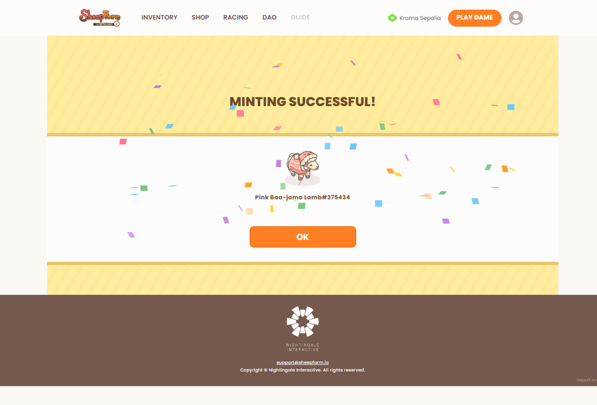

# Minting NFTs

In a new development, the game now allows you to mint **non-NFT** in-game items into **NFTs**, offering interesting possibilities for your virtual assets. This feature is exclusively available on the **Oasys** and **Kroma** networks. It opens up the potential for standard in-game items to be transformed into NFTs, unlocking various opportunities and potential value. While this option does involve a small fee and specific [<mark style="color:blue;">consumable items</mark>](../../gameplay/consumable-items.md), it remains an accessible choice for those interested in expanding their in-game collections and exploring the world of NFTs within the game.

Here's how you can mint Sheep NFTs on each respective network:

##

## **How to Mint NFTs on Oasys - HOME Verse network**

1. **Selecting an item for purchase:**

<figure><figcaption></figcaption></figure>

* Visit the [website](https://sheepfarm.io/inventory) to choose your in-game non-NFT item and transform it into an NFT.

2. **User confirmation of purchase:**

<figure><figcaption></figcaption></figure>

* Confirm the NFT's minting price and complete the payment using OAS tokens.

3. **Crypto wallet confirmation:**

<figure><figcaption></figcaption></figure>

* Sign your wallet to activate the smart contract.

4. **Completion of NFT purchase:**

<figure><figcaption></figcaption></figure>

* Once the process is complete, you can find your item in NFT form on the website.

5. **NFT in inventory:**

<figure><figcaption></figcaption></figure>

* You can choose to transfer or trade the item or deposit it back into the game ([Meta-land](../real-world-and-meta-land.md)) for in-game use.

**NFT in TofuNFT (NFT Marketplace):**

* [Click here](https://tofunft.com/nft/home-verse/0x4dCB42439557194745Cc0C79fB58f5416DC68eB5/730872) to explore your NFT in the TofuNFT marketplace.

***

## How to mint NFTs on KROMA network

**Selecting an item for purchase:**

<figure><figcaption></figcaption></figure>

* Visit the [website](https://sheepfarm.io/inventory) to select your in-game non-NFT item and mint it into NFT form.

**User confirmation of purchase:**

<figure><figcaption></figcaption></figure>

* Confirm the NFT's minting price and agree to make the payment using Kroma Minting Vouchers.

**Crypto wallet confirmation:**

<figure><figcaption></figcaption></figure>

* Sign your wallet to activate the smart contract.

**Completion of NFT purchase:**

<figure><figcaption></figcaption></figure>

* Once the process is complete, you can find your item in NFT form on the website.

**NFT in inventory:**

<figure><figcaption></figcaption></figure>

* You have the option to transfer, trade, or deposit the item back into the game ([Meta-land](../real-world-and-meta-land.md)) for in-game use.

**NFT in Hypermarket (NFT Marketplace on Kroma network):**

* Explore your NFT further in the [Hypermarket marketplace](https://hypermarket.gg/collection/sheepfarm\_kroma?filter%5Bsort%5D=P\_L\_H\&filter%5Bcurrency%5D=WETH\&viewType=Items\&itemType=All) on the Kroma network.

***

With this ability to mint NFTs, you can enhance your in-game collections and explore the vast potential of these digital assets on Oasys and Kroma.

