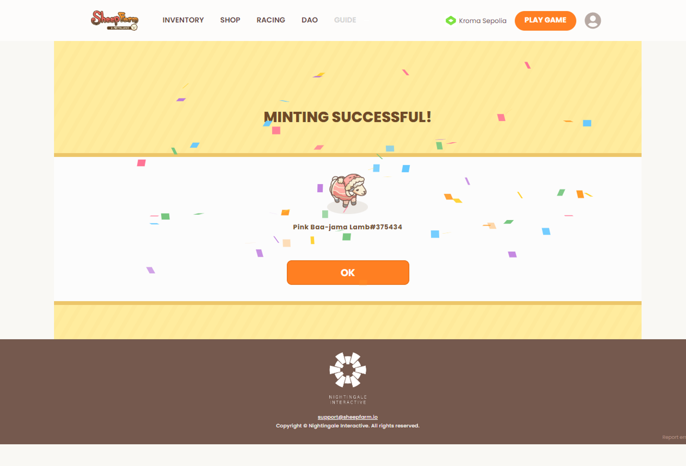

# Minting NFTs

Now you can take your in-game assets to the next level by minting **non-NFT** items into **NFTs**. This exciting feature is available exclusively on the [**Oasys** ](https://www.oasys.games/)and [**Kroma** ](https://kroma.network/)networks, allowing you to transform standard in-game items into NFTs. While minting does require a small fee or specific [consumables](../../gameplay/consumable-items.md), it's a straightforward way to unlock extra value and opportunities with your virtual assets.

## **How to Mint NFTs on** [**Oasys - HOME Verse network**](https://www.oasys.games/)

1. **Selecting an item for minting**:

<figure><figcaption></figcaption></figure>

* Visit the [website](https://sheepfarm.io/inventory), find your in-game item, and choose to mint it into an NFT.

2. **Confirm the purchase**:

<figure><figcaption></figcaption></figure>

* Double-check the minting price and pay using **OAS tokens**.

3. **Sign your wallet**:

<figure><figcaption></figcaption></figure>

* Confirm the transaction by signing your wallet to activate the smart contract.

4. **Completion**:

<figure><figcaption></figcaption></figure>

* Once the process is finished, your shiny new NFT will appear on the website.

5. **NFT in inventory:**

<figure><figcaption></figcaption></figure>

* You can transfer, trade, or use your NFT back in the game [**\[Meta-land\]**](real-world-and-meta-land.md) for all your in-game adventures.

**Explore on TofuNFT (NFT Marketplace):**

* Want to see your NFT in action? Head over to the [**TofuNFT marketplace**](https://tofunft.com/collection/sheepfarm-in-meta-land/items) to explore its full potential.

***

## How to mint NFTs on [KROMA network](https://kroma.network/)

**Selecting an item for minting**:

<figure><figcaption></figcaption></figure>

* Pick an in-game item from your [website ](https://sheepfarm.io/inventory)inventory to mint it into an NFT.

**Confirm the purchase**:

<figure><figcaption></figcaption></figure>

* Review the price and pay with [**Kroma Minting Vouchers**.](../../gameplay/consumable-items.md)

**Sign your wallet**:

<figure><figcaption></figcaption></figure>

* Activate the smart contract by signing your wallet.

**Completion**:

<figure><figcaption></figcaption></figure>

* Once minted, your NFT will appear in your collection on the website.

**NFT in inventory**:

<figure><figcaption></figcaption></figure>

* You can transfer, trade, or deposit your NFT back into **\[**[**Meta-land**](real-world-and-meta-land.md)**]** for in-game use.

**Explore on Hypermarket (NFT Marketplace on Kroma network):**

* Check out your minted NFT in the [**Hypermarket marketplace**](https://hypermarket.gg/collection/sheepfarm\_kroma?filter%5Bsort%5D=P\_L\_H\&filter%5Bcurrency%5D=WETH\&viewType=Items\&itemType=All) on Kroma.

***

Minting NFTs opens up new opportunities for your in-game assets, giving you the freedom to trade, collect, and enhance your virtual collection on [**Oasys** ](https://www.oasys.games/)and [**Kroma**](https://kroma.network/).

