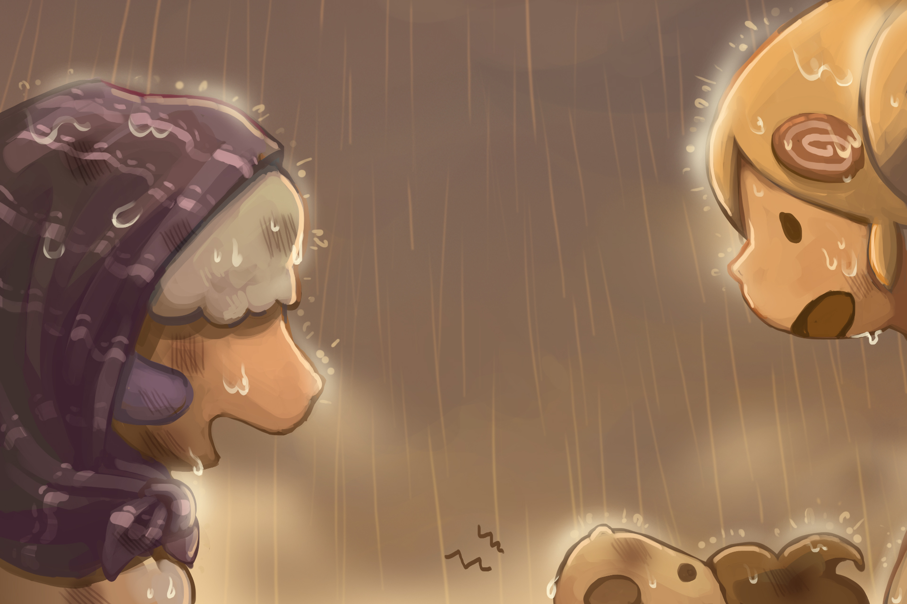

# Sheepfarm DAO

A **Decentralized Autonomous Organization (DAO)** is a system designed to decentralize decision-making, management, and ownership. Instead of relying on a single leader or a central authority, a DAO allows all members to have a say in the direction and management of the organization. This system gives more power to the community, ensuring decisions are made transparently and fairly.

In **Sheepfarm**, the DAO will play an essential role in shaping the future of the game. Shepherds and players alike will have the opportunity to propose and vote on key changes, from game updates to community-driven events. It’s a new frontier of collaboration where every voice counts.

<figure><figcaption></figcaption></figure>

## &#x20;**Weather Voting - Shaping Your Race Destiny**

<figure><figcaption></figcaption></figure>

In sheep racing, the weather can make all the difference. Thanks to our DAO service, you have the power to influence the forecast and tailor it to your racing strategy.

#### **Weather Effects**

Weather conditions directly impact your sheep’s performance:

*  **Sunny**: +12% Speed, +12% Spirit
*  **Rainy**: -10% Speed, +20% Balance
*  **Snowy**: -10% Stamina, +30% Power
*  **Stormy**: -16% Speed, -16% Balance, +24% Spirit

To cast your vote for the ideal racing weather, head to the [**DAO menu**](https://sheepfarm.io/vote) on our website. There, you’ll find active polls for upcoming races. You can track the total votes for each weather condition, view your voting history, and make strategic choices that could change the course of your race.

**Pro tip**: You’ll need  **vNGIT** (our voting token) to cast your vote. So make sure you're stocked up to have your say!&#x20;

