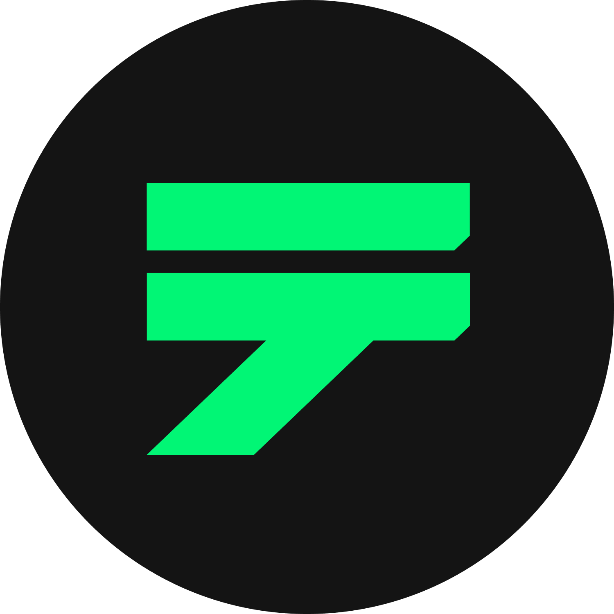

# Withdraw/Deposit MARD

[**MARD Tokens**](../gameplay/currency.md) are the lifeblood of the **Marmalade Kingdom**, essential for unlocking a range of in-game opportunities. Managing your MARD Wallet is crucial for making deposits, withdrawing your earnings, and fueling your sheep farming experience.

**MARD Tokens** are the lifeblood of the **Marmalade Kingdom**, the essential currency that fuels your journey as a shepherd. From unlocking special in-game activities to enabling trades and transactions, MARD tokens offer immense versatility. Knowing how to navigate the world of MARD deposits and withdrawals is key to enhancing your sheep farming experience.

##  Purchasing MARD Tokens

**Guide: Acquire MARD Tokens through Decentralized Exchange (**[**Tealswap**](https://app.tealswap.com/en/swap/?chaintype=HOME\&tokentype=MARD)**):**

<figure><figcaption></figcaption></figure>

If you want to obtain MARD tokens through a decentralized exchange, follow these steps:

1. **Wallet Connection**: Make sure your wallet is connected to the website before proceeding.
2. **Access Shop Menu**: Navigate to the [**shop menu**](https://sheepfarm.io/shop) on our website.
3. **Tokens Tab**: Under the **Tokens** tab, choose the option to purchase MARD tokens through  [**Tealswap**](https://app.tealswap.com/en/swap/?chaintype=HOME\&tokentype=MARD).&#x20;
4. **Choose Payment Method**: On Tealswap, you can either exchange other tokens or use a credit card to get the  **MARD tokens** you need.
5. **Complete Transaction**: Once the transaction is finalized, the  **MARD tokens** will be credited directly to your wallet address, ready for use in the game.

##  **Withdrawing MARD Tokens**

**Guide: How To Withdraw MARD Tokens**

If you wish to make a withdrawal of your MARD tokens from the game, simply follow these steps:

1. **Cash-Out**: Find the  **cash-out button**, conveniently located next to your MARD balance.
2. **Input Withdrawal Amount**: A window will pop up, prompting you to enter the amount you’d like to withdraw.
3. **Initiate Transaction**: After entering the amount, click the  **withdraw button** to start the transaction.

**Note**: The minimum withdrawal amount is 100 MARD tokens, so be sure to meet that requirement before initiating the withdrawal.

##  Depositing MARD

**Guide: Depositing MARD Tokens**

<figure><figcaption></figcaption></figure>

Need to top up your MARD tokens? Follow this quick guide to deposit MARD tokens from your crypto wallet into your game account:

1. **Wallet Connection:** First, make sure your crypto wallet is connected to the game.
2. **Access the Shop Menu:** Head over to our website and enter the [shop menu](https://sheepfarm.io/shop).
3. **Tokens Tab**: In the shop menu, find and click the **Tokens** tab.
4. **Purchase a Cheque**: Choose the option to purchase  **a** **cheque** issued by the Bank of the Kingdom of Marmalade for the amount you want to deposit.
5. **Complete the Transaction**: Follow the on-screen prompts to finalize the transaction.
6. **View Tokens**: Once the transaction is complete, your newly deposited tokens will appear in your in-game account, ready to be used.

